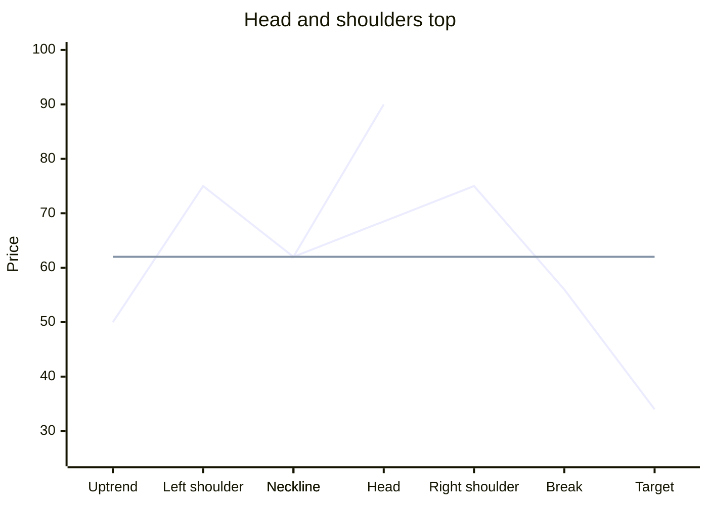

# Technical Analysis Course: From Chart to Trade

A plain-language technical analysis course. You learn to read a price chart, name what you see, and turn it into a trade with a clear entry, stop, and target. It covers candlesticks, chart patterns, price action, wave setups, and futures and options, with a worked example for every idea. The same rules work for stocks, indexes, commodities, and currencies. The course ends with a live playbook for MCX Crude Oil, Natural Gas, Gold, and Silver breakouts.

Read it online at [engineerkv.github.io/stock-market-course](https://engineerkv.github.io/stock-market-course/). The site updates each time a change lands on `main`.

## Contents

Start with the [course overview](src/content/README.md), then work through the steps in order.

| Step | Lesson folder | Lessons |
|---|---|---|
| 1 | [Foundations](src/content/01-foundations/README.md) | [Reading the Chart](src/content/01-foundations/01-reading-the-chart.md), [Method, Risk, and Mindset](src/content/01-foundations/02-method-risk-and-mindset.md) |
| 2 | [Candlesticks](src/content/02-candlesticks/README.md) | [Single Candles](src/content/02-candlesticks/01-single-candles.md), [Two-Candle Patterns](src/content/02-candlesticks/02-two-candle-patterns.md), [Three-Candle Patterns](src/content/02-candlesticks/03-three-candle-patterns.md) |
| 3 | [Chart patterns](src/content/03-chart-patterns/README.md) | [Reversal Patterns](src/content/03-chart-patterns/01-reversal-patterns.md), [Continuation Patterns](src/content/03-chart-patterns/02-continuation-patterns.md) |
| 4 | [Price action](src/content/04-price-action/README.md) | [Reading Price Action](src/content/04-price-action/01-reading-price-action.md), [Confirmation Tools](src/content/04-price-action/02-confirmation-tools.md) |
| 5 | [Wave setups](src/content/05-wave-setups/README.md) | [Wave Structure](src/content/05-wave-setups/01-wave-structure.md), [Guidelines and Indicators](src/content/05-wave-setups/02-guidelines-and-indicators.md), [High-Probability Wave Setups](src/content/05-wave-setups/03-high-probability-setups.md) |
| 6 | [Futures and options](src/content/06-futures-and-options/README.md) | [Futures and Currency](src/content/06-futures-and-options/01-futures-and-currency.md), [Options and Open Interest](src/content/06-futures-and-options/02-options-and-open-interest.md), [Strategy Chooser and Cards](src/content/06-futures-and-options/03-strategy-chooser-and-cards.md), [Crude Oil, Natural Gas, Gold, and Silver](src/content/06-futures-and-options/04-crude-gas-gold-silver.md) |
| Playbook | [MCX Intraday Breakout Playbook](src/content/mcx_intraday_breakout_playbook.md) | |

## Tech stack

- [Docusaurus 3](https://docusaurus.io/) with React 19 and TypeScript
- [Mermaid](https://mermaid.js.org/) diagrams through `@docusaurus/theme-mermaid`
- [lightweight-charts](https://github.com/tradingview/lightweight-charts) for interactive candle and line charts
- Offline full-text search through `@easyops-cn/docusaurus-search-local`
- Inter, Lexend, and JetBrains Mono fonts from Fontsource
- GitHub Actions and GitHub Pages for hosting

## Repository layout

```text
.github/workflows/deploy.yml         builds the site and publishes it to GitHub Pages
src/
  content/
    README.md                        course overview
    01-foundations/ … 06-futures-and-options/   lessons, one folder per step
    mcx_intraday_breakout_playbook.md   live breakout playbook
  components/charts/                 interactive candle, line, and level charts
    parse.ts                         parsers for the chart block syntax
    CandleChart.tsx, XYChart.tsx     charts drawn with lightweight-charts
    LevelLadder.tsx                  price level ladder
  theme/
    CodeBlock/                       turns candles and levels code blocks into charts
    Mermaid/                         turns xychart-beta diagrams into interactive charts
  css/custom.css                     site styling
  pages/index.tsx                    home page
static/img/                          logo and favicon
docusaurus.config.ts, sidebars.ts    site configuration
```

## Getting started

You need Node.js 20 or newer. The deploy workflow uses Node 22.

```bash
npm install
npm start
```

`npm start` opens a live-reloading preview at `http://localhost:3000/`.

| Command | What it does |
|---|---|
| `npm start` | Runs the development server with live reload |
| `npm run build` | Builds the static site into `build/` |
| `npm run serve` | Serves the built site from `build/` |
| `npm run clear` | Clears the Docusaurus cache (`.docusaurus/`) |
| `npm run typecheck` | Type-checks the project with `tsc` |

Search only works on a production build, so run `npm run build && npm run serve` to try it. To preview the site under the same path as GitHub Pages, run `BASE_URL=/stock-market-course/ npm run build` and then `npm run serve`.

## Writing lessons

Lessons are plain markdown files in `src/content/`, so they also read well on GitHub. The site serves them under `/course`.

- Each step lives in a numbered folder (`01-foundations`, `02-candlesticks`, and so on) with a `README.md` introduction and numbered lesson files. Only `src/content/README.md`, files in `0[1-9]-*` folders, and `mcx_*.md` playbooks are published.
- The Course sidebar is generated from the folder and file numbers, with the course overview pinned first. Playbooks have their own sidebar, defined in `sidebars.ts`.
- Link between lessons with relative `.md` paths. A broken link fails the build.

Besides normal markdown and Mermaid diagrams, lessons can use three chart blocks. Colour tones are `good`, `bad`, `info`, `warn`, and `neutral`.

### Candle charts

````markdown
```candles
title: Caption for the whole figure
axis: true
panel: Bullish candle
candle: 100 112 97 110 Close above open
gap
level: 105 Resistance | bad
zone: 95 98 Demand zone | good
```
````

Each `candle` line is open, high, low, close, then an optional label. `panel` starts a new chart side by side, `gap` leaves an empty slot, and `axis: true` shows the price scale.

### Level ladders

````markdown
```levels
title: Retracement levels for a rise from 50 to 100
100 | Swing high | 0 percent
75 | 50 percent | healthy pullback | info
band: 69 75 | Buy zone | good
50 | Swing low | 100 percent
```
````

Each line is `price | label | note | tone`. A `band` line shades the zone between two prices.

### Line and bar charts

````markdown

````

Mermaid `xychart-beta` diagrams are drawn as interactive charts instead of static images. A flat line is shown as a price level, and a straight line after the first series is shown as a guide line.

## Deployment

[`.github/workflows/deploy.yml`](.github/workflows/deploy.yml) builds the site and publishes it to GitHub Pages. It runs on every push to `main` that changes `src/`, `static/`, the site config, the package files, or the workflow, and you can also start it by hand from the Actions tab. The build sets `BASE_URL` to `/stock-market-course/` so the site works under the GitHub Pages path.

## Disclaimer

Educational material only. Nothing here promises that a trade will make money.
