# Reading the Chart

This lesson gives you the tools you will use in every later lesson: how to read a candle, how to see a trend, where to draw levels, and how moving averages, Fibonacci, and oscillators help you judge a move.

---

## 1. What a price really is

A price is simply the last price at which one buyer and one seller agreed to trade. It is not the "true value" of a company or a commodity. It is the balance between people who want to own it and people who want to get rid of it, right now.

Every trade has a buyer and a seller, so there are always exactly as many shares bought as sold. Price does not rise because there are "more buyers than sellers." It rises when buyers are more eager than sellers. Eager buyers accept a higher price to get filled. Nervous sellers ask for more before they let go. When sellers are the eager side, and buyers only step in at a lower price, price falls.

Technical analysis studies that tug of war through the price chart. It does not ask what a company is worth. It asks which side is in control and where that control might change. That is why the same tools work on a stock, an index, gold, crude oil, or a currency pair.

### Bulls, bears, and oversized positions

- A **bull** is a buyer who expects prices to rise.
- A **bear** is a seller who expects prices to fall. In futures and options, a bear can sell first and buy back later.
- A trader who takes a position far too large for the account can be wiped out by a small move against them, even when the idea was right. Rule one of this course is to keep every position small enough that one loss is only a small dent. Step 1, lesson 2 shows how to size it.

---

## 2. Chart types and the four prices

Each point on a chart covers one period of time: one minute, one hour, one day, one week. For each period you can record four prices:

- **Open.** The first traded price of the period.
- **High.** The highest price of the period.
- **Low.** The lowest price of the period.
- **Close.** The last traded price of the period. Many traders treat the close as the most important of the four, because it shows where price settled after the whole fight.

There are three common ways to draw this.

| Chart | What it shows | When to use it |
|---|---|---|
| Line chart | Only the closes, joined by a line | Seeing a long trend quickly |
| Bar chart | A vertical bar from low to high, with ticks for open and close | Same data as candles, harder to read at a glance |
| Candlestick chart | A box (the body) from open to close, and thin lines (wicks) to the high and low | The main chart in this course |

### The parts of a candle

```candles
title: Open 100, high 106, low 98, close 104
axis: true
level: 106 High | neutral
level: 104 Close | good
level: 100 Open | info
level: 98 Low | neutral
candle: 100 106 98 104 Green candle
```

- **Green or white body.** The close is above the open. Buyers won the period.
- **Red or black body.** The close is below the open. Sellers won the period.
- **Long lower wick.** Sellers pushed price down during the period, but buyers pushed it back up before the close.
- **Long upper wick.** Buyers pushed price up, but sellers pushed it back down before the close.
- **Small body with wicks on both sides.** Both sides tried, and neither won.

**Number example.** A stock opens at 100, trades up to 106, down to 98, and closes at 104. The candle is green. The body runs from 100 to 104. The upper wick runs from 104 to 106. The lower wick runs from 100 down to 98.

---

## 3. Timeframes

The same market looks different on different timeframes. A daily candle holds one full day. A 15-minute candle holds 15 minutes.

| Timeframe | Typical user |
|---|---|
| Monthly | Very long-term investor, several years |
| Weekly | Long-term investor, one to two years or more |
| Daily | Swing trader or medium-term investor, weeks to months |
| One hour | Short swing trader, a few days |
| 30, 15, 5, 1 minute | Day trader |

A useful rule is to look at timeframes about five times apart, for example weekly, daily, and hourly for a swing trader, or one hour, 15 minutes, and 3 minutes for a day trader. The slower chart gives the direction. The faster chart times the entry. Lesson 2 turns this into the three-screen method.

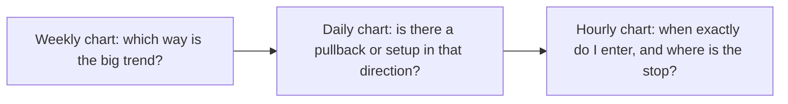

---

## 4. Trend

A trend is the direction price is stepping, one swing at a time. It is the single most important fact on a chart. Most losing trades are trades against the trend.

### The Dow theory ideas you need

Dow theory is one of the oldest ideas in technical analysis. Four parts of it matter here:

1. Prices move in trends: up, down, or sideways.
2. There are trends inside trends. A long trend lasts months or years. A medium trend lasts weeks to months and often moves against the long trend. A short trend lasts days or less.
3. Volume should confirm the trend. In a healthy uptrend, volume grows on rising days and shrinks on pullbacks.
4. A trend stays in force until there is clear proof that it has changed. Do not guess the end of a trend. Wait for the structure to break.

### The three kinds of trend

A **swing high** is a peak with lower prices on both sides. A **swing low** is a trough with higher prices on both sides.

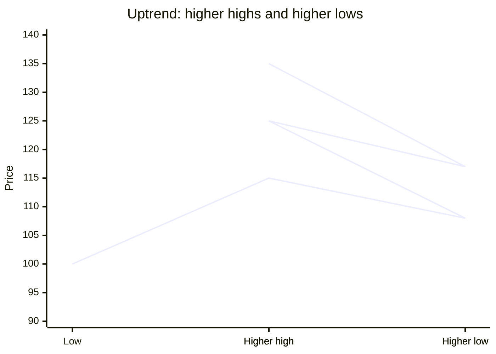

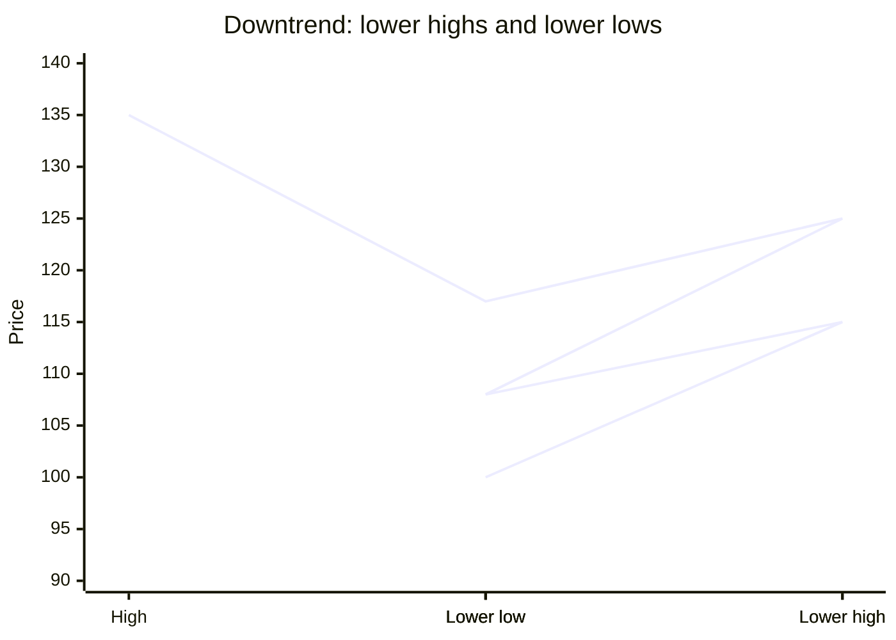

- **Uptrend.** Each swing high is higher than the one before, and each swing low is higher than the one before.
- **Downtrend.** Each swing high is lower, and each swing low is lower.
- **Sideways.** Highs and lows are roughly equal. Price is moving inside a range. In a sideways market, wait and watch. The next trend begins when price breaks out of the range, and the break tells you which side to take.

An uptrend is broken when price makes a lower low, meaning it falls below the last swing low. A downtrend is broken when price makes a higher high, meaning it rises above the last swing high.

**Number example.** A stock moves 100, up to 120, down to 110, up to 130, down to 118, up to 140. The highs are 120, 130, 140. The lows are 110 and 118. Both are rising, so it is an uptrend. If price later falls below 118, the last higher low, the uptrend is broken.

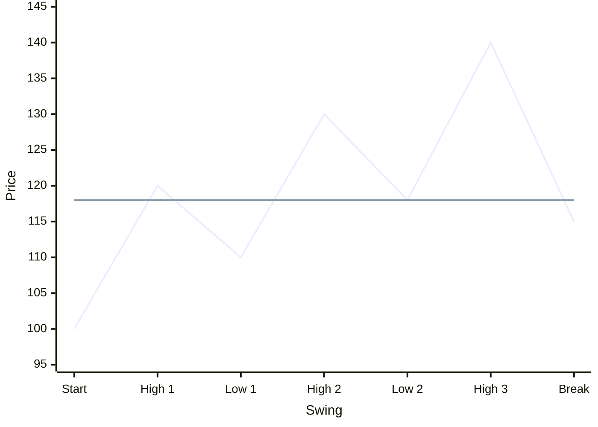

The flat line is the last higher low at 118. As long as price stays above it, the uptrend holds. The last point drops to 115, below the line, so the uptrend is broken.

**Real case.** WTI crude oil fell from roughly 107 dollars in June 2014 to roughly 26 dollars in February 2016. On a weekly chart, every rally in that period stopped below the previous rally high, and every drop went below the previous low. That is a textbook downtrend. Buying "because it is cheap" at 80, 60, or 45 dollars lost money each time.

---

## 5. Strong and weak markets: outperformers and underperformers

In a rising market, some stocks rise faster than the index and some lag behind. The fast ones are **outperformers**. The laggards are **underperformers**.

- In a bull market, buy the outperformers. They rise more in rallies and fall less in pullbacks.
- In a bear market, sell short the underperformers. They fall more in drops and bounce less in rallies.

**How to check.** Divide the stock price by the index level and plot the result. Many charting tools call this a ratio chart or a relative strength line. A rising line means the stock is outperforming. A falling line means it is underperforming.

**Number example.** Over three months the index rises from 20,000 to 21,000, which is 5 percent. Stock A rises from 500 to 575, which is 15 percent. Stock B rises from 500 to 505, which is 1 percent. Stock A is the outperformer, so it is the one to buy on the next pullback. Stock B is the one to avoid.

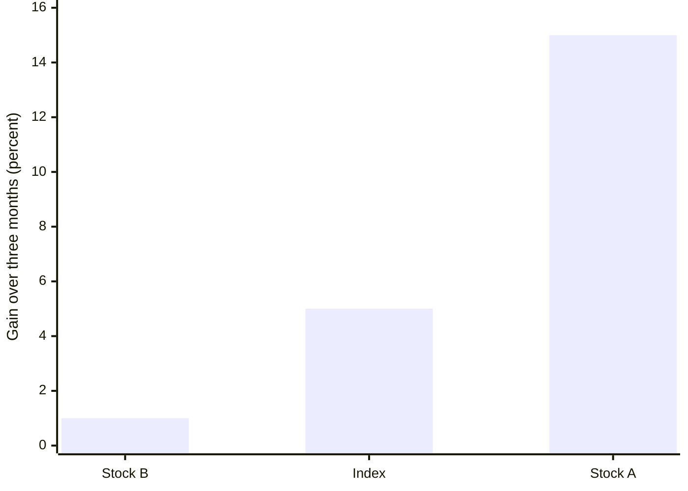

The same idea works across commodities. When gold and silver both rise, check which one is leading before you choose which one to trade.

---

## 6. Support, resistance, trendlines, and channels

### Support and resistance

- **Support** is a price area where falling prices have stopped before, because buyers stepped in.
- **Resistance** is a price area where rising prices have stopped before, because sellers stepped in.

Treat both as **zones**, not single prices. Price rarely turns on the exact same tick. Draw a band that covers the wicks and closes around the turning points.

Good places to find levels:

- Earlier swing highs and swing lows
- The edges of a sideways range
- Round numbers, such as 100, 1,000, or 20,000
- The previous day's high and low, for a day trader
- Gaps on a daily chart
- Long wicks, which show where one side was pushed back hard

### Trendlines and channels

- An **up trendline** joins two or more rising swing lows. It acts as sloping support.
- A **down trendline** joins two or more falling swing highs. It acts as sloping resistance.
- A **channel** is a trendline plus a parallel line on the other side of price. Price swings between the two lines.

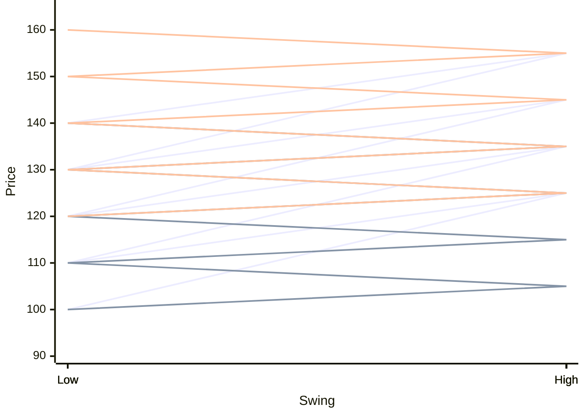

A rising channel. The zigzag is price. The lower straight line is the up trendline, touched by every swing low. The upper straight line is the parallel channel line, touched by every swing high.

A trendline is stronger when it has three or more touches and when it is not too steep. A very steep line breaks easily and does not mean much when it breaks.

### Role reversal

When price breaks a level with conviction, the level often changes jobs.

- Broken resistance often becomes support. Price rises through 100, pulls back to about 100, and bounces.
- Broken support often becomes resistance. Price falls through 100, rallies back to about 100, and fails.

"With conviction" means a close beyond the level, ideally with above-average volume, not just a wick that pokes through and comes back.

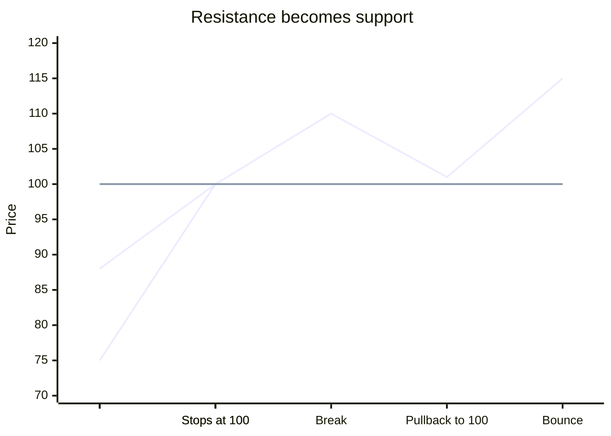

**Number example.** A stock fails at 250 in March, April, and May. In June it closes at 262 on double the usual volume. In July it dips to 252 and bounces to 275. The old resistance at 250 has become support. A trader could buy near 252 to 255 with a stop below 245.

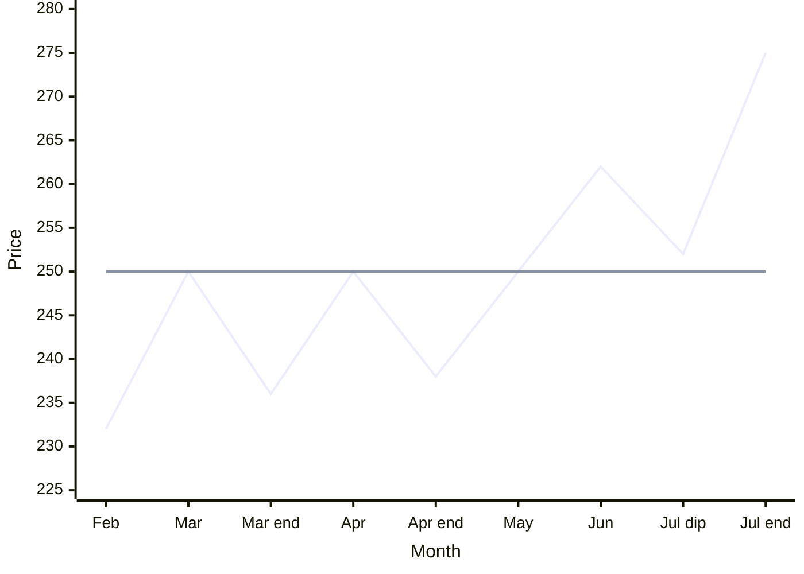

The flat line at 250 stops price three times as resistance. After the June break, the July dip stops at 252, just above the same line, which is now support.

**Real case.** Gold spent roughly 2013 to 2019 below a resistance area near 1,350 to 1,375 dollars. It broke above that area in June 2019. After the break, pullbacks later in 2019 held above the old resistance zone, and the rise continued into 2020.

---

## 7. Volume

Volume is the number of shares or contracts traded in a period. It tells you how strongly people believed in the move.

- **Rising price with rising volume** is a healthy trend. More people are joining.
- **Rising price with falling volume** is a warning. The move is running out of new buyers.
- **A breakout on high volume** is more trustworthy than one on low volume.
- **A very high volume spike after a long move** often marks a turning point, because the last buyers or sellers have rushed in at once.

**Number example.** A stock trades about 100,000 shares a day inside a range. On the day it breaks out, volume jumps to 260,000. That is well above average, so the breakout is more believable.

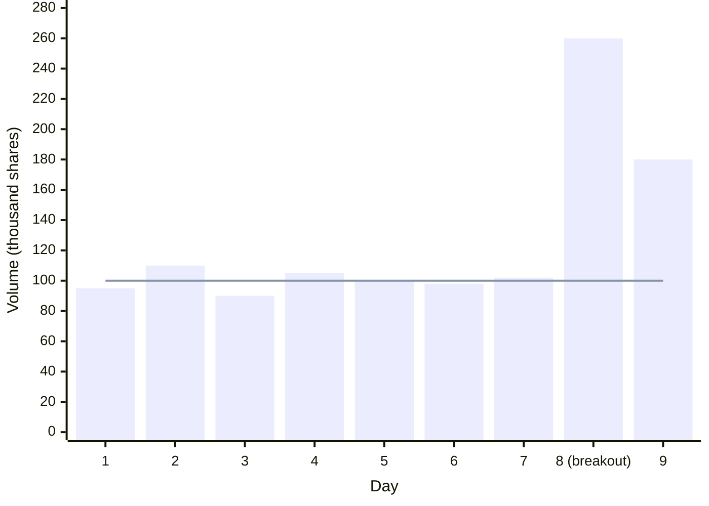

The bars are daily volume. The flat line is the average. The breakout bar is more than twice the average.

"Above average" in this course means higher than the average of roughly the last 10 to 20 candles. Most charting tools can draw a moving average on the volume bars.

Some markets do not show true volume. Currency spot charts and some index charts show only tick counts or no volume at all. In those markets, use the futures contract's volume, or rely more on price structure.

---

## 8. Moving averages

A moving average smooths price into a line. It shows the mood of the market. Price above a rising average is a positive mood. Price below a falling average is a negative mood.

### Simple and exponential

- **Simple moving average (SMA).** The plain average of the last N closes. A 10-day SMA is the sum of the last 10 closes divided by 10.
- **Exponential moving average (EMA).** An average that gives more weight to recent closes, so it turns faster. Each day's EMA equals the old EMA plus a fraction of the gap between today's close and the old EMA. The fraction is 2 divided by (N + 1). For a 13-period EMA, that is 2 ÷ 14, about 0.14.

**Number example of an EMA step.** Yesterday's 13-period EMA was 100. Today's close is 107. The gap is 7. The new EMA is 100 + (0.14 × 7) = about 101. The average moved one point toward the new price, not all seven.

### The periods used in this course

- **5, 13, and 26** are short averages. They are used for timing and for short-term trend.
- **50** is a medium average.
- **100 and 200** are long averages. Big funds watch them, so price often reacts near them.

### The stack

When the short averages sit in order, the trend is clear.

- **Bullish stack:** 5 EMA above 13 EMA above 26 EMA, and for a longer view, above the 50.
- **Bearish stack:** 5 EMA below 13 EMA below 26 EMA, and below the 50.
- **No stack:** the lines are flat or tangled. The market is sideways. Trend-following signals will whipsaw you.

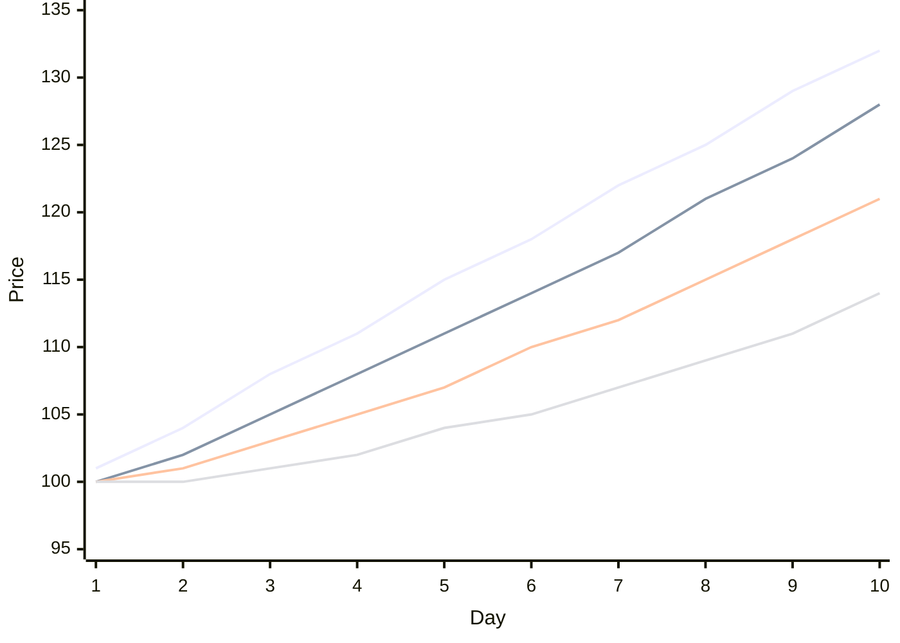

A bullish stack, from top to bottom: price, then the 5 EMA, then the 13 EMA, then the 26 EMA. All four lines rise, and none of them cross. In a bearish stack, the order is flipped.

### Crossovers

- A **positive crossover** is when a faster average crosses above a slower one, for example 5 EMA crossing above 13 EMA. It is a buy signal in an uptrend.
- A **negative crossover** is when a faster average crosses below a slower one. It is a sell signal in a downtrend.

A crossover counts as fresh when it happened within the last few candles, about three. An old crossover has already been priced in.

Long-term investors use slower pairs. A 50 EMA crossing above a 100 EMA on a daily chart is a long-term buy signal. The opposite cross is a long-term sell signal.

**Averages as support and resistance.** In a steady uptrend, price often pulls back to the 13 or 26 EMA and bounces. A hammer candle at a rising EMA is a common buy signal. You will meet the hammer in Step 2. In a downtrend, rallies often fail at a falling EMA.

**When averages fail.** In a sideways market, averages cross back and forth and give false signals. Use them only when the structure is already trending.

---

## 9. Fibonacci retracement and extension

### The numbers

The Fibonacci sequence starts 0, 1, 1, 2, 3, 5, 8, 13, 21, 34, 55. Each number is the sum of the two before it. Divide any number by the one before it, and the answer gets close to 1.618, called the golden ratio. Divide by the one after it, and you get close to 0.618.

Traders use percentages built from these ratios: 23.6, 38.2, 50, 61.8, and 78.6 percent. The 50 percent level is not strictly Fibonacci, but traders watch it anyway.

### Retracement: how far a pullback may go

No market moves in a straight line. After a leg up, early buyers take profit and price pulls back. In a healthy trend, the pullback stops and the trend resumes. Fibonacci retracement gives likely areas where it may stop.

To draw it in an uptrend, run the tool from the swing low to the swing high. The levels appear between them.

| Pullback depth | What it suggests |
|---|---|
| 23.6 to 38.2 percent | Very strong trend. Buyers are impatient. |
| Up to 50 percent | Healthy pullback. The trend is still fine. |
| 61.8 percent or deeper | Be careful. The trend is weakening. |
| Beyond 78.6 percent | The move is probably over. |

**Number example.** A stock rises from 50 to 100, a move of 50.

- 38.2 percent retracement: 100 − (0.382 × 50) = about 81
- 50 percent retracement: 100 − 25 = 75
- 61.8 percent retracement: 100 − (0.618 × 50) = about 69

```levels
title: Retracement levels for a rise from 50 to 100
100 | Swing high | 0 percent
88 | 23.6 percent | very strong trend | good
81 | 38.2 percent | strong trend stops here | good
75 | 50 percent | healthy pullback | info
69 | 61.8 percent | trend weakening; the stop goes below | warn
61 | 78.6 percent | beyond this, the move is probably over | bad
50 | Swing low | 100 percent
```

If the pullback stops near 75 and a bullish candle appears, that is a buy area. The stop goes below 69, the 61.8 percent level.

In a downtrend, draw the tool from the swing high to the swing low. The levels then mark where a bounce may fail.

### Extension: where a move may reach

Extensions project a target beyond the last swing. Common levels are 127.2, 161.8, and 261.8 percent of the earlier leg.

**Number example.** A stock rises from 50 to 100, pulls back to 75, and starts rising again. The first leg was 50. A 161.8 percent extension of that leg, measured from the 75 low, gives 75 + (1.618 × 50) = about 156. A 100 percent extension gives 75 + 50 = 125. Those are two possible target areas.

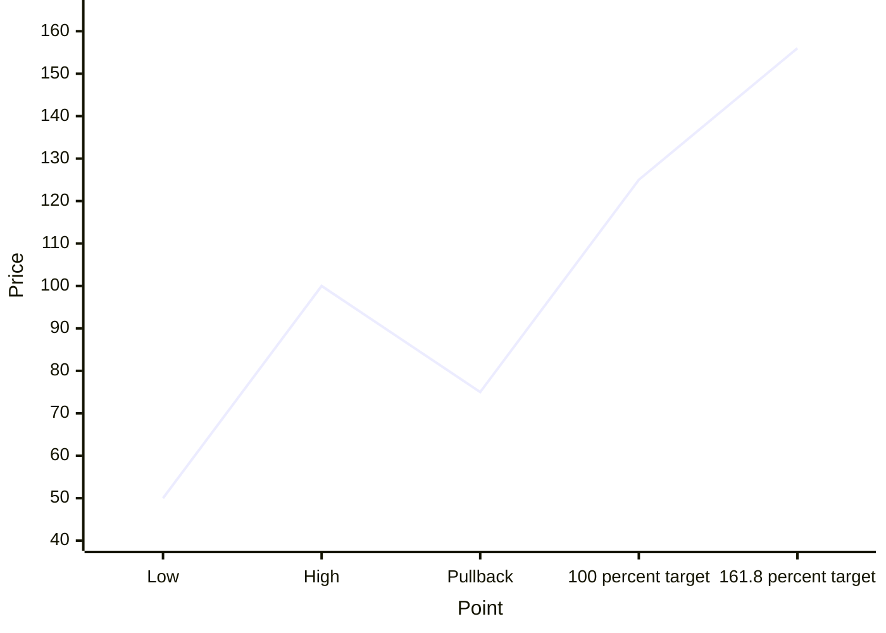

Fibonacci levels are likely areas, not guarantees. Trust a level more when it lines up with an old support or resistance or a moving average.

---

## 10. Oscillators

An oscillator is an indicator that swings between two limits. It shows whether a recent move is stretched. An extreme high reading is called **overbought**. An extreme low reading is called **oversold**. These are emotional extremes of the crowd.

### The three oscillators used in this course

- **RSI (Relative Strength Index).** Moves between 0 and 100. It compares the size of recent up-closes with recent down-closes, usually over 14 periods. Above 70 is often called overbought, and below 30 oversold. For trend trading, this course also uses 60 and 40. Above 60 shows bullish momentum, and below 40 shows bearish momentum. Between 40 and 60 is neutral.
- **Stochastic.** Moves between 0 and 100. It shows where the close sits inside the recent high-to-low range. It has two lines, a fast line and a slow line. When the fast line crosses above the slow line from below 20, that is a positive crossover. When it crosses below from above 80, that is a negative crossover.
- **MACD (Moving Average Convergence Divergence).** The difference between a fast and a slow EMA, usually 12 and 26. A 9-period average of that line is the signal line. The bars showing the gap between the two lines are the histogram.
  - MACD above zero means the short-term trend is up. Below zero means it is down.
  - MACD line crossing above its signal line is a positive crossover. Crossing below is a negative crossover.
  - The slope of the MACD, or of its histogram, shows whether momentum is growing or fading. Lesson 2 uses the slope on the slower chart as the direction filter.

```levels
title: RSI zones used in this course
band: 70 100 | Overbought | warn
band: 60 70 | Bullish momentum | good
band: 40 60 | Neutral | neutral
band: 30 40 | Bearish momentum | bad
band: 0 30 | Oversold | info
100 | RSI 100
70 | RSI 70
60 | RSI 60
40 | RSI 40
30 | RSI 30
0 | RSI 0
```

### How to use them without getting hurt

- **In a sideways market,** oscillators work well. Buy near support when the stochastic or RSI turns up from oversold. Sell near resistance when it turns down from overbought.
- **In a strong trend,** an oscillator can stay overbought for weeks in an uptrend, or oversold for weeks in a downtrend. Selling only because RSI is above 70 in a strong uptrend is a common and expensive mistake.
- **With the trend,** the best buy signal is an oscillator turning up from oversold during a pullback in an uptrend. The best sell signal is an oscillator turning down from overbought during a rally in a downtrend.

---

## 11. Divergence

Price and oscillators usually move together. When they disagree, it is called **divergence**, and it often appears near turning points.

- **Bullish divergence.** Price makes a lower low, or an equal low, but the oscillator makes a higher low. Selling pressure is weakening even though price looks weak.
- **Bearish divergence.** Price makes a higher high, or an equal high, but the oscillator makes a lower high. Buying pressure is weakening even though price looks strong.

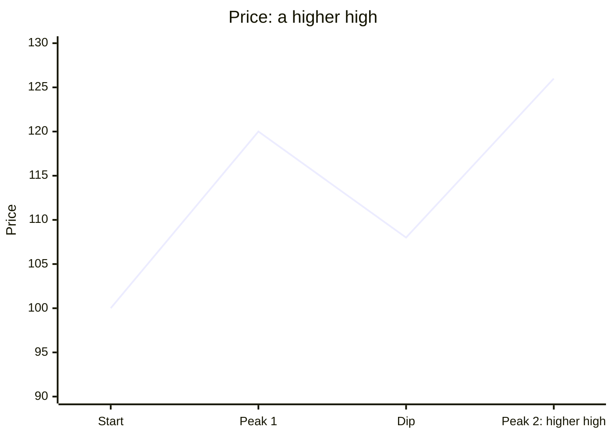

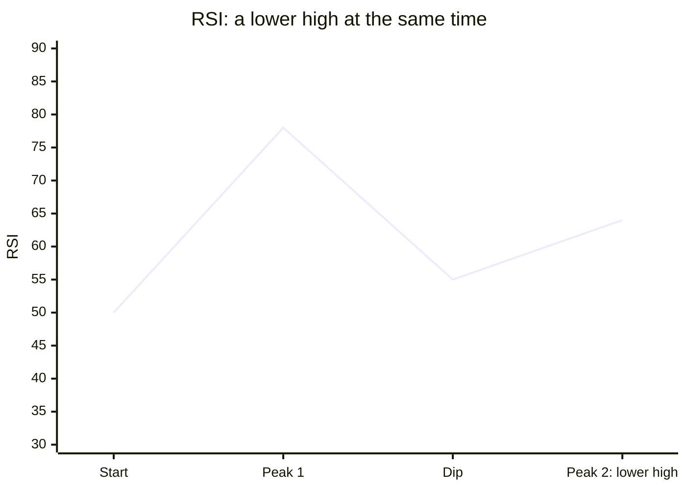

**Number example.** A stock peaks at 200 with RSI at 78. It dips, then makes a new high at 206, but RSI peaks only at 64. Price rose, but momentum did not follow. That is bearish divergence. It is not a sell signal by itself. It is a warning to tighten the stop, and to sell if a bearish reversal candle or a break of support follows.

Divergence is most useful:

- In the direction of the bigger trend. A bullish divergence at a pullback low inside an uptrend is a strong buy clue.
- At a major support or resistance level.
- Together with a reversal candle or pattern.

A divergence against the main trend, for example a bearish divergence inside a strong uptrend, is only a reason to be watchful. It is not a reason to sell short.

Step 5 adds a second kind, called reverse divergence, which helps find the end of a correction.

---

## Practice

1. Which two statements explain a rising market? (a) There are more buyers than sellers. (b) Buyers are more eager than sellers. (c) Sellers are nervous and want a higher price before they sell. (d) More shares are bought than sold.
2. A stock's swing highs are 80, 88, and 86, and its swing lows are 70, 76, and 74. What is the trend?
3. A stock rises from 200 to 300. Where are the 38.2, 50, and 61.8 percent retracement levels?
4. Price makes a new high, but RSI makes a lower high. What is this called, and what should you do?
5. The 5 EMA is above the 13 EMA, but the 13 EMA is below the 26 EMA, and all three lines are flat. Should you use a crossover signal here?

### Answers

1. (b) and (c). Every trade has one buyer and one seller, so (a) and (d) are always equal and cannot explain the move.
2. The last high (86) is lower than the one before (88), and the last low (74) is lower than the one before (76). The uptrend has broken, and price may be turning sideways or down. Wait for more structure.
3. The move is 100. 38.2 percent gives about 262, 50 percent gives 250, and 61.8 percent gives about 238.
4. It is bearish divergence. Treat it as a warning. Tighten your stop on a long, and look for a bearish candle or a support break before selling.
5. No. The averages are not stacked and they are flat, so the market is sideways. Crossovers give false signals in a sideways market.
