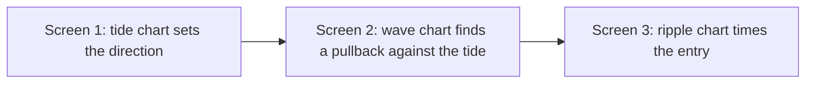
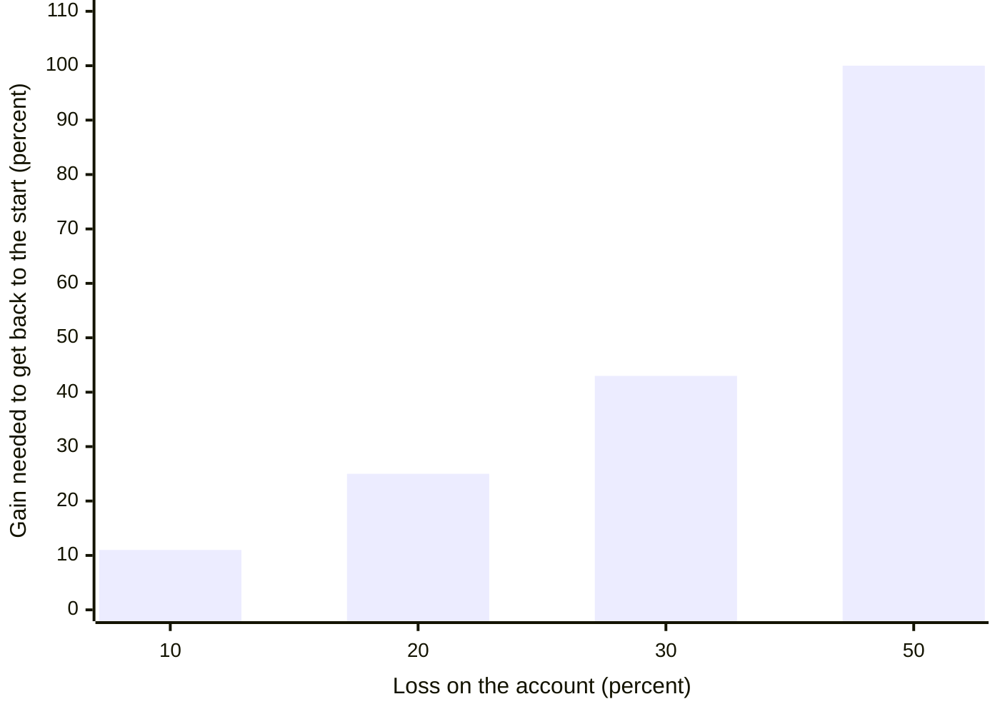

# Method, Risk, and Mindset

A good pattern does not make a good trader. What keeps you in the game is a method you repeat, a loss limit you never break, and the calm to follow both. This lesson turns the tools from lesson 1 into a complete decision process.

---

## 1. Myths that cost traders money

| Myth | What is actually true |
|---|---|
| "I lose because I do not know the secret." | There is no secret. Most losses come from breaking simple rules: no stop, too large a position, or trading against the trend. |
| "Only very clever people make money." | Discipline matters more than intelligence. A simple method followed every time beats a clever one followed sometimes. |
| "Successful traders are just lucky." | Luck evens out over hundreds of trades. Skill and risk control decide the result. |
| "I would win if I had a bigger account." | A bigger account just loses faster if the method is poor. Learn with small size first. |
| "A good system will trade for me." | Every system has losing runs. Only a trader who understands it will keep following it through those runs. |
| "Price follows the company's results." | Over years, results matter. Over weeks, price follows the balance of buyers and sellers. The chart shows that balance first. |
| "This famous company always makes money." | Any stock can fall for years. Loyalty to a name is not a plan. |
| "I have to trade full time." | Swing trading on daily charts takes a few minutes a day. Full-time day trading is harder, not easier. |
| "The market will be fair to me." | The market is full of skilled people trying to take the other side of your trade. Protect yourself first. |
| "Trading is a fair game where winners take what losers lose." | After brokerage, taxes, and slippage, winners collect less than losers give up. Being slightly better than average is not enough. |

### Habits that fill a portfolio with losers

- **Buying because it looks cheap.** A falling stock can keep falling. Let the chart show that the fall has ended.
- **Adding to a losing position.** "Averaging down" puts good money after bad. Add only to winners, and only at a new setup.
- **Staying loyal.** Holding a loser because you like the company. Sell when the chart says sell.
- **Acting on tips and news.** By the time news is public, the chart has usually moved. Follow the chart.
- **Being brave.** Trying to catch the exact bottom of a crash. Wait for the reversal to be confirmed.

---

## 2. The three parts of a trading plan

A trading plan has three parts. All three must be in place.

1. **Method.** How you find a trade: which charts, which setups, which entry, stop, and target.
2. **Money.** How much you risk per trade and per month, so no losing run can end your trading.
3. **Mind.** How you control fear, greed, and hope, so you actually follow the method and the money rules.

Most beginners spend all their time on the method. Experienced traders say money and mind decide more of the result.

---

## 3. The method: three screens

Markets move in three waves at once, like the sea. The **tide** is the long trend. A **wave** is a medium move, often against the tide. A **ripple** is a short move inside the wave. The three-screen method looks at one chart for each, in that order.



| Screen | Chart for a swing trader | Chart for a day trader | Question it answers | Tool |
|---|---|---|---|---|
| 1. Tide | Weekly | One hour | Which way is the main trend? | Structure, and the slope of MACD or its histogram |
| 2. Wave | Daily | 15 or 10 minutes | Is there a pullback against the tide that is ending? | Oscillator turning back toward the tide |
| 3. Ripple | Hourly | 3 or 2 minutes | Where exactly do I enter? | A break of a small high or low in the tide's direction |

Keep the charts about five times apart in time.

**How it works in an uptrend.** The weekly MACD is rising, so you only look for longs. On the daily chart you wait for a pullback, where the stochastic or RSI dips toward oversold and then turns up. On the hourly chart you buy when price breaks above the last small swing high. The stop goes below the pullback low.

**How it works in a downtrend.** It is the mirror image. The weekly MACD is falling, so you only look for shorts. On the daily chart you wait for a rally where the oscillator reaches overbought and turns down. On the hourly chart you sell when price breaks below the last small swing low.

The MCX Intraday Breakout Playbook in this repository uses the same idea with one hour, 30 minutes, and 15 minutes.

### The first gate: both slower screens must agree

Before looking at any candle pattern, check the tide and the wave. Choose a side only when both agree.

| Tide chart (monthly or weekly for a swing trade) | Wave chart (weekly or daily) | Your side |
|---|---|---|
| Trend indicator rising, or flattening after a fall. Structure is up. | Oscillator gives a buy signal | Long only |
| Trend indicator falling, or flattening after a rise. Structure is down. | Oscillator gives a sell signal | Short only |
| Any other combination | | No trade yet |

Also look at the chart with your own eyes. If the trend is not obvious to you, the indicator reading is not enough.

---

## 4. The two-screen decision checklist

Once both screens agree, this checklist decides whether the trade is good enough. The row numbers make it easy to use on paper.

| # | Check | Buy side | Sell side |
|---|---|---|---|
| 1 | Candle pattern at the right place | A bullish candle or pattern near support: strong green candle, bullish engulfing, piercing, hammer at a low, morning star | A bearish candle or pattern near resistance: strong red candle, bearish engulfing, dark cloud, shooting star at a top, evening star, hanging man confirmed by a red candle |
| 2 | Volume on the key candle | Green candle with volume above the recent average | Red candle with volume above the recent average |
| 3 | Short-term average | 5 EMA crossed above the 13 or 26 EMA within the last three candles | 5 EMA crossed below the 13 or 26 EMA within the last three candles |
| 4 | Chart pattern | Inverse head and shoulders, double bottom, rounding bottom or cup and handle, flag breakout, failed breakdown | Head and shoulders, double top, rounding top, flag breakdown, failed breakout |
| 5 | Pullback depth, for a continuation trade | Up to 50 percent is healthy. 61.8 percent or deeper: be careful. | Same |
| 6 | Divergence | Bullish divergence supports a long. Bearish divergence is a warning against it. | Bearish divergence supports a short. Bullish divergence is a warning against it. |
| 7 | Stop-loss | Below the candle where the oscillator turned up, or below the middle of the high-volume key candle, and below the nearest support | Above the candle where the oscillator turned down, or above the middle of the high-volume key candle, and above the nearest resistance |
| 8 | Target | The chart pattern's measured target, or the next major resistance | The chart pattern's measured target, or the next major support |
| 9 | Reward compared with risk | At least 2 to 1, and 3 to 1 is better | Same |

Notes on the checklist:

- **Row 3 is skipped for a reversal pattern.** A morning star, evening star, double bottom, or double top happens before the averages turn. Do not demand a crossover there.
- **If no pattern shows on your chart,** look one timeframe higher or lower. A pattern on the daily chart can be invisible on the weekly chart.
- **Row 7 needs the most care.** A stop is not a random number of points. It goes at the price where your idea is proven wrong.

---

## 5. Entry, stop, target, and exit

### Think about the loss first

Before you think about profit, decide where you are wrong. Only then work out the target, and check whether the trade is worth it.

- **Reward** = target − entry for a long, or entry − target for a short.
- **Risk** = entry − stop for a long, or stop − entry for a short.
- **Reward compared with risk** = reward ÷ risk.

Take the trade only if all of these are true:

1. Reward compared with risk is at least 2 to 1. Many traders insist on 3 to 1.
2. The market is liquid enough that you can get out quickly.
3. Nothing in your analysis points the other way. If you want to buy, no tool you use should be giving a sell signal.

**Number example.** Entry 200. Stop 194. Target 218. Risk is 6, and reward is 18. Reward compared with risk is 3 to 1, so the trade qualifies. If the target were only 206, reward would be 6 and the ratio 1 to 1, so you would pass.

```levels
title: Entry 200, stop 194, target 218. Reward 18 ÷ risk 6 = 3, so the trade qualifies
band: 200 218 | Reward 18 | good
band: 194 200 | Risk 6 | bad
218 | Target | | good
200 | Entry | | info
194 | Stop | | bad
```

If there is no clear pattern to give a target, use the next major support or resistance. If even that is unclear, skip the trade.

### Where to put the stop

First find the nearest support, or resistance for a short. Then find the next one beyond it. The stop goes just beyond one of them. Common cases:

| Setup | Stop for a long (mirror it for a short) |
|---|---|
| Breakout above resistance | Below the breakout candle's low, or below its midpoint if the candle is very large |
| Double bottom | Below the confirmation candle's low or midpoint, or below the second bottom |
| Inverse head and shoulders | Below the midpoint of the confirmation candle, or below the right shoulder |
| Three-screen pullback signal | Below the low of the candle pattern that gave the signal |

The stop must come from the chart. Never move it further away just to avoid a loss.

### Exits

- **Do not rush out just because the target is reached.** If the trend is still strong, keep part of the position and trail the stop.
- **Trail the stop.** As price moves your way, move the stop behind each new swing low (for a long) or swing high (for a short), or behind a short EMA such as the 13.
- **Exit signals:**
  - The stop or trailing stop is hit
  - A moving average crossover against you, such as the 5 EMA crossing below the 13 EMA in a long
  - A reversal pattern at a major level
  - The reason you entered no longer exists
- **Exit without emotion.** Cash is safe. You can always buy again later, but only if you still have money.

---

## 6. Money rules: position size and loss limits

### Risk per trade

Never risk more than **2 percent of your trading capital** on one trade. Many careful traders use 1 percent. Risk here means the money you lose if the stop is hit, not the value of the position.

**Position size formula**

```text
Quantity = (Capital × Risk %) ÷ (Entry − Stop)
```

**Number example.** Capital is 5,00,000 rupees. Two percent is 10,000 rupees. Entry is 500 and the stop is 480, so the risk per share is 20. Quantity is 10,000 ÷ 20 = 500 shares. If the stop were 490 instead, you could hold 1,000 shares for the same 10,000-rupee risk.

For futures, divide the rupee risk by the loss per lot at your stop. If the lot size makes even one lot too risky, skip the trade or use a smaller contract.

### Loss limit per month

- Set a maximum monthly loss of 6 to 10 percent of capital. Day traders often use 8 percent.
- If you hit it, stop trading for the rest of the month.
- If you lose four trades in a row, stop and review. Either your reading is off or the market has changed.
- If you hit the monthly limit three months in a row, stop trading with real money. Go back to paper trading until your results change.

**Why the limits are strict.** A loss needs a bigger gain to win it back. If 1,00,000 rupees falls 50 percent to 50,000, you need a 100 percent gain just to return to 1,00,000.



Small losses are easy to recover. Big ones are not. That is why each trade risks only 1 to 2 percent, and why trading stops at the monthly limit.

### Portfolio rules for investors

- A common rule of thumb is to keep about (100 − your age) percent of your long-term savings in equities. A 30-year-old would keep about 70 percent.
- Hold about 5 to 15 positions. Fewer is too concentrated. More is too many to watch.
- Put about 8 to 20 percent of the portfolio in each position.
- Keep each position's stop-loss risk below 2 percent of the whole portfolio.

### Rules that protect you from yourself

- The stop comes from the chart, not from how much you are willing to lose. If the chart stop is too far away for a 2 percent risk, trade fewer shares. Do not tighten the stop to a meaningless price.
- Do not increase your risk after a winning streak. Overconfidence is expensive.
- Take some profit out of the trading account regularly.
- Expect small wins, small losses, and a few big wins. Not every trade will be a big winner.

---

## 7. Mindset

You cannot control the market. You can control four things:

1. When you enter
2. When you exit
3. How much you risk
4. How much capital you keep safe

Pressure makes traders break rules. Common self-made pressures:

- "I must win this trade."
- "I need quick money."
- "I want to quit my job and trade full time."
- "I want to double my account this year."
- Trading with borrowed money

If you notice these thoughts, reduce your size or stop trading until they pass.

### Mindset rules

- Do not count profit on an open trade. It is not yours until you exit.
- Let winners run. Do not jump off a trend that is still moving.
- Do not add to a loser. Ever.
- A missed trade costs nothing. A forced trade usually costs money.
- If you do not understand what the market is doing, do nothing.

---

## 8. Rules of the game

1. Follow what the market is doing, not what you want it to do.
2. Trade with the trend. Get on the train going your way.
3. Do not try to catch a falling knife. Let the chart confirm the bottom before you buy.
4. Do not buy something only because it looks cheap. The market decides what is cheap.
5. Follow the chart, not the headlines. When a story is on every front page, most of the move has usually happened.
6. Treat tips with suspicion. Use them only as a reason to look at the chart.
7. Honor your stop every time, without arguing with it.
8. Do not let a good profit turn into a loss. Move the stop to break-even once the trade has moved well in your favor.
9. Do not let a short-term trade become a long-term investment because it is losing.
10. Study more and trade less. Be a sniper: wait for the clear shot.
11. The crowd is often wrong at extremes. The market is never wrong. Opinions often are.
12. Always read at least two timeframes before you decide.
13. The habit of managing money matters more than the amount you start with.

---

## 9. Building your own method

1. **Choose your style.** Swing trading on daily charts, or day trading on intraday charts. Pick the one that fits your time and temperament.
2. **Choose a few setups.** Two or three setups you understand well are better than twenty you half understand. Step 2 to Step 5 give you the choices.
3. **Write the rules down.** Location, trigger, stop, target, and exit, for each setup.
4. **Set your money rules.** Risk per trade, monthly limit, maximum positions.
5. **Test.** Scroll through old charts, then paper trade, then trade small.
6. **Journal every trade.** Keep it short:

```text
Date:              Market:            Timeframe:
Setup:             Long / Short:
Entry:             Stop:              Target:
Reward:risk:       Quantity:          Money at risk:
Why I took it:
Result:            Exit reason:
Did I follow my rules?   Yes / No     Which rule did I break?
Screenshot saved?  Yes / No
```

Every experienced trader says the same thing: they lose money when they break their own rules. So follow the rules, and keep the discipline.

---

## Practice

1. Your capital is 2,00,000 rupees and you risk 1 percent per trade. Entry is 150 and the stop is 146. How many shares can you buy?
2. The weekly MACD is falling and the daily stochastic has just given a buy signal. Do you buy?
3. Entry is 1,000, stop 980, target 1,030. Does the trade pass a 2 to 1 filter?
4. You have lost four trades in a row this week. What should you do?
5. Why is "the stock has fallen 60 percent, so it must be cheap" not a buy signal?

### Answers

1. One percent of 2,00,000 is 2,000 rupees. Risk per share is 4. Quantity is 2,000 ÷ 4 = 500 shares.
2. No. The tide is down and the wave is giving a buy signal, so the two screens disagree. Wait until they agree, or look for a short when the daily oscillator turns down again.
3. Risk is 20 and reward is 30, so the ratio is 1.5 to 1. It fails a 2 to 1 filter, so skip it or find a better entry.
4. Stop trading and review the four trades. Check location, confirmation, and trend direction. Resume only when you know what went wrong.
5. Price can keep falling. A big fall alone is not proof that selling has ended. Wait for a reversal pattern, a higher low, or a break above resistance.
