# Reversal Patterns

A reversal pattern shows a trend losing strength and the other side taking over. Almost every reversal pattern has the same three stages: the trend fails to make progress, a key support or resistance line forms, and price finally breaks that line.

---

## Head and shoulders top

`Bearish reversal` · `Chart pattern` · `Core`

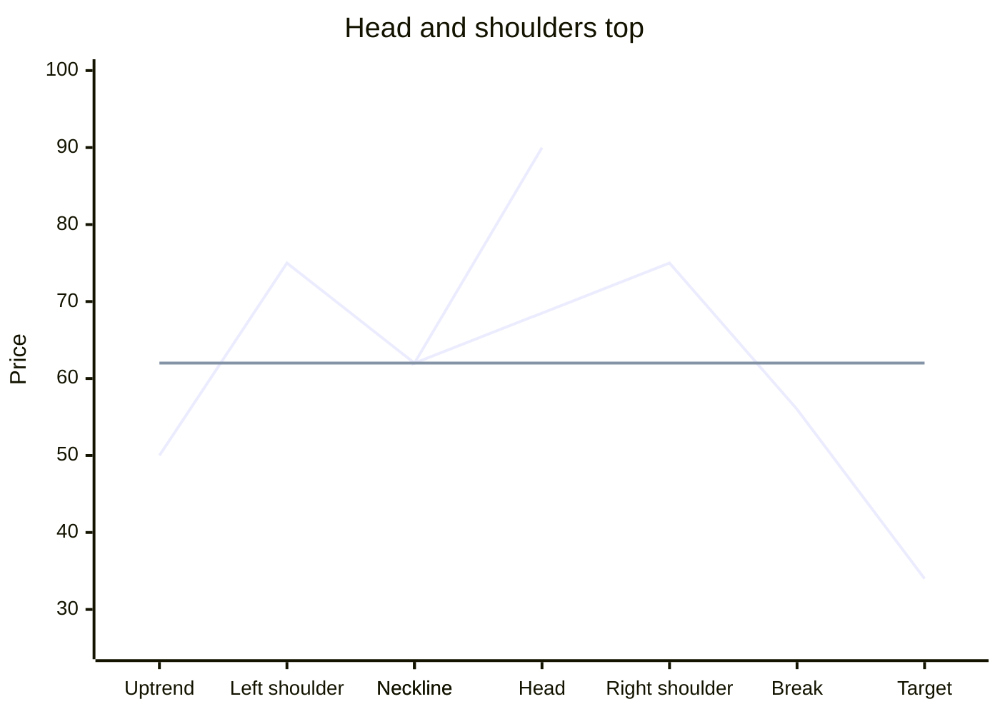

**Story.** In an uptrend, price makes a peak (left shoulder), pulls back, then makes a higher peak (head). The pullback from the head goes back to about the same level as the first pullback. Price rallies again, but this time it fails below the head (right shoulder). Buyers could not make a new high. When price falls below the line joining the two pullback lows, called the **neckline**, the uptrend has made a lower high and a lower low. It is over.

**Where it counts.** After a clear uptrend. The two shoulders should look roughly similar in height and width. Volume is often highest on the left shoulder or the head, and lighter on the right shoulder, which shows buyers losing interest.

**Trigger, stop, and target.**

- **Trigger.** A close below the neckline. Do not sell short in anticipation while the right shoulder is still forming. Many "head and shoulders" never break the neckline.
- **Second entry.** Price often rallies back to the neckline from below and fails there. That retest is a safer entry with a closer stop.
- **Stop.** Above the right shoulder's high. A tighter stop goes above the breakdown candle's high, or above the neckline after a failed retest.
- **Target.** Measure from the top of the head straight down to the neckline. Subtract that distance from the breakout point.

**Checklist**

- [ ] A clear uptrend came before it
- [ ] Three peaks, with the middle peak highest
- [ ] Shoulders roughly balanced in height and time
- [ ] Volume lighter on the right shoulder than the left or the head
- [ ] Daily or hourly close below the neckline
- [ ] The higher timeframe is not in a strong uptrend (see "When it fails")

**Number example.** A stock rises to 120 (left shoulder), dips to 100, rises to 140 (head), dips to 101, and rallies to 122 (right shoulder). The neckline is about 100. The head is 40 above the neckline, so the target is 100 − 40 = 60. Price closes at 98. Sell at 98, stop at 123, target 62 (a little inside the full target). Risk is 25, reward is 36.

**When it fails.** Price breaks the neckline, then rises back above the right shoulder. This is a **failed head and shoulders**, and it often leads to a strong move up, because every short seller is trapped. It happens most often when the bigger trend is still strongly up, for example when the weekly chart's moving averages are rising steeply while the daily chart shows the pattern. Step 5 teaches how to trade the failure.

**Chart hunt.** Look at the daily chart of any large index in the months before a known market top. Find a pattern with a clear neckline, and measure whether the target was reached.

---

## Inverse head and shoulders

`Bullish reversal` · `Chart pattern` · `Core`

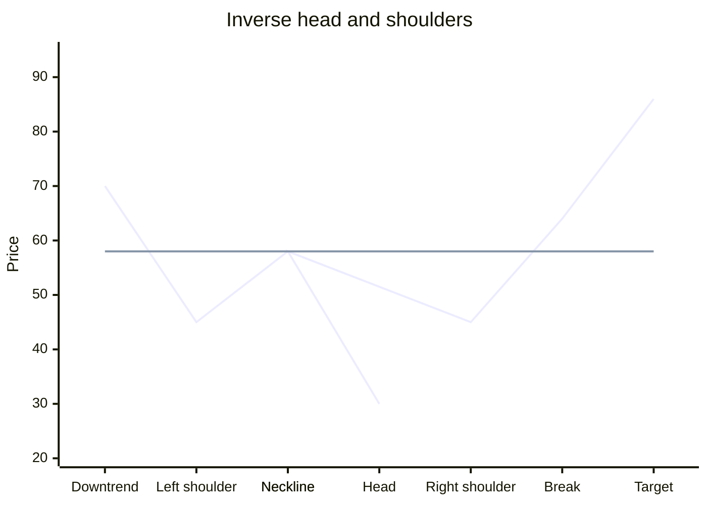

**Story.** The mirror image of the top. In a downtrend, price makes a low (left shoulder), bounces, makes a lower low (head), bounces to about the same level, then makes a higher low (right shoulder). Sellers could not make a new low. A close above the neckline confirms the turn.

**Where it counts.** After a clear downtrend. Volume often shrinks on the right shoulder and expands on the neckline break. A breakout with strong volume is much more trustworthy.

**Trigger, stop, and target.**

- **Trigger.** A close above the neckline, ideally on above-average volume.
- **Second entry.** A pullback to the neckline that holds, followed by a bullish candle.
- **Stop.** Below the right shoulder's low, or below the midpoint of the breakout candle for a tighter stop.
- **Target.** The distance from the bottom of the head to the neckline, added to the breakout point.

**Checklist**

- [ ] A clear downtrend came before it
- [ ] Three troughs, with the middle trough lowest
- [ ] Right shoulder low is above the head
- [ ] Close above the neckline, preferably on above-average volume
- [ ] Room to the target without a major resistance in the way

**Number example.** A commodity falls to 4,800 (left shoulder), bounces to 5,100, drops to 4,500 (head), bounces to 5,080, and dips to 4,820 (right shoulder). The neckline is about 5,100. The head is 600 below it, so the target is 5,700. Price closes at 5,140 on high volume. Buy at 5,140, stop at 4,960 (the breakout candle's midpoint area, which sits above the right shoulder), target 5,650. Risk is 180, reward is 510.

**When it fails.** Price breaks above the neckline, then falls back below the right shoulder. Exit. The downtrend has resumed.

**Chart hunt.** Look at a weekly chart of a major stock index around a well-known bear market bottom. Find the three troughs and check whether the head was the lowest point of the whole fall.

---

## Double top

`Bearish reversal` · `Chart pattern` · `Core`

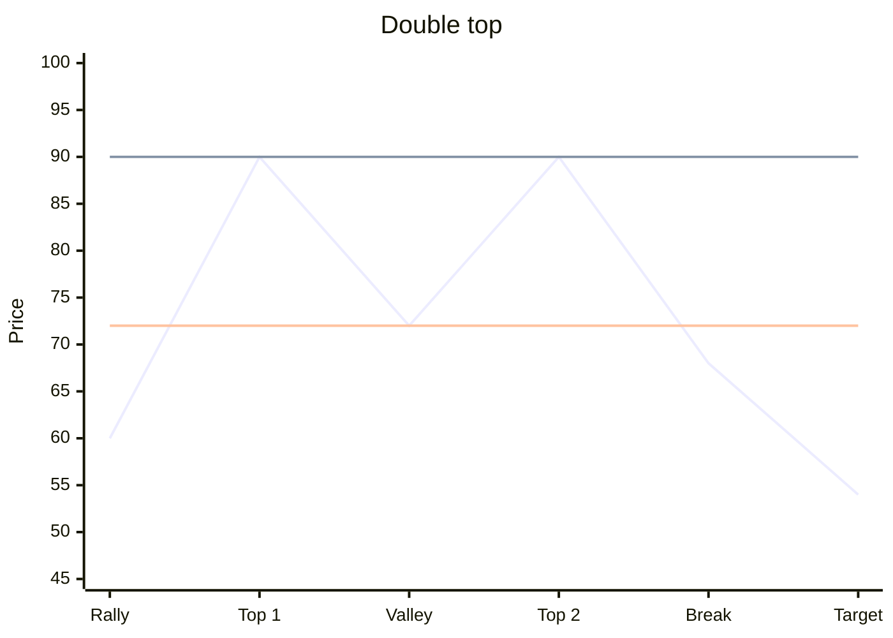

**Story.** In an uptrend, price makes a high, pulls back to a valley, and rallies back to about the same high. Buyers fail at the same price twice. When price falls below the valley low, the uptrend has made a lower low, and the pattern is complete. Because of its shape, it is also called an "M" top.

**Where it counts.** After a clear uptrend. The two tops should be separated by a meaningful pullback, not just a few candles. Watch for bearish candles at the second top: a shooting star, a bearish engulfing, or a doji followed by a red candle. Also look for bearish divergence, where RSI or MACD makes a lower high at the second top.

**Trigger, stop, and target.**

- **Trigger.** A close below the valley low.
- **Early trigger with a tight stop.** At the second top, a clear bearish candle forms, and price breaks below that candle's low. The stop goes above that candle's high. This candle is the **decisive candle**: its extreme is the price sellers defended.
- **Stop.** Above the higher of the two tops.
- **Target.** The height from the tops to the valley, subtracted from the valley.

**Checklist**

- [ ] A clear uptrend came before it
- [ ] Two tops at about the same level, a clear valley between
- [ ] Bearish candle or divergence at the second top
- [ ] Close below the valley low, ideally on higher volume

**Number example.** A stock rises to 500, falls to 450, and rises to 502. At 502 a bearish engulfing forms, and RSI peaks lower than at 500. Price falls and closes at 447, below the valley. The height is 50, so the target is 400. Sell at 447, stop at 505, target 405. Risk is 58, reward is 42. The ratio is poor at the breakdown, so a better plan is to wait for a retest of 450 to 455 and sell there with a stop at 475.

### Double top with a false breakout

Sometimes the second top pokes slightly above the first, pulling in breakout buyers, and then fails and falls back below the first top. This is a strong version of the pattern, because new buyers are trapped above the old high. The stop goes above the false-breakout high. Step 4 covers false breakouts in detail.

**Real case.** Bitcoin made a high near 64,000 dollars in April 2021 and a slightly higher high near 69,000 dollars in November 2021. Momentum indicators on the weekly chart were weaker at the second high. The main low between the two tops was near 29,000 to 30,000 dollars, set in mid-2021. Bitcoin fell below that area in 2022 and kept falling. On a weekly chart this is a double top with a slightly higher second top, which is the false-breakout version.

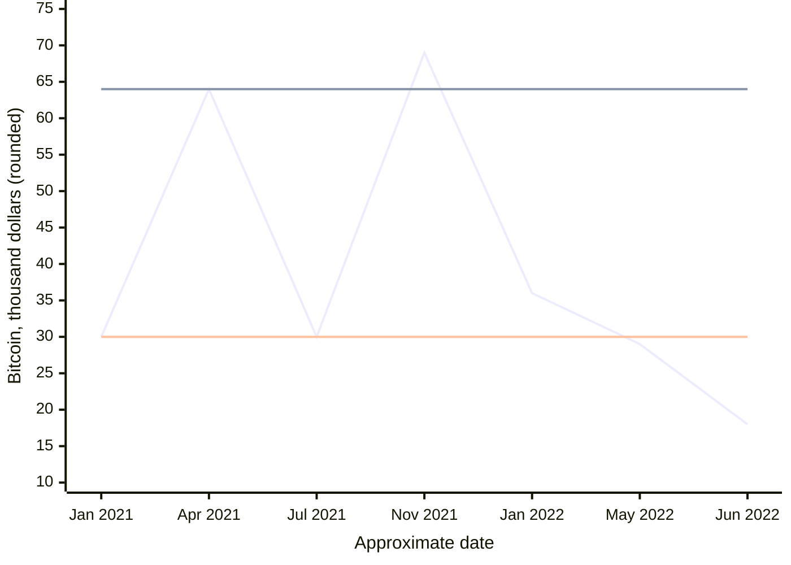

The upper flat line is the first top near 64,000. The November high pokes above it and fails. The lower flat line is the low between the tops, near 30,000. The break below it in 2022 completed the pattern. The values are rounded to show the shape.

**When it fails.** Price rallies back above both tops and closes there. The uptrend has resumed, often with force.

---

## Double bottom

`Bullish reversal` · `Chart pattern` · `Core`

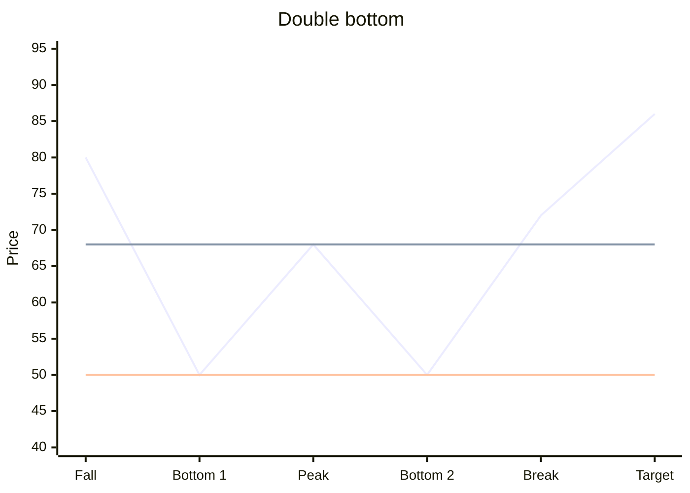

**Story.** In a downtrend, price makes a low, bounces to a peak, and falls back to about the same low. Sellers fail at the same price twice. When price rises above the peak between the two bottoms, the downtrend has made a higher high. It is also called a "W" bottom.

**Where it counts.** After a clear downtrend. Look for bullish candles at the second bottom (hammer, bullish engulfing, morning star) and for bullish divergence, where RSI or MACD makes a higher low at the second bottom. Volume is often lighter at the second bottom and heavier on the breakout.

**Trigger, stop, and target.**

- **Trigger.** A close above the peak between the bottoms.
- **Early trigger.** At the second bottom, a bullish candle forms, and price breaks above that candle's high. The stop goes below that candle's low.
- **Stop.** Below the lower of the two bottoms, or below the midpoint of the breakout candle.
- **Target.** The height from the bottoms to the peak, added to the peak.

**Checklist**

- [ ] A clear downtrend came before it
- [ ] Two bottoms near the same level, a clear peak between
- [ ] Bullish candle or divergence at the second bottom
- [ ] Close above the peak, ideally on higher volume

**Number example.** A stock falls to 80, rallies to 95, and falls to 81. At 81 a hammer forms, and RSI makes a higher low. Price later closes at 96, above 95, on strong volume. The height is 15, so the target is 110. Buy at 96, stop at 88 (below the breakout candle's midpoint area), target 109.

**When it fails.** Price rises above the peak, then falls back below both bottoms. The downtrend has resumed.

**Chart hunt.** On a weekly commodity chart, find a double bottom after a long fall. Check whether the second bottom had bullish divergence on RSI.

---

## Triple top and triple bottom

`Reversal` · `Chart pattern` · `Useful`

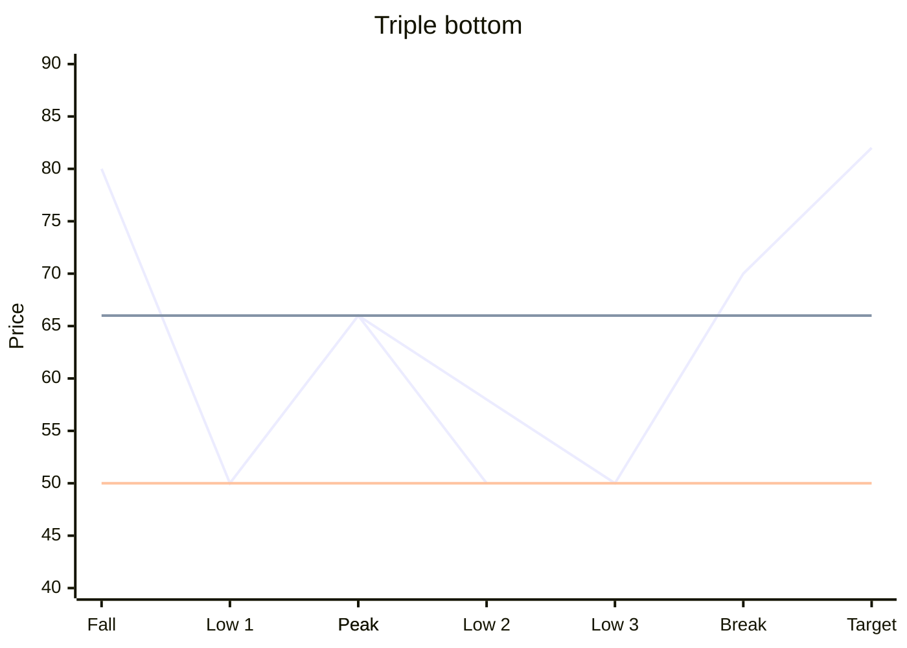

**Story.** Like the double patterns, but price tests the same level three times. A triple bottom shows sellers failing three times at the same support. A triple top shows buyers failing three times at the same resistance. The breakout line joins the peaks, or valleys, between the tests.

**Where it counts.** After a trend. It takes longer to form, so it usually comes before a larger move.

**Trigger, stop, and target.** A close beyond the line joining the two intermediate peaks, or valleys. The stop goes beyond the tested level. The target is the pattern's height projected from the breakout.

**Number example.** A stock holds 300 three times over four months, bouncing to 340 in between. It closes at 345. Buy at 345, stop at 318, target 385.

**Real case.** In the middle of 2021, Bitcoin found support near 29,000 to 30,000 dollars three times: in May, in June, and in July. Each fall stopped in that area. It then rose above its earlier bounce highs and reached about 50,000 dollars by early September 2021. On a daily chart this is a triple bottom.

**When it fails.** A fourth test that closes through the level. Repeated tests can also wear a level down. Many traders become more cautious after the third test.

---

## Rounding top and rounding bottom

`Reversal` · `Chart pattern` · `Useful`

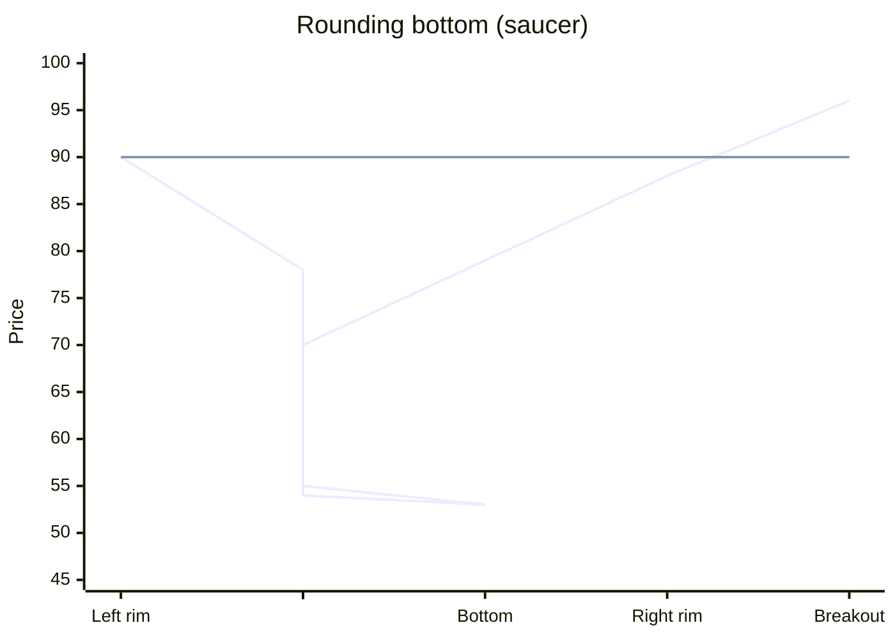

**Story.** A slow, curved turn. In a rounding bottom, a decline loses speed. Big red candles appear with no strong follow-through, and then the candles get smaller and mixed. Sellers are quietly running out while buyers slowly take over. The curve bends upward until a strong candle breaks out of the base.

A rounding top is the mirror image. Big green candles with no follow-through turn into small, mixed candles at the top, and the curve bends down.

**Where it counts.** After a long trend, often on weekly charts. Volume usually dries up at the bottom of the curve and rises as price leaves it.

**Trigger, stop, and target.**

- **Rounding bottom.** Buy when a strong breakout candle closes above the sideways range at the bottom, or above the curve's rim. The stop goes below the low of the candles in that range. Target the next major resistance or the pattern's depth added to the breakout.
- **Rounding top.** Sell when a strong breakdown candle closes below the sideways range at the top. The stop goes above the high of the candles in that range.

**Number example.** A stock drifts from 200 down to 150 over five months. For eight weeks it trades between 148 and 158 with small candles. Then a large green candle closes at 162 on twice the average volume. Buy at 162, stop at 147, target 200.

**When it fails.** The breakout candle is followed by a close back inside the base. The base needs more time.

---

## Rising wedge at a top and falling wedge at a bottom

`Reversal` · `Chart pattern` · `Useful`

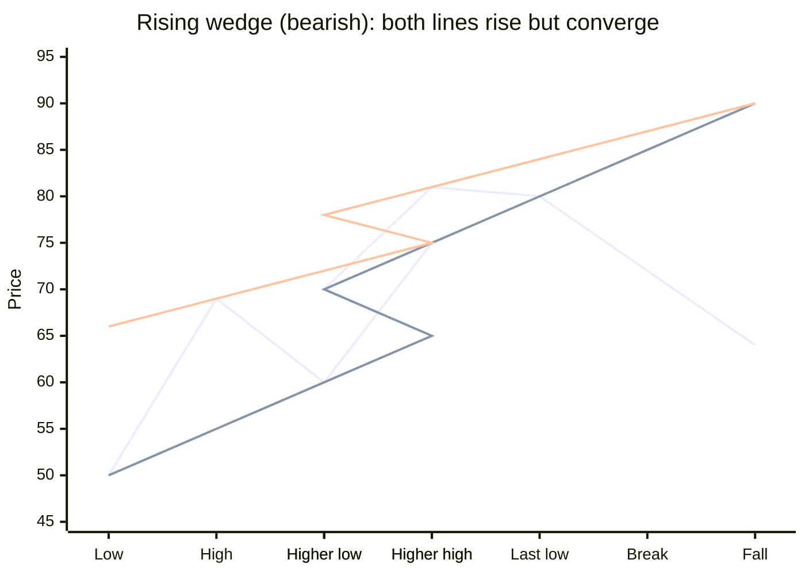

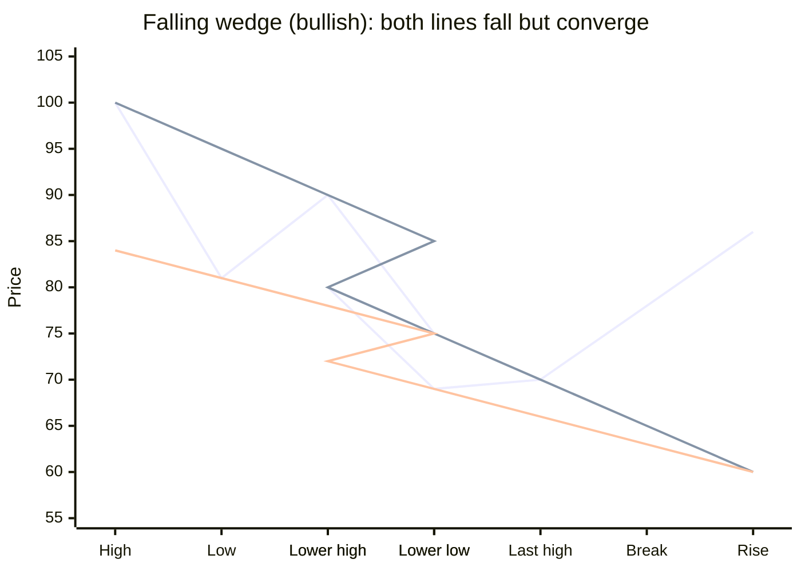

**Story.**

- **Rising wedge.** Price makes higher highs and higher lows, but the highs rise more slowly than the lows. The two lines slope up and converge. Each push higher gains less ground. Buyers are tiring. A break below the lower line often starts a sharp fall.
- **Falling wedge.** Price makes lower highs and lower lows, but the lows fall more slowly. The two lines slope down and converge. Selling is losing force, and a break above the upper line often starts a rise.

**Where it counts.** A rising wedge after an uptrend, as a top. A falling wedge after a downtrend, as a bottom. The same shapes can also form as continuation patterns against the trend, covered in the next lesson.

**Trigger, stop, and target.** Enter on a close beyond the wedge line. The stop goes beyond the last swing inside the wedge. A common target is the start of the wedge, meaning price retraces the whole wedge.

**Number example.** A stock rises from 100 to 140 in a rising wedge. The lower line is at 132 when price closes at 130. Sell at 130, stop at 141, target 105.

**When it fails.** Price breaks the wedge line, then returns inside and makes a new extreme. Divergence on RSI or MACD at the last touch makes the pattern more reliable.

---

## Broadening top and diamond top

`Bearish reversal` · `Chart pattern` · `Advanced`

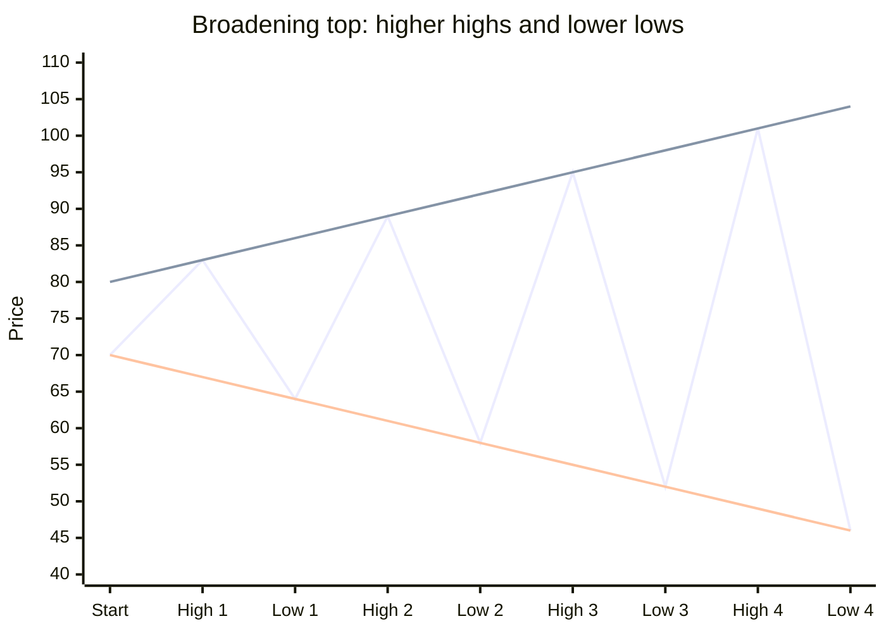

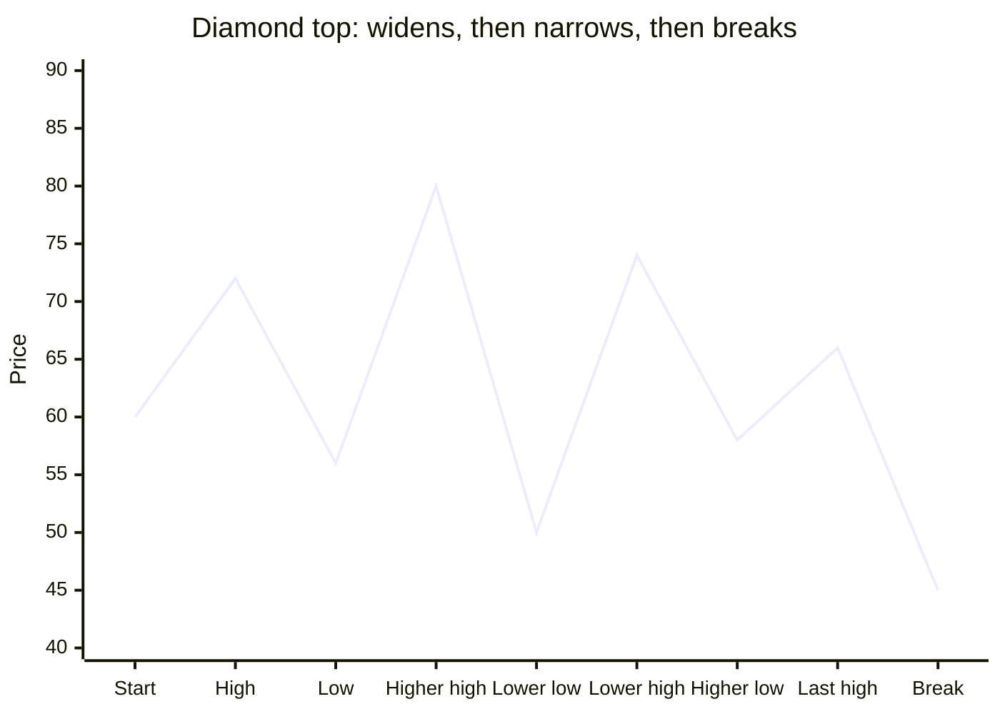

**Story.**

- **Broadening top.** Swings get wider: each high is higher and each low is lower. The market is emotional and out of control. This often happens near the end of a long rise, when late buyers and nervous sellers are both active.
- **Diamond top.** The swings first widen like a broadening top, then narrow like a triangle. The outline looks like a diamond. The final break below the lower right line signals the top.

**Where it counts.** After a long rise, usually on daily or weekly charts. Both are harder to read than other patterns.

**Trigger, stop, and target.** For a diamond, sell on a close below the lower right boundary. The stop goes above the last swing high inside the diamond. The target is the diamond's height at its widest, projected down. For a broadening top, many traders wait for the break of the most recent swing low after a failed new high.

**Number example.** A stock swings 100 to 112, 96 to 118, and 92 to 121. Then it swings narrower, 104 to 114 and 106 to 111, and closes at 103, below the lower right line. The widest height was about 29. Sell at 103, stop at 112, target 78.

**When it fails.** Price breaks out upward from the narrowing part of the diamond.

---

## V-reversal

`Reversal` · `Price shape` · `Useful`

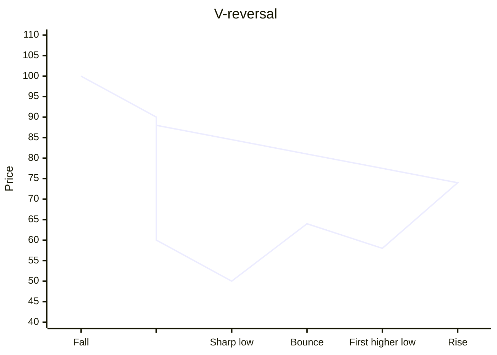

**Story.** A sharp fall is followed by an equally sharp rise, with almost no base. Usually a sudden event or panic drives the fall, and a sudden change drives the recovery. There is no time for a neat pattern.

**Where it counts.** After a fast, emotional move, often with a volume spike at the low.

**Trigger, stop, and target.** A V-reversal is hard to trade at the exact bottom. The practical entry comes later: wait for the first higher low after the bottom, and buy the break above the bounce high that formed it. The stop goes below that higher low. Trail the stop, because V-shaped recoveries can run far.

**Number example.** An index falls from 18,000 to 14,000 in four weeks. It bounces to 15,500, dips to 14,800 (higher low), and closes at 15,600. Buy at 15,600, stop at 14,750, and trail below each new swing low.

**Real case.** In March 2020, stock markets around the world fell sharply. India's Nifty 50 bottomed near 7,511 on 24 March 2020, and the US S&P 500 bottomed near 2,191 on 23 March 2020. Both then rose almost as steeply as they had fallen, with no base. The Nifty 50 was back above 12,000 by November 2020. On a daily chart, both show a V-reversal.

**When it fails.** The first higher low breaks. The bounce was only a relief rally.

---

## Practice

1. A stock forms a head and shoulders pattern, but the price is still above the neckline. Do you sell?
2. The head is at 250 and the neckline at 200. Price breaks the neckline at 198. What is the target?
3. At the second top of a double top, what kinds of evidence make the pattern stronger?
4. What is the difference between a rising wedge and an ascending channel?
5. Why is a V-reversal hard to trade at the exact low?

### Answers

1. No. The pattern is not complete until price closes below the neckline. Many right shoulders become a new rally.
2. The height is 50. The target is 200 − 50 = 150.
3. A bearish candle such as a shooting star or bearish engulfing, bearish divergence on RSI or MACD, lighter volume on the second rally, and a false poke above the first top that fails.
4. In an ascending channel, the two lines are parallel. In a rising wedge, they converge, because the highs rise more slowly than the lows. That shows fading strength.
5. There is no base and no pattern to confirm the turn. The practical entry is the first higher low, after the reversal is already visible.
