# Continuation Patterns

A continuation pattern is a pause inside a trend. Early buyers in an uptrend take some profit, new buyers wait for a better price, and price moves sideways or slightly against the trend. When the pause ends, the trend usually resumes in its original direction. These patterns let you join a trend at a defined price, with a stop just beyond the pause.

---

## Bull flag and bear flag

`Continuation` · `Chart pattern` · `Core`

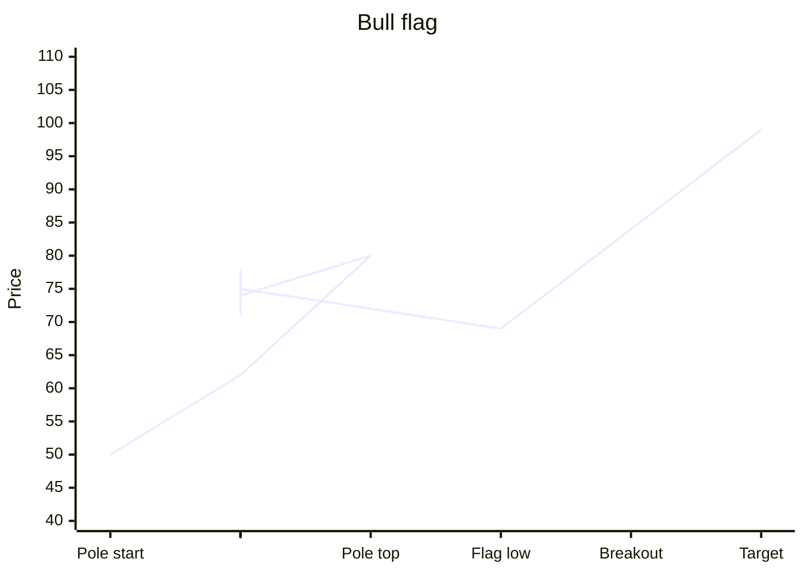

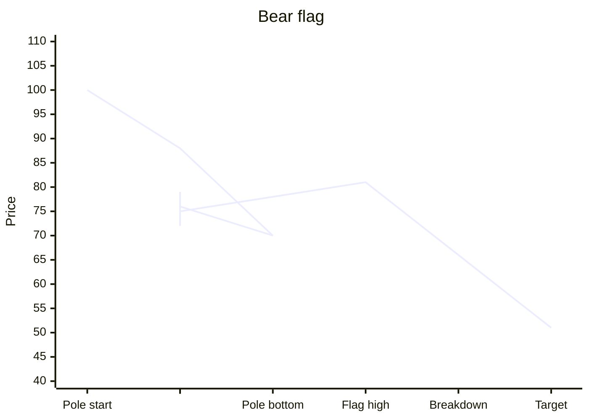

**Story.**

- **Bull flag.** Price shoots up in a strong, almost straight move: the **pole**. It then drifts slightly down or sideways in a small, tidy channel: the **flag**. Buyers are resting, not leaving. When price breaks above the top of the flag, the next leg begins.
- **Bear flag.** Price drops sharply (the pole), then drifts slightly up in a small channel. When it breaks below the flag, the next leg down begins.

**Where it counts.** Inside a clear trend, after a strong pole. The flag should be short compared with the pole, and shallow, retracing less than half of the pole. Volume is usually high during the pole, falls during the flag, and rises again on the breakout.

**Counting dominance inside the flag.** Count the green and red candles in the flag and compare their sizes. In a healthy bull flag, the red candles are small and the pullback is orderly. If big red candles start to dominate, sellers are gaining ground and the flag may fail. The mirror is true for a bear flag.

**Trigger, stop, and target.**

- **Trigger.** A close beyond the flag's boundary in the trend direction.
- **Stop.** Beyond the other side of the flag, meaning below the flag's low for a bull flag.
- **Target.** The length of the pole, added to the breakout point for a bull flag, or subtracted from the breakdown point for a bear flag.

**Checklist**

- [ ] A strong, fast pole came first
- [ ] The flag is short and slopes gently against the pole
- [ ] The flag retraces less than half of the pole
- [ ] Volume falls in the flag and rises on the break
- [ ] Small candles against the trend inside the flag

**Number example.** A stock jumps from 200 to 240 in five days (a 40-point pole). Over the next eight days it drifts down to 228 in a narrow channel. It then closes at 236, above the flag's upper line. Buy at 236, stop at 227, target 236 + 40 = 276.

**When it fails.** The flag drifts too deep, beyond half the pole, or breaks the other way. The pause has become a reversal.

---

## Pennant

`Continuation` · `Chart pattern` · `Useful`

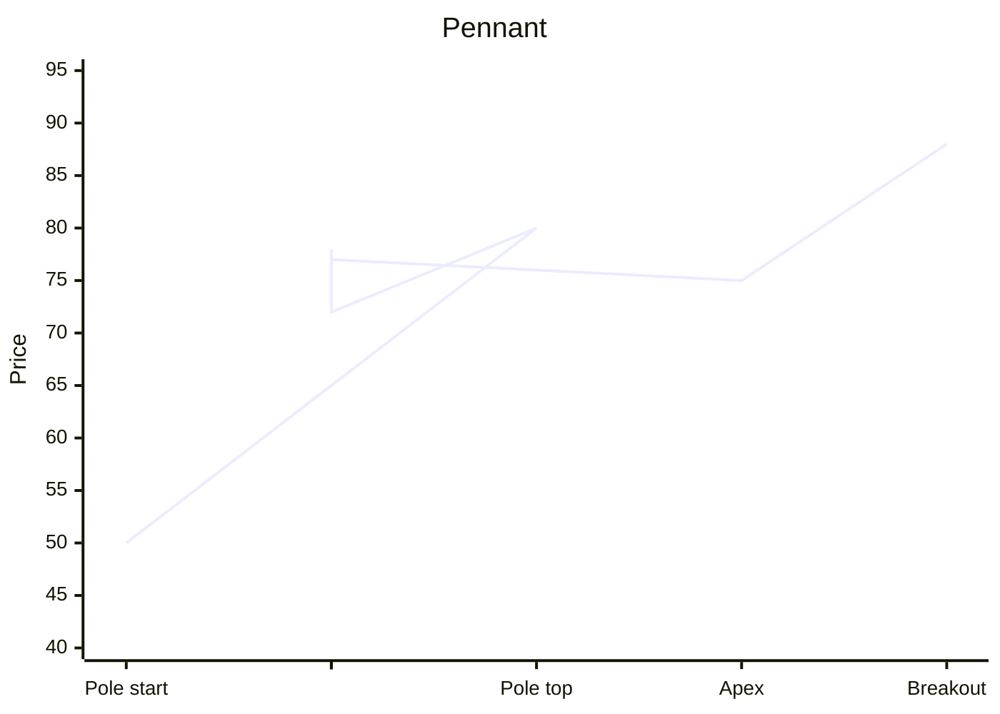

**Story.** A pennant is a flag whose pause forms a small triangle instead of a small channel. After a strong pole, price swings in a narrowing range as buyers and sellers settle down. The breakout continues the trend.

**Where it counts.** Right after a strong pole, and short in time, usually one to three weeks on a daily chart.

**Trigger, stop, and target.** Enter on a close beyond the pennant in the pole's direction. The stop goes beyond the other side of the pennant. The target is the pole's length, projected from the breakout.

**Number example.** Silver futures rise 4,000 points in a week, then trade in a narrowing range for six sessions, from a 2,000-point range down to 600. A close above the upper line at 91,500 triggers a buy. The stop goes at 90,700, and the target is 95,500.

**When it fails.** The pennant takes too long to break, or breaks against the pole. Momentum has been lost.

---

## Cup and handle

`Bullish continuation` · `Chart pattern` · `Core`

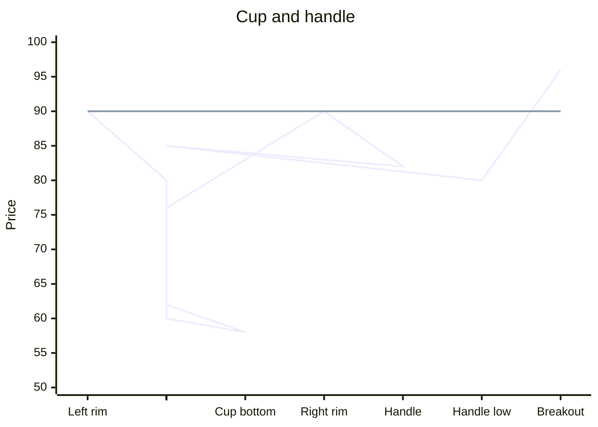

**Story.** Price falls from a high, rounds out a bottom slowly (the cup), and climbs back to near the old high. At that rim, some holders sell to break even, so price dips a little and moves sideways (the handle). When buyers absorb that selling and price breaks above the rim, the uptrend resumes.

**Where it counts.** In an uptrend, or after a long base. The cup should be rounded, not a sharp V. The handle should form in the upper half of the cup and be shallow.

**Volume rule.** Volume should be low at the bottom of the cup and during the handle, because sellers are running out. The breakout above the rim should come with above-average volume.

**Trigger, stop, and target.**

- **Trigger.** A close above the rim or the handle's high, on above-average volume.
- **Stop.** Below the handle's low.
- **Target.** The depth of the cup, from the rim to the bottom, added to the breakout point.

**Checklist**

- [ ] Rounded cup, not a V
- [ ] Handle in the upper half of the cup, and shallow
- [ ] Low volume at the bottom of the cup and in the handle
- [ ] Breakout above the rim on above-average volume

**Number example.** A stock peaks at 100, falls in a rounded arc to 70, and climbs back to 99 over five months. It then dips to 92 over three weeks on light volume. It closes at 102 on double the average volume. The cup depth is 30. Buy at 102, stop at 91, target 130.

**Real case.** Gold made a high near 1,920 dollars in 2011, fell to about 1,050 dollars by late 2015, and climbed back to that old high area in 2020. From 2020 to 2023 it moved sideways below roughly 2,075 to 2,080 dollars, which formed the handle. In March 2024 it broke above that level and rose strongly over the following year. On a monthly chart this is a very large cup and handle.

**When it fails.** The handle drops into the lower half of the cup, or the breakout fails and closes back below the rim.

---

## Rectangle

`Continuation (sometimes reversal)` · `Chart pattern` · `Useful`

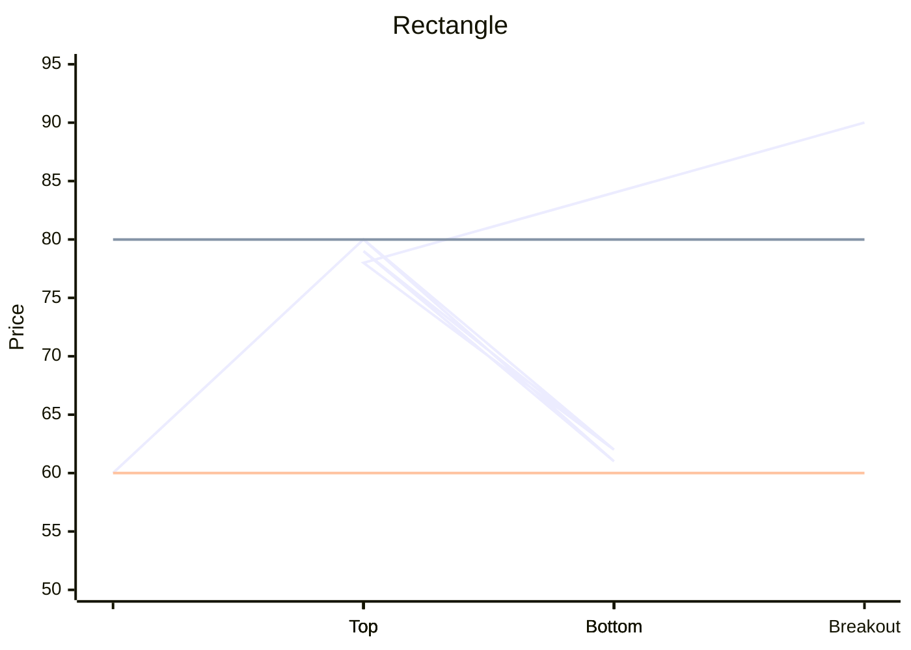

**Story.** Price bounces between a flat support and a flat resistance. Buyers and sellers are evenly matched for a while. The trend resumes when one side finally wins and price breaks out.

**Where it counts.** In a trend, as a pause. A rectangle can also form at the end of a trend and break the other way, so let the break tell you. Short-term traders can also buy near support and sell near resistance while the range holds.

**Trigger, stop, and target.** Enter on a close beyond the rectangle. For a long, the stop goes back inside the range, below the breakout candle's low or the middle of the range. The target is the rectangle's height, added to the breakout point.

**Number example.** A stock trades between 150 and 165 for two months. It closes at 168 on high volume. Buy at 168, stop at 158, target 183.

**When it fails.** The breakout closes back inside the rectangle within one or two candles. Step 4 calls this a false breakout. It often sends price to the other side of the range.

---

## Ascending triangle

`Bullish continuation` · `Chart pattern` · `Core`

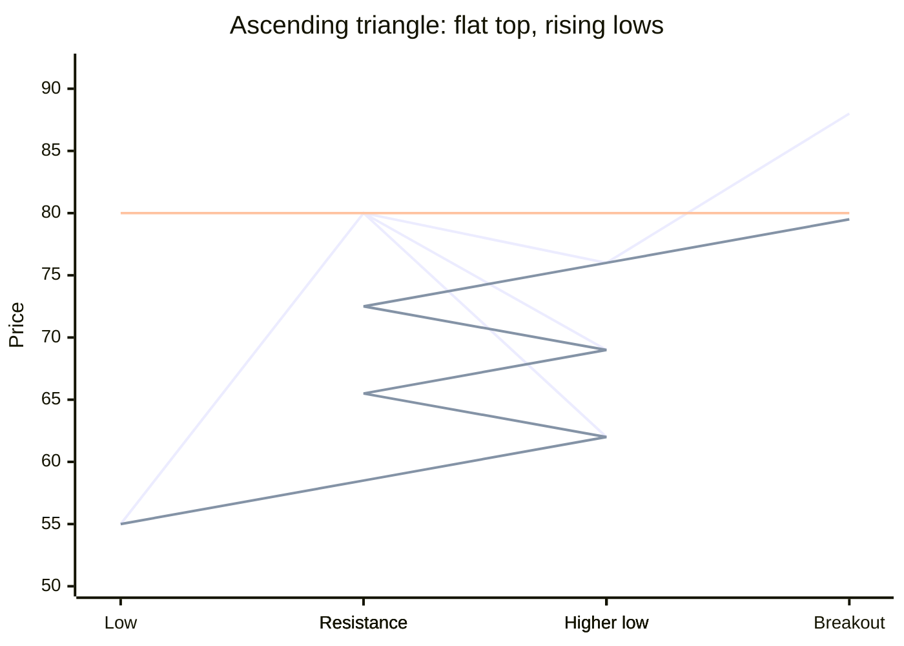

**Story.** Sellers defend the same price again and again (flat top). But buyers keep stepping in at higher and higher prices (rising lows). The squeeze builds until buyers finally overpower the sellers at the top.

**Where it counts.** Most reliable in an uptrend. Volume usually shrinks as the triangle narrows and rises on the breakout.

**Trigger, stop, and target.** Enter on a close above the flat top. The stop goes below the last rising low. The target is the height of the triangle at its widest point, added to the breakout.

**Number example.** A stock hits 500 four times over three months, with lows at 450, 465, 478, and 488. It closes at 506. The widest height is 50. Buy at 506, stop at 486, target 556.

**Real case.** Gold failed near 1,350 to 1,375 dollars several times between 2014 and 2018, while its lows rose from about 1,050 dollars in late 2015 to about 1,120 in late 2016 and about 1,160 in 2018. In June 2019 it broke above that flat resistance and rose to above 2,000 dollars by August 2020. On a weekly chart this is a large ascending triangle.

**When it fails.** Price breaks below the rising lows instead. The buyers gave up.

---

## Descending triangle

`Bearish continuation` · `Chart pattern` · `Core`

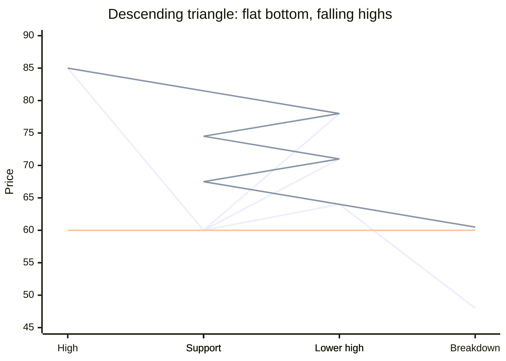

**Story.** Buyers defend the same price again and again (flat bottom), but sellers keep selling at lower and lower prices (falling highs). Eventually the buyers at the bottom run out.

**Where it counts.** Most reliable in a downtrend, but it also forms at tops.

**Trigger, stop, and target.** Enter on a close below the flat support. The stop goes above the last falling high. The target is the widest height, subtracted from the breakdown.

**Number example.** A stock holds 300 four times with highs at 350, 338, 325, and 314. It closes at 294. The height is 50. Sell at 294, stop at 316, target 244.

**Real case.** Through much of 2018, Bitcoin held a support area near 6,000 dollars while each rally stopped at a lower high. In mid-November 2018 it broke below that support and fell to near 3,200 dollars by December. A similar picture appears in gold in 2012 and early 2013: it held near 1,525 to 1,540 dollars several times while rallies faded, then broke below that support in April 2013 and fell about 200 dollars in two sessions.

**When it fails.** Price breaks above the falling highs. The sellers gave up.

---

## Symmetrical triangle

`Continuation (usually)` · `Chart pattern` · `Core`

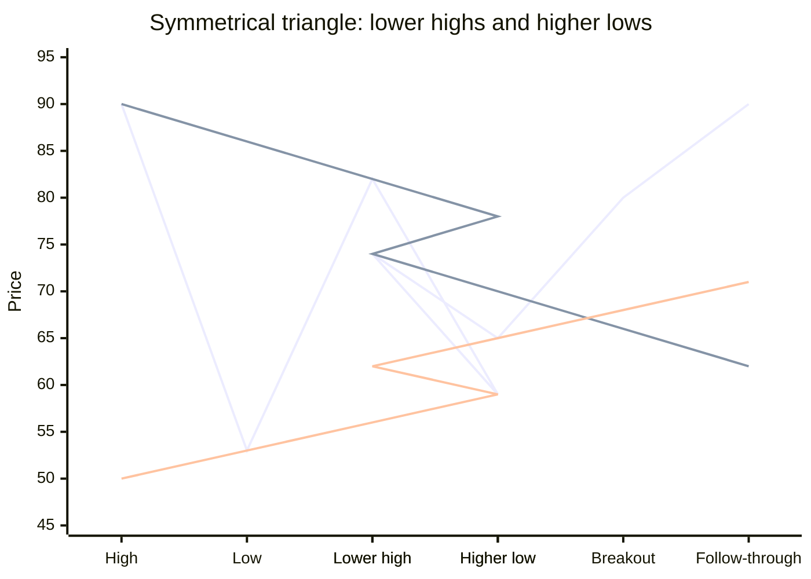

**Story.** Highs get lower and lows get higher, so the lines converge. Both sides are becoming less aggressive, and the range tightens until one side breaks out. Most symmetrical triangles break in the direction of the trend that came before them, but not all, so wait for the break.

**Where it counts.** Inside a trend, as a pause. The break is more reliable if it comes before the tip of the triangle, around two-thirds to three-quarters of the way along. A break very near the tip often fizzles.

**Trigger, stop, and target.** Enter on a close beyond either line. The stop goes beyond the last swing inside the triangle. The target is the height at the widest part, projected from the breakout.

**Number example.** In an uptrend, a stock swings 120 to 100, 116 to 104, and 113 to 107. It closes at 115, above the falling upper line. The widest height is 20. Buy at 115, stop at 106, target 135.

**When it fails.** The break is followed by a quick return inside the triangle and a break the other way. Close the trade at the stop and consider the new direction.

---

## Expanding triangle

`Continuation or reversal` · `Chart pattern` · `Advanced`

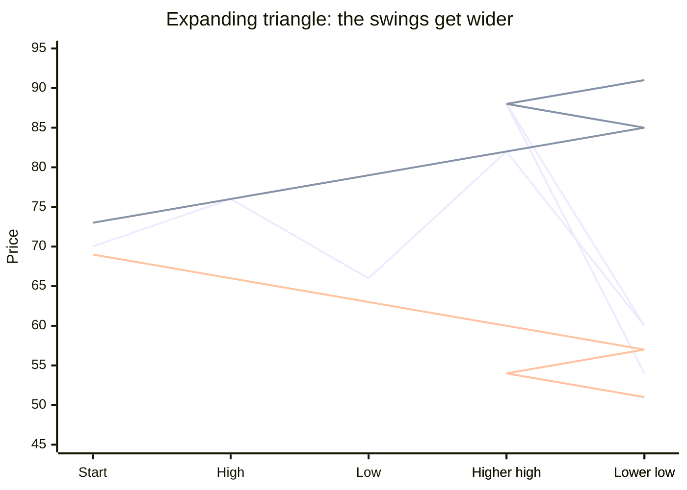

**Story.** The opposite of a symmetrical triangle: the highs get higher and the lows get lower, so the range widens. The market is nervous and swinging wider. In wave counting (Step 5), this shape often appears as a fourth-wave pause before a final push. At the end of a long rise, it can act as a broadening top.

**Where it counts.** Mostly as a pause late in a trend. It is harder to trade than a contracting triangle, because stops need to be wide.

**Trigger, stop, and target.** Wait for the widening to stop. Enter when price breaks the most recent swing in the trend's direction after a failed attempt at the other side. The stop goes beyond the last swing extreme. The target is the next major level.

**Number example.** In an uptrend, a stock swings 500 to 480, 510 to 470, and 518 to 462. Then it rises and closes above 518 with strong volume. Buy at 520, stop at 460, and target the next resistance at 600.

**When it fails.** The widening continues, and each side keeps getting stopped out. Stand aside until one side breaks clearly.

---

## Wedge against the trend

`Continuation` · `Chart pattern` · `Useful`

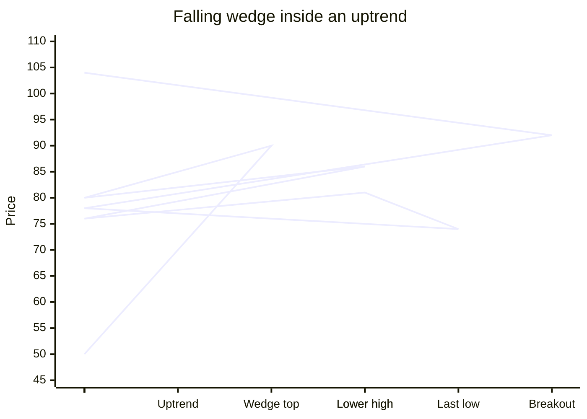

**Story.** In an uptrend, the pause slopes down in a narrowing wedge instead of a flag. Sellers push lower, but each push gains less ground. When price breaks above the upper line, the uptrend resumes. In a downtrend, the pause is a rising wedge, which breaks down.

**Where it counts.** Inside a clear trend, after a strong move. The same wedge shapes act as reversals at the end of trends, covered in the previous lesson. The difference is location: a wedge against the trend in the middle of a move is usually a continuation.

**Trigger, stop, and target.** Enter on a close beyond the wedge line in the trend's direction. The stop goes beyond the wedge's last swing. The target is the start of the wedge first, then the prior trend high or low.

**Number example.** A stock rises from 300 to 380, then drifts down in a falling wedge to 355 over three weeks. It closes at 368, above the upper line. Buy at 368, stop at 353, target 380 first and then 420.

**When it fails.** Price breaks the lower line of the falling wedge. The pause has turned into a deeper correction.

---

## Measured move

`Continuation` · `Price structure` · `Useful`

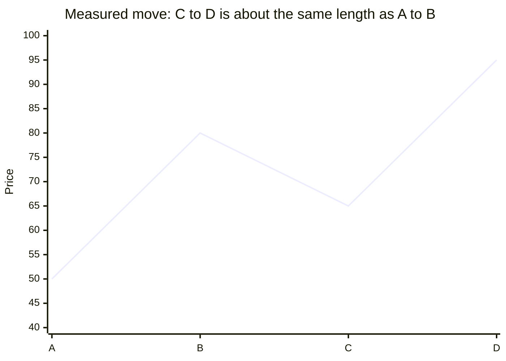

**Story.** A trend often moves in two similar legs separated by a pause. The first leg (A to B) shows how far the crowd is willing to push. After the pause (B to C), the second leg (C to D) often travels about the same distance.

**Where it counts.** In a clean trend with a clear first leg and a clear pause. It is a way to set a target, not an entry signal by itself.

**Trigger, stop, and target.** Enter on a continuation signal after the pause, such as a flag breakout or a bullish candle at support. The stop goes beyond point C. The target is point C plus the length of A to B.

**Number example.** A stock rises from 100 (A) to 140 (B), pulls back to 125 (C), and resumes. The first leg was 40, so the target is 125 + 40 = 165.

**When it fails.** The second leg stalls well short of the target. Take partial profit at the first strong resistance, even before the measured target.

---

## Practice

1. A stock rises 50 points in a week, then drifts down 30 points over two weeks. Is this a good bull flag?
2. What does the volume look like in a healthy cup and handle?
3. A symmetrical triangle breaks upward right at its tip. How much should you trust the break?
4. Where do you put the stop in an ascending triangle breakout?
5. A rectangle breaks out upward, and two candles later price closes back inside. What does that suggest?

### Answers

1. No. The flag retraced 30 of 50 points, which is 60 percent. That is too deep for a healthy flag. Treat it as a correction, not a flag.
2. Low volume at the bottom of the cup and during the handle, then above-average volume on the breakout above the rim.
3. Less than usual. Breaks near the tip often fizzle. A break about two-thirds of the way along is more reliable.
4. Below the last rising low inside the triangle.
5. It may be a false breakout. Exit the long. A move to the other side of the rectangle is now more likely.
