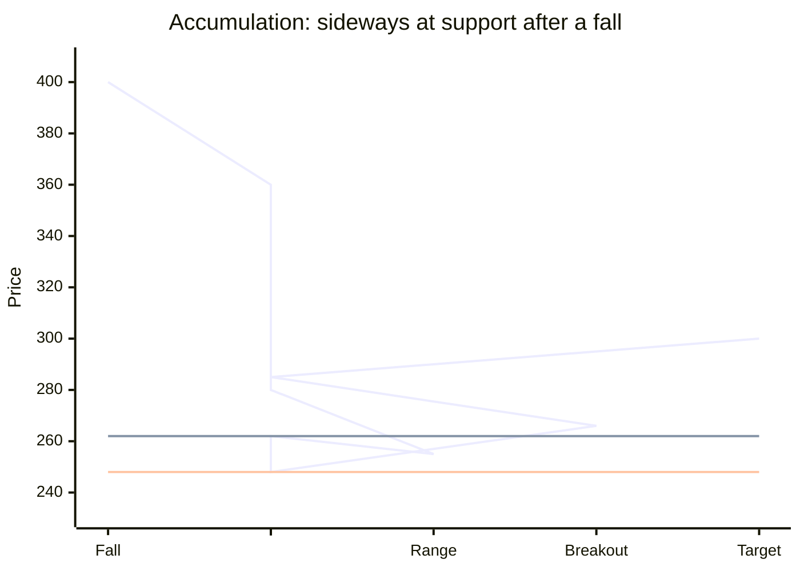
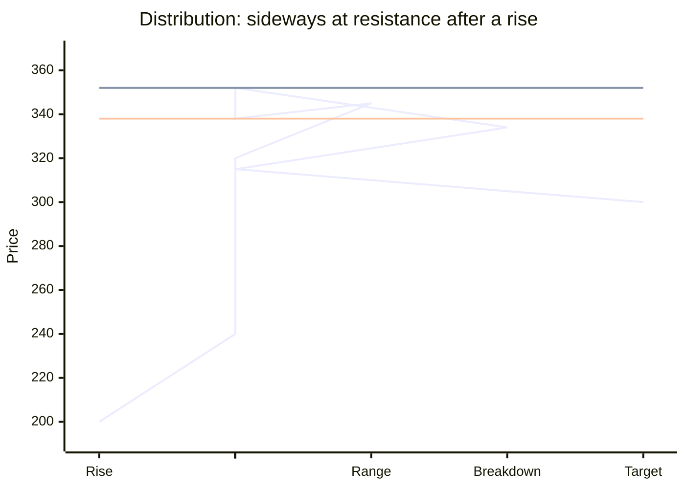
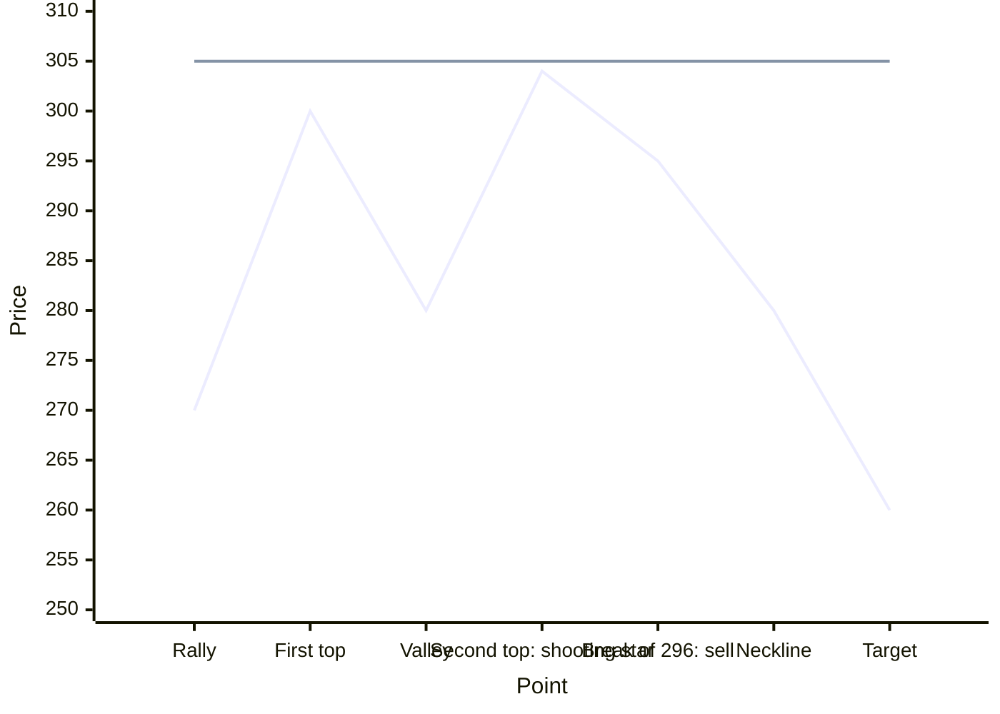
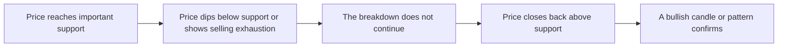
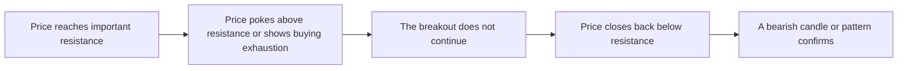

# Reading Price Action

This lesson covers the setups that come from combining candles with levels. Each one answers the same question: which side is in control here, and where would I be proven wrong?

---

## 1. Combining candles into a higher timeframe

Candlestick patterns sometimes fail. Merging several candles into one often shows what the market is really doing, and what candle is printing on the higher timeframe.

To merge any number of candles in a row:

- **Open** = the open of the first candle
- **High** = the highest high among them
- **Low** = the lowest low among them
- **Close** = the close of the last candle

**Number example.** Four 15-minute candles:

| Candle | Open | High | Low | Close |
|---|---|---|---|---|
| 1 | 500 | 502 | 494 | 495 |
| 2 | 495 | 496 | 488 | 490 |
| 3 | 490 | 499 | 489 | 498 |
| 4 | 498 | 503 | 497 | 502 |

```candles
title: Four 15-minute candles merge into one hourly hammer
axis: true
panel: Four 15-minute candles
candle: 500 502 494 495 1
candle: 495 496 488 490 2
candle: 490 499 489 498 3
candle: 498 503 497 502 4
panel: One hourly candle
candle: 500 503 488 502 Hammer
```

Merged, this is one hourly candle: open 500, high 503, low 488, close 502. It has a small green body near the top and a long lower wick. It is a hammer on the hourly chart, even though no single 15-minute candle was a hammer.

**Why it helps.**

- A bullish engulfing at a top merges into a candle with a long lower wick near the high. That looks like a hanging man, so treat it as a warning, not a buy.
- A bearish engulfing at a bottom merges into a hammer-like candle, so it often fails.
- Before trading a pattern on a fast chart, merge it to see whether the slower chart agrees.

---

## 2. Wicks and shadows: who is losing control

- **Upper wicks** show that buyers could not hold higher prices. Sellers pushed back.
- **Lower wicks** show that sellers could not hold lower prices. Buyers pushed back.

```candles
title: New highs with long upper wicks: each high is pushed back
candle: 100 104 99 103
candle: 103 111 102 105
candle: 105 116 104 107
candle: 107 121 106 109 Warning
```

**New highs with long upper wicks are a warning.** Price is making new highs, but each candle closes well below its high. Buyers reach up and are pushed back every time. Do not buy these new highs. Wait for a clean close above them, or for a pullback to support.

**At a rising trendline, check the wicks.** If the candles touching the trendline have long lower wicks, buyers are defending it. If they close weak with long upper wicks, the defense is failing.

**Longer wicks are stronger signals.** Two hammers form at the same support. The one with the longer lower wick shows a harder rejection and a stronger support.

---

## 3. Accumulation at the bottom and distribution at the top

`Reversal` · `Price action` · `Useful`





**Story.**

- **Accumulation** means someone is quietly buying at the bottom. After a fall, price stops making new lows and moves sideways at support with many small, neutral candles such as dojis and spinning tops. Every dip is bought, and there is no follow-through lower.
- **Distribution** means someone is quietly selling at the top. After a rise, price stops making new highs and moves sideways at resistance with many small, neutral candles. Every rally is sold, and there is no follow-through higher.

**Where it counts.** Accumulation after a long decline, at major support. Distribution after a long rise, at major resistance.

**Trigger, stop, and target.** Do not guess. Buy when a strong candle closes above the accumulation range. Sell when a strong candle closes below the distribution range. The stop goes on the other side of the range. The target is the range height projected from the break, or the next major level.

**Number example (accumulation).** A stock falls from 400 to 250, then trades between 248 and 262 for six weeks with small candles. A large green candle closes at 266 on high volume. Buy at 266, stop at 247, target 300.

**When it fails.** The range breaks the other way. What looked like accumulation was a pause before more selling.

---

## 4. Sandwich pattern

`Breakout from indecision` · `Price action` · `Useful`

```candles
title: Number example: red and green candles alternate, then a breakout
axis: true
level: 24300 Range top | bad
level: 24100 Range bottom | good
candle: 24280 24300 24110 24130
candle: 24130 24290 24100 24270
candle: 24270 24295 24120 24140
candle: 24140 24285 24105 24265
candle: 24265 24290 24115 24135
candle: 24135 24280 24110 24250
candle: 24250 24290 24160 24200
candle: 24200 24400 24180 24380 Breakout
```

**Story.** Candles alternate colors, red then green then red then green, inside a range. Buyers and sellers trade blows like two boxers, and neither lands a knockout. There is no fixed number of candles. The fight ends when one side prints a candle that breaks out of the pattern.

**Where it counts.** Anywhere, but it is most useful at a key level or inside a trend's pause.

**Trigger, stop, and target.**

- **Bullish break.** A breakout candle closes above the previous candle and above the range. The stop goes below the breakout candle's low. Target the next major resistance.
- **Bearish break.** A breakdown candle closes below the previous candle and below the range. The stop goes above the breakdown candle's high. Target the next major support.

**Number example.** An index alternates red and green candles between 24,100 and 24,300 for seven sessions. Then a green candle closes at 24,380, above the previous candle's high of 24,290. Buy at 24,380, stop at 24,180 (the breakout candle's low), target 24,700.

**When it fails.** The next candle falls back inside the range. The fight is not over.

---

## 5. Dominance inside a flag

When price pauses in a flag or range, count the candles.

- In a bull flag, if the green candles are larger than the red ones, buyers still dominate. The flag is likely to break up.
- If the red candles start to grow and outnumber the green ones, sellers are taking over. The flag may break down.

This small check helps you decide whether to wait for the breakout or stand aside.

**Number example.** In a 10-candle flag after a rally, there are 6 small red candles averaging 3 points each and 4 green candles averaging 5 points each. Buyers still dominate, so a breakout is more likely.

```candles
title: A 10-candle flag: 6 red candles of 3 points, 4 green candles of 5 points
candle: 100 100.5 96.5 97 −3
candle: 97 102.5 96.5 102 +5
candle: 102 102.5 98.5 99 −3
candle: 99 99.5 95.5 96 −3
candle: 96 101.5 95.5 101 +5
candle: 101 101.5 97.5 98 −3
candle: 98 103.5 97.5 103 +5
candle: 103 103.5 99.5 100 −3
candle: 100 100.5 96.5 97 −3
candle: 97 102.5 96.5 102 +5
```

---

## 6. Slowdown in momentum

`Warning` · `Price action` · `Useful`

**Story.** After a strong move, the candles get smaller. Price still makes higher highs, but only by a little each time, with many small bodies. Buyers are still pushing, but with less energy. This often comes just before a reversal, such as three black crows after a rise.

**How to use it.** Do not open new longs when momentum has clearly slowed near resistance. Tighten the stop on existing longs. Look for a bearish reversal candle or a break of the last swing low to exit or reverse. The mirror is true at the end of a decline.

**Number example.** A stock gains 12, 10, and 11 points on three days, then 3, 2, and 1 point on the next three days, with tiny bodies each time. The trend is fading. The next day it falls 9 points. Exit the long below the last swing low.

```mermaid
xychart-beta
  x-axis "Day" ["Start", "1", "2", "3", "4", "5", "6", "7"]
  y-axis "Close" 95 --> 145
  line [100, 112, 122, 133, 136, 138, 139, 130]
```

The line is steep for three days, then almost flat for three days, then turns down. The flattening was the warning.

---

## 7. Mother candle, inside bar, outside bar, and pin bar

### Mother candle and inside bar

`Breakout setup` · `Price action` · `Core`

```candles
title: Number example: a mother candle at support, three inside bars, then a breakout
axis: true
level: 1240 Mother high | info
level: 1194 Stop | bad
candle: 1197 1240 1195 1238 Mother
candle: 1232 1235 1215 1220 Inside
candle: 1220 1230 1210 1226 Inside
candle: 1226 1234 1218 1230 Inside
candle: 1230 1252 1228 1250 Breakout
```

**Story.** A **mother candle** is a large candle, and the next one or more candles trade entirely inside its high and low. Each of those smaller candles is an **inside bar**. The market is catching its breath. The break of the mother candle's high or low shows which side won the pause.

**Three uses.**

1. **Bullish reversal.** A mother candle at major support. Buy when a candle breaks above the mother candle's high. This is stronger if price first poked below support and then recovered, which is the failed-breakdown reversal in section 10. The stop goes below the mother candle's low.
2. **Bearish reversal.** A mother candle at major resistance. Sell when a candle breaks below the mother candle's low. This is stronger if price first poked above resistance and failed. The stop goes above the mother candle's high.
3. **Continuation.** A mother candle in the middle of a trend. In an uptrend, buy the break above its high, with a stop below its low. In a downtrend, sell the break below its low, with a stop above its high.

**Target.** The next major level, or a chart-pattern target.

**Number example.** At support near 1,200, a large candle runs from 1,195 to 1,240. For three days, candles trade between 1,210 and 1,235. On day four, price breaks above 1,240. Buy at 1,242, stop at 1,194, target 1,340. Risk is 48, reward is 98.

**When it fails.** Price breaks one side, then reverses and breaks the other side. Exit at the stop. Some traders then take the second break.

### Outside bar

`Volatility and reversal` · `Price action` · `Useful`

An outside bar has a higher high and a lower low than the candle before it. It covers the previous candle completely, including the wicks. It is a broader version of the engulfing pattern.

- At a top, an outside bar that closes near its low is bearish.
- At a bottom, an outside bar that closes near its high is bullish.
- In the middle of a range, it just shows volatility.

Trade the break of the outside bar's high or low in the direction of its close. The stop goes at the opposite end.

### Pin bar

`Rejection` · `Price action` · `Core`

A pin bar is a price-action name for any candle with one very long wick, at least two-thirds of its whole range, and a small body at the other end. A hammer and a shooting star are both pin bars. The wick "pins" the price that was rejected.

- A bullish pin bar at support points up. Buy above its high, with a stop below its wick.
- A bearish pin bar at resistance points down. Sell below its low, with a stop above its wick.

The longer the wick and the more important the level, the stronger the pin bar.

---

## 8. Decisive candles at double tops and double bottoms

At the second test of a top or bottom, look for one clear candle that shows the defense. Call it the **decisive candle**. It is usually a reversal candle such as a shooting star, gravestone doji, or bearish engulfing at a top, or a hammer, dragonfly doji, or bullish engulfing at a bottom.

**Double top**

- **What you see.** Neutral or bearish candles at an earlier resistance level.
- **Enter when.** Price breaks below the decisive candle's low.
- **Extra evidence.** Bearish divergence, a failed breakout above the first top, and high volume.
- **Stop.** Above the decisive candle's high.
- **Target.** The double-top measured target from Step 3.

**Double bottom**

- **What you see.** Neutral or bullish candles at an earlier support level.
- **Enter when.** Price breaks above the decisive candle's high.
- **Extra evidence.** Bullish divergence, a failed breakdown below the first bottom, and high volume.
- **Stop.** Below the decisive candle's low.
- **Target.** The double-bottom measured target from Step 3.

This entry comes earlier than the classic break of the neckline, and the stop is much closer. It is the reason price action traders study candles at levels.

**Number example.** A stock's first top was 300. It rallies to 303, prints a shooting star with its high at 304 and low at 296, and RSI is lower than at the first top. The next candle breaks 296. Sell at 295, stop at 305, target 260 (the double-top target, with the valley at 280). Risk is 10, reward is 35.



The flat line is the stop at 305. Entering on the break of the decisive candle's low (296) comes well before the classic neckline break at 280.

---

## 9. Gaps

A gap is a space on the chart where no trading happened. Price opened above the previous high, or below the previous low. Gaps are common on daily charts of stocks and futures, because news arrives overnight. They are rare in markets that trade almost all day, such as spot currencies.

Gaps often act as support or resistance later, and they can help set targets and stops.

| Gap type | Where it forms | What it means |
|---|---|---|
| Common gap | Inside a range | Little meaning. Often filled soon. |
| Breakaway gap | Right at a breakout from a range or pattern | A new trend is starting. Often not filled for a long time. |
| Runaway gap | In the middle of a strong trend | The trend is speeding up. Also called a continuation or measuring gap. |
| Exhaustion gap | After a long, fast move | The last buyers or sellers rushed in. A reversal is near. |
| Island reversal | An exhaustion gap, a few candles, then a gap back the other way | A cluster of candles is left isolated. Traders who bought or sold there are trapped. |

```candles
title: Where each gap appears in a trend's life
candle: 100 102 98 101 Range
candle: 101 103 99 100
candle: 106 110 105.5 109 Breakaway
candle: 109 112 108 111
candle: 115 119 114.5 118 Runaway
candle: 118 121 117 120
candle: 124 127 123.5 125 Exhaustion
candle: 125 126.5 123 124
candle: 119 120 116 117 Island gap
```

**The significant gaps** are the ones that cross a major support or resistance level. In wave terms (Step 5), breakaway gaps often appear in a third wave.

**Trading a gap across a level.**

- **Gap up above resistance** that holds. Enter after a follow-through candle confirms it. The stop goes below the low of the breakout candle, or below the gap level.
- **Gap down below support** that holds. Enter short after follow-through. The stop goes above the high of the breakdown candle, or above the gap level.

A band breakout candle (Lesson 2) adds support to the trade.

**Number example.** A stock has support at 500. It closes at 504, then opens the next day at 488 and closes at 482. The gap from 488 to 504 sits right across support. The following day it stays below 488. Sell at 483, stop at 505 (above the gap), target 440.

**Real case of gap risk.** On 15 January 2015, the Swiss National Bank unexpectedly removed its cap on the Swiss franc. The EUR/CHF rate collapsed from about 1.20 to below 1.00 within minutes, and many stop orders were filled far away from where they were placed. Even in currencies, which rarely gap, a sudden event can jump over your stop. This is why position size matters as much as the stop.

**When it fails.** The gap fills: price moves back through the gap and closes on the other side. A filled breakaway gap means the breakout has failed.

---

## 10. Genuine and fake breakouts and breakdowns

A breakout is when price closes above resistance. A breakdown is when price closes below support. Some are real, and some are traps. Learning the difference is one of the most valuable price action skills.

### Genuine breakout

`Momentum` · `Price action` · `Core`

```candles
title: A genuine breakout: shakeout dip, firm close above resistance, follow-through
level: 100 Resistance | bad
candle: 90 99.5 89 98
candle: 98 99 93 94
candle: 94 99.8 93 99
candle: 99 99.5 95 96
candle: 96 97 90 91 Shakeout
candle: 91 99 90.5 98.5
candle: 98.5 106 98 105 Breakout
candle: 105 109 104 108 Follow
```

**Story.** Real breakouts usually come after a **shakeout**: just before the break, price dips sharply and scares weak holders out. Then the breakout candle closes firmly above resistance, and the next candle follows through.

- **What you see.** A shakeout near the major resistance, before the actual breakout candle.
- **Enter when.** The follow-up candle closes above the breakout level.
- **Extra evidence.** A band breakout candle (Lesson 2), and above-average volume.
- **Stop.** Below the breakout candle's low.
- **Target.** The next major resistance, or a chart-pattern target.

**Genuine breakdown.** The mirror image: a shakeout rally near major support, then a breakdown candle, then a follow-up candle closing below the breakdown level. The stop goes above the breakdown candle's high.

**Number example.** Resistance is at 850. Price dips from 845 to 826 in two days (the shakeout), then closes at 858 on high volume. The next day closes at 864. Buy at 864, stop at 838 (the breakout candle's low), target 920.

### Fake breakout

`Trap and reversal` · `Price action` · `Core`

```candles
title: A fake breakout: pokes above resistance, then falls back below
level: 100 Resistance | bad
candle: 90 99 89 97
candle: 97 99.5 93 95
candle: 95 100 94 99
candle: 99 104 98.5 102 Poke
candle: 102 102.5 95 96 Back below
candle: 96 97 90 91
```

**Story.** Price pokes above resistance, often with no shakeout before it, then falls back below the breakout level with bearish candles. Breakout buyers are trapped, and their selling adds fuel to the fall.

- **What you see.** Usually no shakeout. Price breaks out, then re-enters below the breakout level with bearish candles.
- **Enter when.** The follow-up candle closes below the breakout candle.
- **Extra evidence.** Bearish divergence, the failed-breakout reversal sequence in section 11, and high volume on the drop.
- **Stop.** Above the breakout candle's high.
- **Target.** The next major support, or the other side of the range.

**Fake breakdown.** The mirror: price pokes below support, then re-enters above it with bullish candles. Enter when the follow-up candle closes above the breakdown candle. The stop goes below the breakdown candle's low. A morning star, or a candle that fails to challenge the lower Bollinger Band, confirms it.

**Why fakes are valuable.** A fake move gives a fresh trade with a very close stop, and it shows you a new, well-defined level.

**Number example (fake breakdown).** Support at 1,500. A candle falls to 1,482 and closes at 1,490. The next candle opens at 1,491 and closes at 1,512, back above support and above the breakdown candle's high. RSI shows a higher low. Buy at 1,512, stop at 1,480, target 1,580.

---

## 11. The failed-breakdown and failed-breakout reversals

These two sequences are the full step-by-step form of the fake moves above. Use them as the confirmation for reversal trades at an important bottom or top.

### Failed breakdown reclaimed (bullish)



Every step must happen in order. If price never went below support, or never came back above it, you do not have this setup.

### Failed breakout rejected (bearish)



**Number example (failed breakout rejected).** Resistance at 3,000. Price rises to 3,036, but the candle closes at 3,008. The next candle closes at 2,975, below 3,000, as a bearish engulfing. Sell at 2,975, stop at 3,040, target 2,850.

---

## 12. Quick reference of every setup

Use this as a summary once you know the setups above. Each entry lists what you see, when you enter, the stop, and the target.

### Bullish setups

- **Double bottom with a decisive candle.** Neutral or bullish candles at old support. Enter above the decisive candle's high. Stop below its low. Target: double-bottom measurement.
- **After three white soldiers.** Price dips into the second soldier's range. Enter on a bullish candle there. Stop below the first soldier's low. Target: next major resistance.
- **Bull counter attack.** Price opens below major support, then trades back above it. Enter once price is back above the broken level. Stop below the counter-attack candle's low. Target: next major resistance.
- **Sandwich breakout.** Alternating candles in a range, then a breakout candle closes above the previous candle. Stop below the breakout candle's low. Target: next major resistance.
- **Rounding bottom.** Big red candles with no follow-through, then small mixed candles. Enter when a strong candle closes above the sideways range. Stop below the range. Target: next major resistance.
- **Genuine breakout.** Shakeout, then breakout. Enter when the follow-up candle closes above the level. Stop below the breakout candle's low.
- **Fake breakdown.** Price dips below support without a shakeout and re-enters with bullish candles. Enter when the follow-up candle closes above the breakdown candle. Stop below the breakdown candle's low.
- **Gap up above resistance that holds.** Enter after follow-through. Stop below the breakout candle's low or below the gap.
- **Mother candle at support.** Enter on a break of the mother candle's high. Stop below its low.
- **Mother candle in an uptrend.** Enter on a break of its high. Stop below its low.

### Bearish setups

- **Double top with a decisive candle.** Neutral or bearish candles at old resistance. Enter below the decisive candle's low. Stop above its high. Target: double-top measurement.
- **After three black crows.** Price rallies into the second crow's range. Enter on a bearish candle there. Stop above the first crow's high. Target: next major support.
- **Bear counter attack.** Price opens above major resistance, then trades back below it. Enter once price is back below the broken level. Stop above the counter-attack candle's high.
- **Sandwich breakdown.** A breakdown candle closes below the previous candle and below the range. Stop above the breakdown candle's high.
- **Rounding top.** Big green candles with no follow-through, then small mixed candles. Enter when a strong candle closes below the range. Stop above the range.
- **Genuine breakdown.** Shakeout, then breakdown. Enter when the follow-up candle closes below the level. Stop above the breakdown candle's high.
- **Fake breakout.** Price pokes above resistance and re-enters with bearish candles. Enter when the follow-up candle closes below the breakout candle. Stop above the breakout candle's high.
- **Gap down below support that holds.** Enter after follow-through. Stop above the breakdown candle's high or above the gap.
- **Mother candle at resistance.** Enter on a break of the mother candle's low. Stop above its high.
- **Mother candle in a downtrend.** Enter on a break of its low. Stop above its high.

Whatever the setup, a perfect-looking candle is not a trade unless the reward compared with the risk meets your plan, which should be at least 2 to 1 and ideally 3 to 1.

---

## Practice

1. Merge these three candles: open 100, high 104, low 99, close 103; open 103, high 105, low 96, close 97; open 97, high 99, low 95, close 98. What does the merged candle look like?
2. Price makes three new highs in a row, each with a long upper wick. Should you buy the next new high?
3. What is the main difference between a genuine breakout and a fake breakout?
4. A mother candle forms in the middle of an uptrend. Price breaks below its low. What do you do?
5. Which gap type is most likely to mark the end of a move?

### Answers

1. Open 100, high 105, low 95, close 98. It is a red candle with a small body in the middle and wicks on both sides, close to a high-wave or spinning top. The three candles together show indecision.
2. No. The long upper wicks show sellers pushing back each time. Wait for a clean close above the highs or a pullback to support.
3. A genuine breakout usually has a shakeout before it and a follow-up candle that closes beyond the level. A fake breakout usually has no shakeout, and price returns inside the range with candles in the opposite direction.
4. If you bought the continuation setup, the stop below the mother candle's low has been hit. Exit. Do not buy until a new setup forms.
5. The exhaustion gap, especially when it becomes part of an island reversal.
