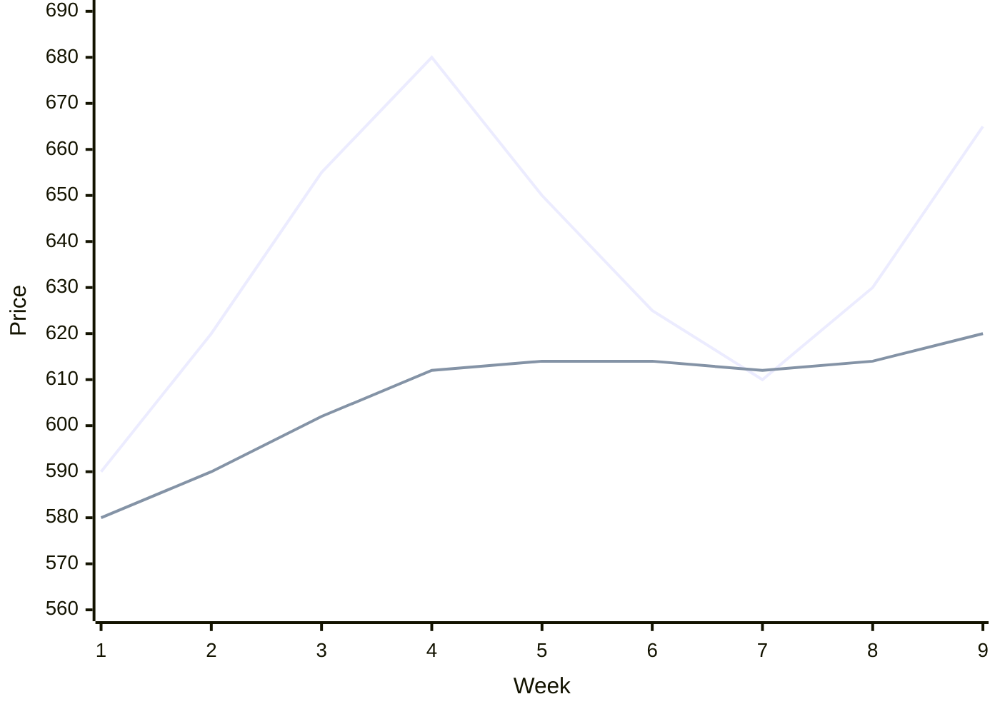
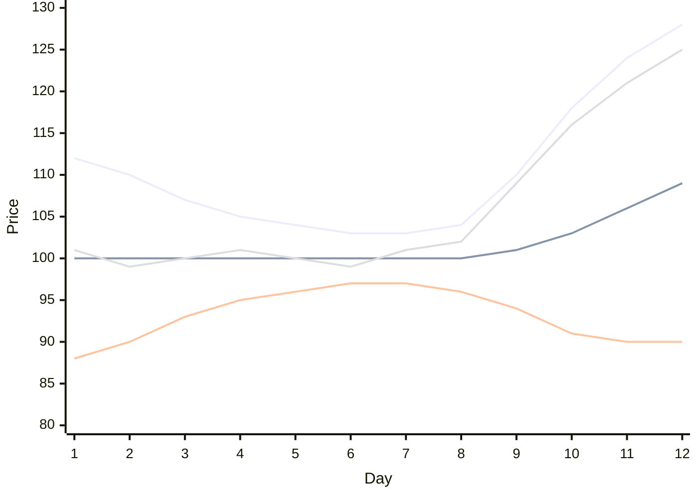
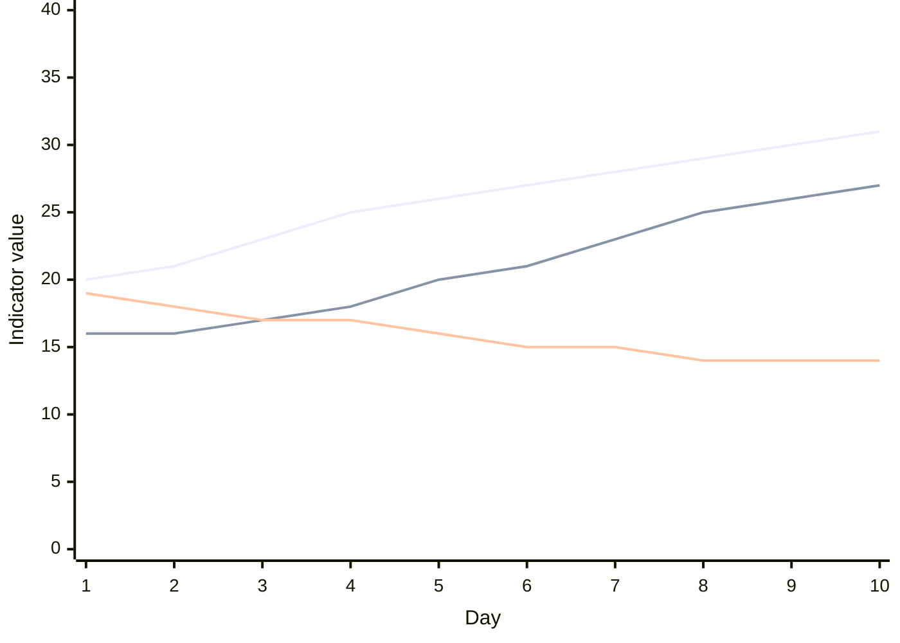
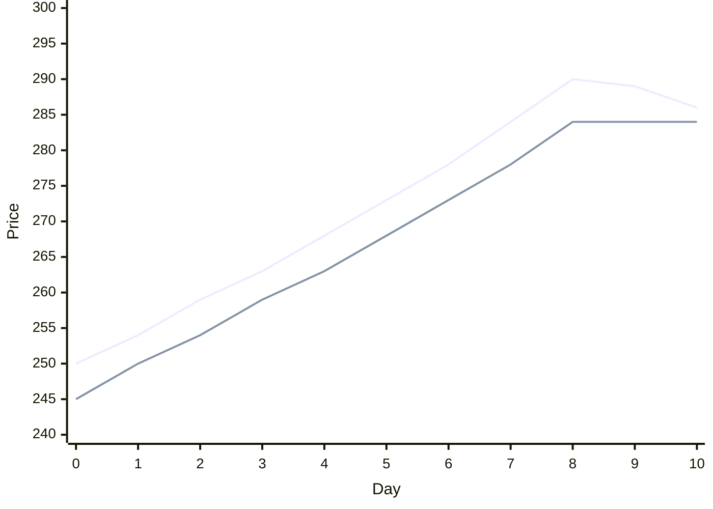
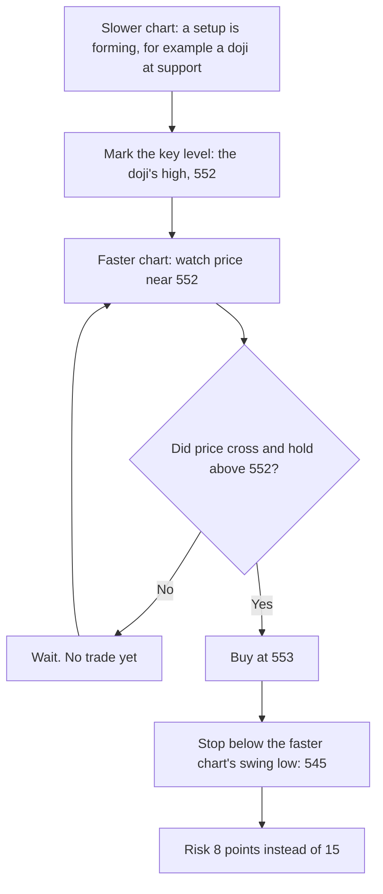
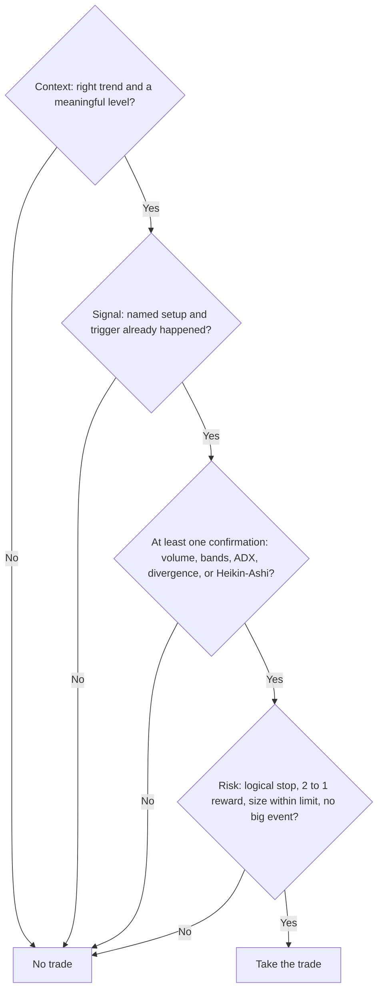

# Confirmation Tools

Indicators do not create trades. They confirm what price action is already showing, or they warn you that it is not as strong as it looks. This lesson covers the tools used in this course and how to use each one without letting it overrule a clear price structure.

---

## 1. Candles with moving averages

In a trend, moving averages act as moving support and resistance. That makes them a natural place to look for a candle signal.

- **In an uptrend,** wait for price to pull back to a rising EMA, usually the 13, 26, or 50. A hammer, bullish engulfing, or morning star at that EMA is a buy signal. The stop goes below the candle's low.
- **In a downtrend,** wait for price to rally to a falling EMA. A shooting star, bearish engulfing, or evening star at that EMA is a sell signal. The stop goes above the candle's high.

Combine the signal with an oscillator turning in the trend's direction, or with the Bollinger Band behavior in the next section.

**Number example.** A stock is in an uptrend on the weekly chart, with the 13 EMA rising at 612. Price pulls back to 610 and prints a hammer with its low at 603. Stochastic turns up from 25. Buy above the hammer's high at 622, stop at 602, target the prior high at 680.



The upper line is price, the lower line is the rising 13 EMA. The pullback in weeks 5 to 7 ends right at the EMA, where the hammer forms, and price turns up again.

---

## 2. Bollinger Bands

### What they are

Bollinger Bands, created by John Bollinger, have three lines:

- **Middle band.** A 20-period simple moving average.
- **Upper band.** The middle band plus two standard deviations of price.
- **Lower band.** The middle band minus two standard deviations.

A **standard deviation** measures how spread out prices have been. When prices swing widely, the bands move apart. When prices are quiet, the bands move close together. So the bands show volatility and momentum at the same time. They are useful for both swing traders and momentum traders.

### Squeeze and expansion

- **Squeeze.** The bands narrow to their tightest in months. The market is quiet, and quiet periods are usually followed by big moves. The squeeze does not tell you the direction. The breakout does.
- **Expansion.** The bands widen quickly as price breaks out. The move has energy.



The top line is the upper band, the bottom line is the lower band, and the middle line is the moving average. The fourth line is price. From day 1 to day 8 the bands pinch together: that is the squeeze. On day 9 price breaks out, and the bands open wide: that is the expansion.

### Band breakout candle

A **band breakout candle** is a strong candle that closes outside the upper band, for a long, or outside the lower band, for a short, while the bands start to widen in that direction. It shows momentum. In this course it confirms genuine breakouts, gap trades, and wave-3 entries.

A looser version of the same signal also counts on momentum trades: price pushes through or closes near the band while the band expands in the trade's direction.

### A band that is not challenged

- A shooting star that **fails to reach the upper band** while sitting at resistance confirms that resistance. Sellers stepped in before price could even stretch. A fresh short is reasonable.
- A hammer that **fails to reach the lower band** while sitting at support confirms that support.

### Band direction: impulse or correction

- When price touches the upper band and the band itself turns up with price, a new strong move (an impulse) is likely starting.
- When price falls to the lower band but the band does not turn down, the fall is probably just a correction. Look for a buy, with a stop below the recent low.
- A flat band means a sideways correction is in progress.

Step 5 uses this to tell impulse waves from corrective waves.

### The 3-standard-deviation band

Add a second set of bands at three standard deviations. Price rarely closes beyond them.

- A candle closing beyond the upper 3-standard-deviation band shows extreme excitement.
- A candle closing beyond the lower 3-standard-deviation band shows extreme panic.
- In both cases, a pullback is more likely than usual.

**Two uses:**

1. **Exit at a better price.** If you are long and price closes beyond the upper 3-standard-deviation band, take part or all of your profit.
2. **Do not chase.** If a momentum candle closes beyond the 3-standard-deviation band, do not buy it. Wait for the pullback.

**Number example.** A stock's 20-period average is 400 and the standard deviation is 10. The 2-standard-deviation bands are 380 and 420. The 3-standard-deviation bands are 370 and 430. A candle closes at 434 after a sharp rally. That is beyond the 3-standard-deviation band. Take profit on part of a long, and do not start a new long until price pulls back toward 410 to 420.

```levels
title: Average 400, standard deviation 10
434 | Close at 434 | beyond the 3-standard-deviation band: extreme | bad
430 | Upper 3-standard-deviation band | | warn
420 | Upper 2-standard-deviation band
400 | Middle band | 20-period average | info
380 | Lower 2-standard-deviation band
370 | Lower 3-standard-deviation band | | warn
```

**Real case.** In April 2011, silver rose in a near-vertical move to close to 50 dollars an ounce, stretching far above its upper band on the daily chart. In early May 2011 it fell by about a quarter in less than a week. A trader who took profit while price was far outside the band, or who refused to buy there, avoided that fall.

---

## 3. ADX with +DI and -DI

The Directional Movement Index has three lines:

- **+DI** measures upward movement.
- **-DI** measures downward movement.
- **ADX** measures the strength of the trend, whichever way it is going. It does not show direction.

**How to read them.**

- **+DI above -DI:** bulls are in control. **-DI above +DI:** bears are in control.
- **ADX below 20, or falling:** weak or no trend. The market is ranging. Trend-following signals will whipsaw, so use range tactics or stand aside.
- **ADX rising from about 15 upward:** a trend is starting.
- **ADX above 25 and rising:** a strong trend. Momentum trades work best here.
- **ADX very high and turning down:** the trend is maturing. Tighten stops.

**Bollinger Bands plus ADX.** When the bands expand in the direction of the move and ADX is rising, the move is dynamic. This combination is a strong filter for momentum and wave-3 trades.

**Number example.** On a daily chart, ADX rises from 16 to 27 over two weeks, +DI is 31, and -DI is 14. The bands are expanding upward. This is a strong uptrend. Buy pullbacks to the 13 EMA, and do not short.



The top line is +DI, which rises to 31. The middle line is ADX, climbing from 16 to 27: the trend is getting stronger. The bottom line is -DI, which sinks to 14. +DI above -DI with a rising ADX is the picture of a healthy uptrend.

---

## 4. Heikin-Ashi candles

### What they are

Heikin-Ashi ("average bar" in Japanese) is a way of drawing candles that averages price, which removes much of the noise. It is calculated like this:

- **HA close** = (open + high + low + close) ÷ 4 of the normal candle
- **HA open** = (previous HA open + previous HA close) ÷ 2
- **HA high** = the highest of the normal high, HA open, and HA close
- **HA low** = the lowest of the normal low, HA open, and HA close

Because each HA candle uses the previous one, trends appear as long runs of the same color.

**Important.** HA prices are not real traded prices. Use HA to read the trend and to trail stops. Place actual orders using the normal chart's prices.

### Decisive and indecisive candles

- **Strong bullish HA candle:** green with **no lower wick**. Buyers are fully in control.
- **Strong bearish HA candle:** red with **no upper wick**. Sellers are fully in control.
- **Indecisive HA candle:** small body with wicks on **both** sides. The trend is pausing or turning.

```candles
panel: Strong bullish
candle: 100 110 100 108 No lower wick
panel: Strong bearish
candle: 108 108 98 100 No upper wick
panel: Indecisive
candle: 103 108 98 104 Wicks both sides
```

**The same trend on two charts:**

```candles
title: The same eleven periods, drawn two ways
panel: Normal candles: colours flip often
candle: 99 104 98.5 103
candle: 103 104 100.5 101.5
candle: 101.5 106 101 105
candle: 105 109 104.5 108
candle: 108 109 105.5 106.5
candle: 106.5 111 106 110
candle: 110 111 107.5 108.5
candle: 108.5 113 108 112
candle: 112 116 111.5 115
candle: 115 115.5 108 109
candle: 109 110 104 105
panel: Heikin-Ashi: one green run, then a clear change
candle: 101 104 98.5 101.13
candle: 101.06 104 100.5 102.25
candle: 101.66 106 101 103.38
candle: 102.52 109 102.52 106.63
candle: 104.57 109 104.57 107.25
candle: 105.91 111 105.91 108.38
candle: 107.14 111 107.14 109.25
candle: 108.2 113 108 110.38
candle: 109.29 116 109.29 113.63
candle: 111.46 115.5 108 111.88 Wick
candle: 111.67 111.67 104 107 Red
```

### Buy and sell signals

- **Buy signal.** At a support level, HA candles change from red to green directly, with no indecisive candle in between, and the green candle has no lower wick.
- **Sell signal.** At a resistance level, HA candles change from green to red directly, and the red candle has no upper wick.

### Trailing a stop with Heikin-Ashi

HA helps you stay in a trend without being shaken out by noise.

- **In a long trade,** stay in while HA candles are green with no lower wicks. Trail the stop below the low of each new HA candle, or below the last indecisive HA candle. Exit when a red HA candle appears, or when strong red candles begin.
- **In a short trade,** stay in while HA candles are red with no upper wicks. Trail the stop above each new HA candle's high. Exit when a green HA candle appears.

**Number example.** You buy a stock at 250. The HA candles turn green with no lower wicks for eight days while price rises to 290. On day nine an HA candle shows a lower wick and a small body. On day ten the HA candle turns red. Exit near 286 on the normal chart. You caught most of the trend without reacting to every small red candle on the normal chart.



The upper line is price. The lower line is the trailing stop, moved up under each new HA candle's low. Day 9 shows the first lower wick, and day 10 turns red, so the trade exits near 286.

---

## 5. Timing the entry with two timeframes

Why time the entry? To reduce your risk and increase your reward. A daily signal with a daily stop can be wide. Watching the same setup on an intraday chart often gives a closer stop.

**How.** Use two screens: intraday with daily, or daily with weekly.

1. On the slower chart, spot a setup that is forming: a possible engulfing, a possible morning or evening star, or a possible fake breakout or fake breakdown.
2. On the faster chart, wait for price to cross the key level: the high of the previous candle, a resistance, or the high of a doji.
3. Enter on the faster chart as soon as it crosses, with the stop below the faster chart's swing low.

**Number example.** On the daily chart, a stock printed a doji at support yesterday, with its high at 552. Today, on the 30-minute chart, price breaks above 552 at 11 a.m. and holds. Buy at 553. The 30-minute swing low is 546, so the stop goes at 545. The daily stop would have been 538, below the doji's low. The intraday entry cut the risk from 15 points to 8.



---

## 6. Adapting to market conditions

- **Never take an anticipatory trade.** Do not buy because you think a breakout is coming. Buy when it comes.
- **Have momentum on your side.** Trade in the direction of the main trend. Use moving averages and MACD to find it.
- **Entries:**
  - Buy an oversold dip in an uptrend when price action gives a bullish signal.
  - Short an overbought rally in a downtrend when price action gives a bearish signal.
- **Exits:**
  - If you are short in a downtrend, book profit on a clear bullish signal.
  - If you are long in an uptrend, book profit on a clear bearish signal.
- **Follow what the market is doing, not what you want it to do.** If a trade does not behave as expected, do not argue with it. Exit quickly, and re-enter only on a new confirmation.
- **Always check the context.** Before trading any candle signal, look at the trend that came before it. A hammer in a strong downtrend with no support nearby is weaker than a hammer at a major support level after a slowing decline.

---

## 7. One confirmation checklist for every setup

Use this before any price action trade. It pulls the whole step together.

**Context**

- [ ] I know the higher-timeframe trend, and my trade goes with it, or it is a reversal at a major level with clear evidence.
- [ ] The setup is at a meaningful level: support, resistance, trendline, EMA, or pattern boundary.

**Signal**

- [ ] I can name the setup, such as a fake breakdown, mother candle breakout, or double top with a decisive candle.
- [ ] The trigger has happened: the candle closed beyond the level, or broke the signal candle's high or low. I am not anticipating.

**Confirmation (at least one)**

- [ ] Volume above average on the key candle
- [ ] A band breakout candle, or a band that was not challenged, as the setup requires
- [ ] ADX rising with the correct DI on top, for momentum trades
- [ ] Divergence in the trade's favor, for reversal trades
- [ ] Heikin-Ashi agrees: color change with no opposing wick

**Risk**

- [ ] The stop is at the price where the setup is proven wrong
- [ ] The target is the next major level or a measured pattern target
- [ ] Reward compared with risk is at least 2 to 1
- [ ] Position size keeps the loss under my per-trade limit
- [ ] No major scheduled event is about to hit

If any box in Context, Signal, or Risk is empty, the answer is no trade.



---

## Practice

1. The Bollinger Bands have been very narrow for three weeks. What does that tell you, and what does it not tell you?
2. A shooting star forms at resistance but stays well below the upper band. Is that bullish or bearish?
3. ADX is 14 and falling. Should you use a moving average crossover strategy?
4. On a Heikin-Ashi chart, green candles have started showing lower wicks. What does that mean?
5. A long trade is running. Price closes beyond the 3-standard-deviation upper band. What should you consider?

### Answers

1. A big move is likely soon. It does not tell you the direction. Wait for the breakout.
2. Bearish. The sellers stopped price before it could stretch to the band, which confirms the resistance.
3. No. A low, falling ADX means there is no trend. Crossovers will give false signals.
4. The uptrend is losing strength. Tighten the stop, and be ready to exit if the HA candles turn red.
5. Taking part or all of the profit. A pullback is more likely than usual after such an extreme close.
