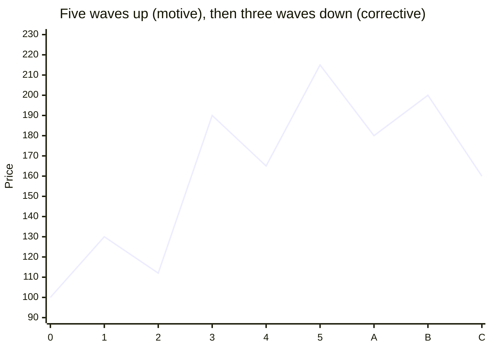
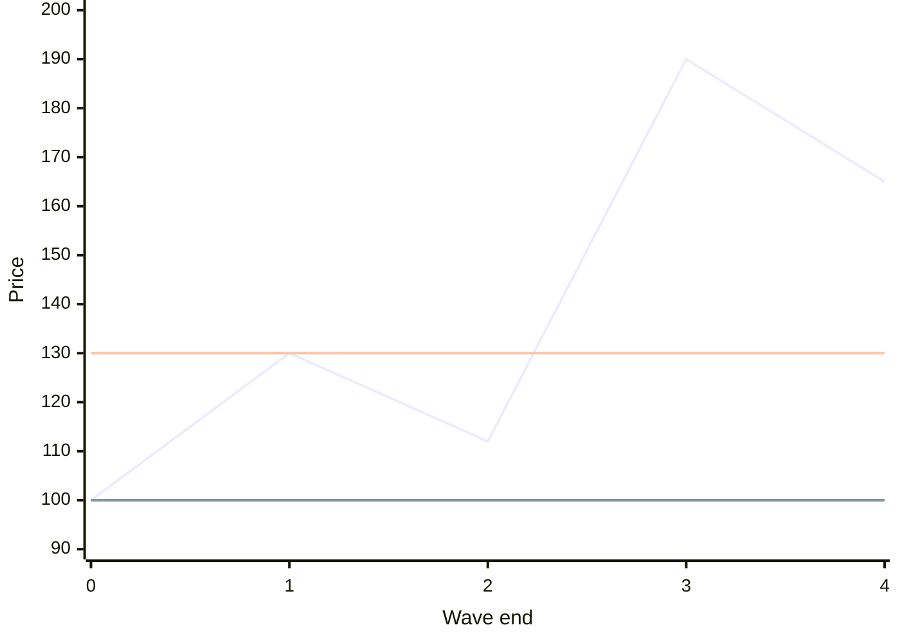
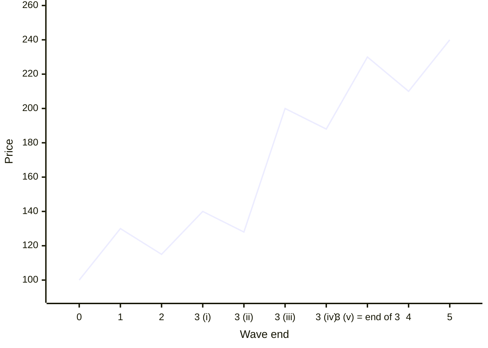
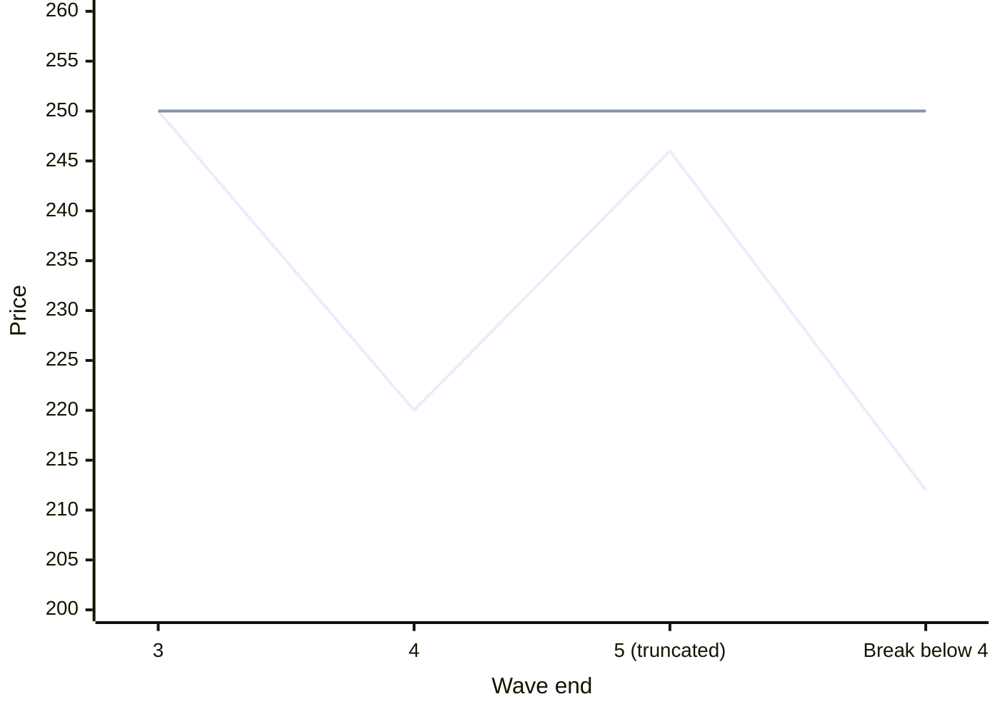
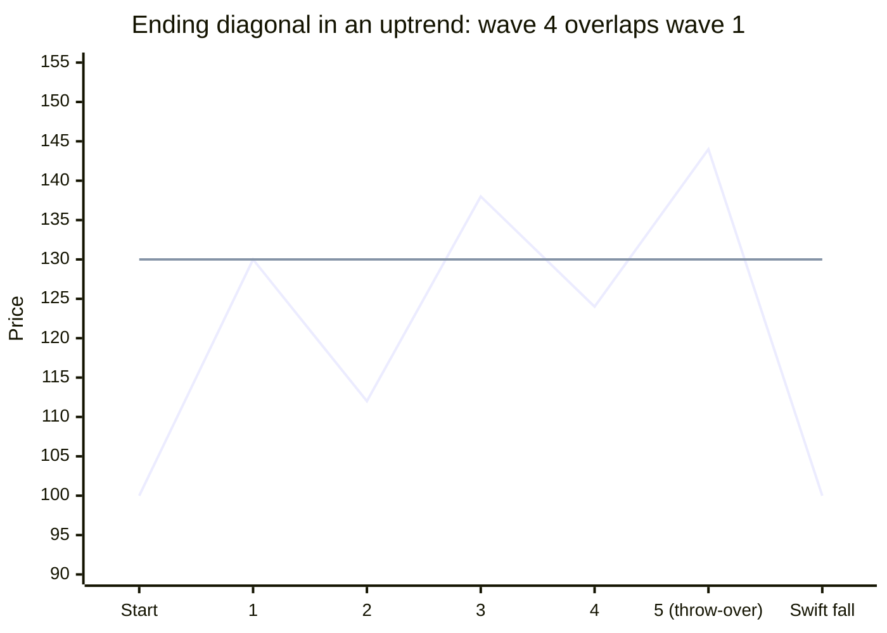
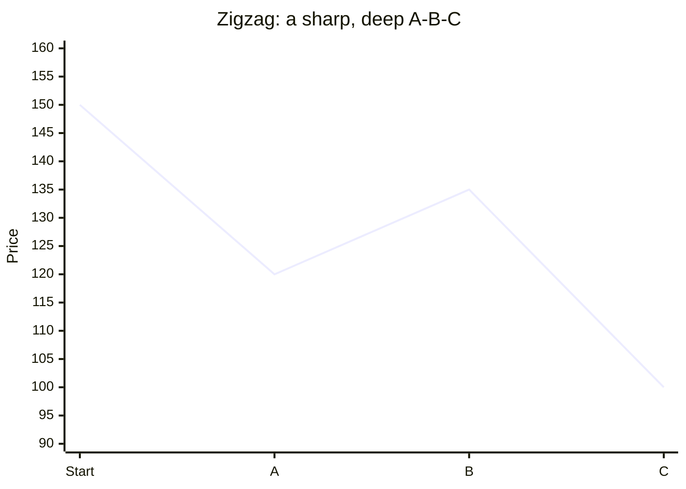
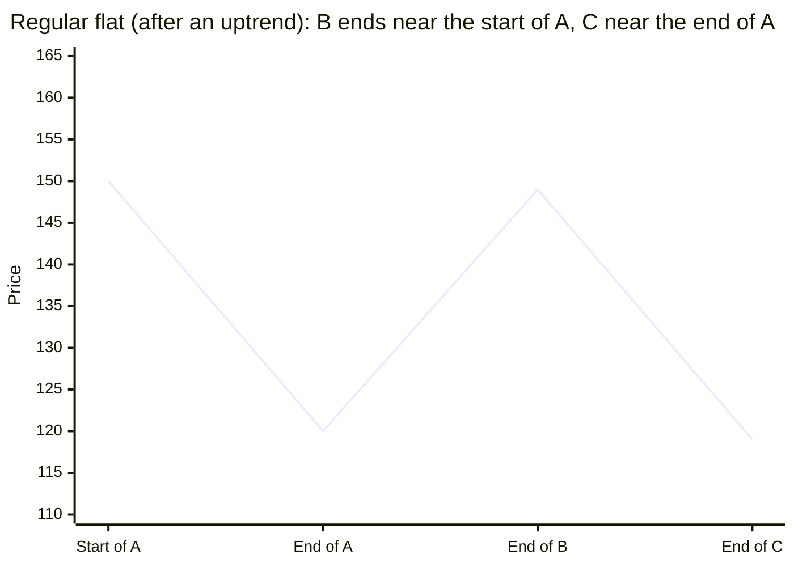
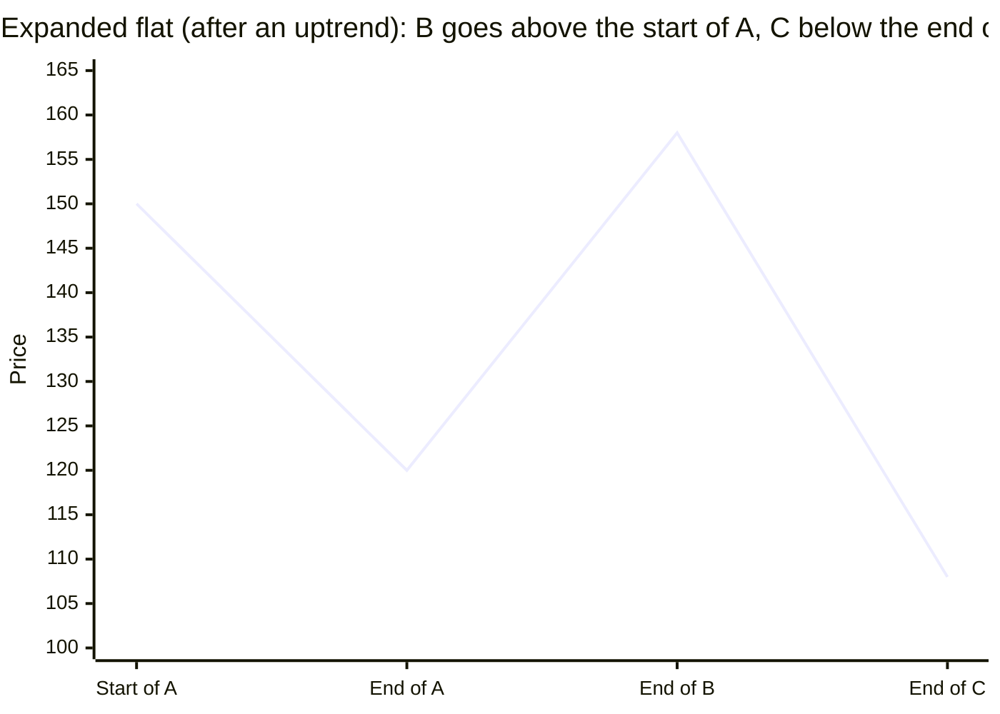
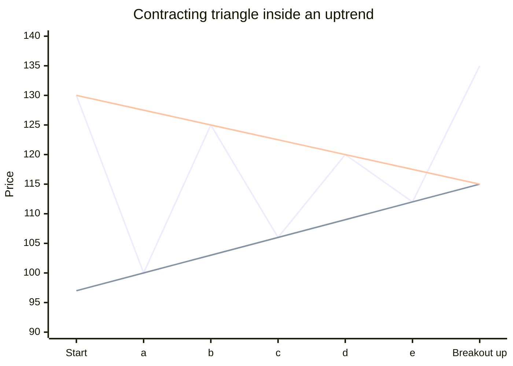

# Wave Structure

This lesson explains how waves are built, the three rules that must never break, and the common shapes of trends and corrections.

---

## 1. Why markets move in waves

Classic economics says prices move toward a fair value. In practice, market moods swing between hope and fear. People copy each other (herding), react emotionally, and decide with incomplete information. So prices overshoot in both directions.

In the 1930s, Ralph Nelson Elliott noticed that this crowd behavior leaves a repeating pattern on price charts. His Wave Principle says:

- Markets move in recognizable patterns called waves.
- Small patterns link together to form larger versions of the same pattern, which then become building blocks of even larger patterns.
- The pattern looks similar on a 5-minute chart, a daily chart, and a monthly chart. It is similar, not identical. This property is called being **fractal**.

---

## 2. The basic pattern: five waves up, three waves down

- **Motive phase: five waves** in the direction of the main trend. Waves 1, 3, and 5 move with the trend. Waves 2 and 4 are pauses against it.
- **Corrective phase: three waves** against the main trend, labeled A, B, and C.

A full cycle has eight waves: five up and three down in a bull market, or five down and three up in a bear market.

### Subdivision

Each wave is made of smaller waves.

- Waves that move with the trend of one larger size (1, 3, 5, A, and C in a zigzag) usually divide into five smaller waves.
- Waves that move against it (2, 4, and B) divide into three smaller waves.

So a complete five-wave advance, looked at one level closer, has 21 smaller waves, and a three-wave correction has 13. You do not need to count every one. You need to know that a clean trend move has five parts and a correction usually has three.

### Degree

The same pattern appears at every size. A five-wave advance on a monthly chart may be wave 1 of an even larger move. Each of its waves contains a five-wave or three-wave pattern on the weekly chart, and so on down to the intraday chart. Traders call these sizes **degrees**. Different labeling styles, such as 1-2-3, (1)-(2)-(3), and i-ii-iii, are used to show different degrees on the same chart.

**Practice with degrees.** Open an index on a monthly, a weekly, and a daily chart. Find a clear five-wave rise on the monthly chart. Then look at one of its waves on the weekly chart and find the smaller five or three waves inside it.

---

## 3. The three hard rules

These rules never break inside an impulse wave. If your count breaks one, the count is wrong.

1. **Wave 2 never goes beyond the start of wave 1.** In an uptrend, wave 2 never falls below the low where wave 1 began.
2. **Wave 3 is never the shortest** of waves 1, 3, and 5. It is often the longest.
3. **Wave 4 never enters the price territory of wave 1** in a normal impulse. In an uptrend, the low of wave 4 stays above the high of wave 1. (The one exception is a diagonal, in section 5.)

**Number example.** Wave 1 rises from 100 to 130. Wave 2 falls to 112. Wave 3 rises to 190. Wave 4 falls to 165.

- Rule 1: 112 is above 100. Pass.
- Rule 2: wave 1 = 30, wave 3 = 78. Wave 3 is not the shortest so far. Pass.
- Rule 3: 165 is above 130, the top of wave 1. Pass.

The zigzag is the count. The flat line at 100 is the floor for wave 2 (rule 1). The flat line at 130 is the floor for wave 4 (rule 3). Both waves stay above their floors, so the count is valid.

If wave 4 had fallen to 125, it would enter wave 1's territory, and the count would be wrong, unless the pattern is a diagonal.

These rules are what make wave analysis useful for stop placement. Lesson 3 turns them into three stop rules.

---

## 4. Impulse waves, extensions, and truncation

Motive waves come in two types: impulses, which are the common kind, and diagonals.

### Impulse

An impulse is a five-wave move in the direction of the larger trend, in which all three rules hold. Waves 1, 3, and 5 each divide into five smaller waves.

### Extension

Often one of the three trend waves is much longer than the other two, and its inner waves look almost like a five-wave pattern of their own. That wave is **extended**.

- In stock markets, wave 3 is most often the extended wave.
- In commodity markets, wave 5 is often extended.

Wave 3 is extended: it runs from 115 to 230 and shows its own five smaller waves, (i) to (v). Waves 1 and 5 are short and about equal (30 points each).

Why it matters: if you know extensions happen, you are less likely to exit in the middle of the best part of a move.

### Truncation

Sometimes wave 5 fails to go beyond the end of wave 3. It still has its own five inner waves, but it ends short. That is a **truncated** fifth wave. It often follows an unusually strong wave 3. Truncations are hard to spot in real time, but knowing about them helps you correct your count when a fifth wave stalls.

**Number example.** Wave 3 ends at 250 after a huge rise. Wave 4 falls to 220. Wave 5 rises in five small waves to only 246, then price falls below 220. The fifth wave was truncated, and the trend has turned.

The flat line is the top of wave 3. Wave 5 stops below it, and the fall below the end of wave 4 confirms the turn.

---

## 5. Leading and ending diagonals

A diagonal is a motive wave shaped like a wedge, with two converging trendlines.

**Key features**

- Waves 1, 3, and 5 each divide into three smaller waves, not five.
- Wave 4 almost always enters the price territory of wave 1. This is the exception to rule 3.
- The shape is a wedge within two converging lines.
- The final wave sometimes pokes beyond the upper line in an uptrend. That is called a **throw-over**. In a downtrend, the final wave may poke below the lower line, which is a **throw-under**.

**Ending diagonal.** Found in wave 5 of an impulse, or in wave C of a correction. It shows that the larger move is exhausted. When it ends, price usually moves swiftly back to where the diagonal started. That swift reversal is one of the best setups in this step.

**Leading diagonal.** Less common. It appears in wave 1 of an impulse, or in wave A of a zigzag. It is followed by a deep wave 2, and then usually a strong wave 3.

---

## 6. Corrections

Corrections move against the larger trend. They are harder to count than impulses, because there are more shapes. Knowing the shapes helps you avoid treating a correction as a new trend.

### Zigzag (5-3-5)

- A sharp, deep correction with three waves: A has five inner waves, B has three, and C has five.
- It often appears as wave 2 of an impulse.
- It often retraces a large part of the previous wave.

### Flat (3-3-5)

- A sideways correction. A has three inner waves, B has three, and C has five.
- **Regular flat.** B ends near the start of A. C ends near the end of A.
- **Expanded flat.** B goes well beyond the start of A. C goes beyond the end of A.

Flats often fool traders. In an expanded flat in an uptrend, wave B makes a new high, and traders assume the trend has resumed. Then wave C falls below the end of A. When a new extreme appears during a correction, do not assume the old trend is back.

### Triangles (3-3-3-3-3)

Each swing is smaller than the one before. The falling top line and rising bottom line meet at a point ahead of price.

- Five waves labeled A, B, C, D, and E. Each divides into three smaller waves.
- The lines connect A to C to E, and B to D.
- **Contracting triangle.** The lines converge. This is the most common kind.
- **Running triangle.** Like a contracting triangle, but wave B goes well beyond the start of wave A.
- **Expanding triangle.** The lines diverge. The swings get wider.
- Wave E sometimes falls short of, or overshoots, the A-C line.
- Triangles usually appear in wave 4 of an impulse, or in wave B of a correction.

Why triangles matter: a triangle is almost always the last pause before the final move of the larger trend. When it ends, the next move goes in the direction of the larger trend. If you find a triangle, expect one more push in the trend's direction, then a larger turn.

### Combinations

Two or three corrective patterns can link together, joined by a three-wave connecting move called an **X wave**. For example: a flat, then an X wave, then a zigzag. Combinations create long, frustrating sideways periods.

Why they matter: after one correction ends, you may expect a new trend wave, but another correction starts instead. Look for combinations in long consolidation zones, and wait for a clear breakout before assuming the correction is over.

---

## 7. The personality of each wave

Each wave reflects a different crowd mood. Recognizing the mood helps you label the wave.

| Wave | In a bull market |
|---|---|
| 1 | Often mistaken for another bounce in the old downtrend. Most people still think the trend is down, and many are selling short. Volume and breadth improve a little. If wave 1 starts from a long base, it can be strong and only lightly retraced. |
| 2 | Retraces much of wave 1. Investors are convinced the bear market is back. Often shows bullish divergence. Low volume and volatility show that selling is drying up. A good buying area. |
| 3 | Strong, broad, and unmistakable. Good news starts to appear as confidence returns. The biggest volume and the biggest price moves. Breakouts, continuation gaps, and trend confirmations happen here. If wave 3 extends, the third wave within wave 3 is the most powerful part of the whole move. |
| 4 | Often sideways and predictable in depth. It builds a base for the final wave. Laggard stocks start to top out during wave 4, because only wave 3's strength could lift them. |
| 5 | Optimism is very high, but fewer stocks are participating. Usually less dynamic than wave 3, with lower volume. If wave 5 extends, its middle part can be fast, but its end still lacks energy. |
| A | Often seen as just a pullback in the bull market. |
| B | A rally that traps buyers who think the old trend has resumed. Often on weak volume. |
| C | A strong, broad decline that erases the hopes raised in wave B. |

In a bear market, the same descriptions apply in reverse.

---

## 8. Telling an impulse from a correction, and where to start

### Impulse or correction?

- **Impulse.** Five waves, energetic, steep, and covers a lot of ground in little time.
- **Correction.** Usually three waves, or a sideways overlapping pattern. Sluggish, slow, and can take days or weeks to finish.

The first question for any wave trade is: is price in an impulse or a correction? You need an impulse to make good money, whether it is a motive wave or the C wave of a correction.

### A five-wave move against the big trend

Suppose the big trend is up. Price falls in a clear five-wave pattern. Is this the start of a new downtrend, or wave C of a correction? If the fall came after an A wave and a B wave, it is more likely wave C. The correction is ending, and the next pullback is a chance to go long, with the stop below the end of the fifth wave.

### Where to start counting

Markets are continuous. They have no official beginning. Always start your count from a significant top or bottom, such as a major multi-month low or high. If a stock rallies in three waves while its index makes new highs, it may be an A-B-C bounce in a longer bear market, not a new wave 1 to 3.

### Be flexible

As new candles form, your count may stop fitting. Change the count and adjust the trade. The rules decide. Your wish for a particular count does not.

---

## Practice

1. Wave 1 runs from 50 to 70. Wave 2 falls to 48. Is this a valid impulse count?
2. Wave 1 = 30 points, wave 3 = 25 points, wave 5 = 40 points. Is this valid?
3. In an uptrend, wave 4 falls into the price range of wave 1. What pattern might this be?
4. Wave B makes a new high above the start of wave A. What kind of correction might be forming, and what is the danger?
5. You find a contracting triangle. Which wave is it most likely to be, and what do you expect next?

### Answers

1. No. Wave 2 fell below 50, the start of wave 1. That breaks rule 1.
2. No. Wave 3 is the shortest of the three, which breaks rule 2.
3. A diagonal, where wave 4 overlapping wave 1 is allowed. Check whether the waves form a converging wedge and each divides into three.
4. An expanded flat. The danger is buying the new high, thinking the uptrend has resumed, just before wave C falls below the end of A.
5. Wave 4 of an impulse, or wave B of a correction. Expect one more move in the direction of the larger trend after the triangle ends.
