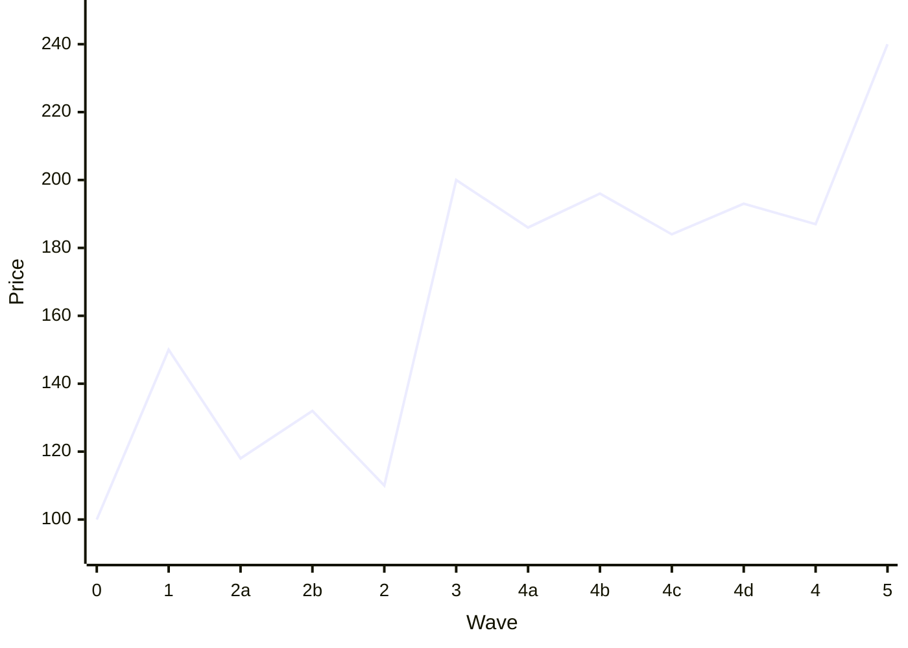
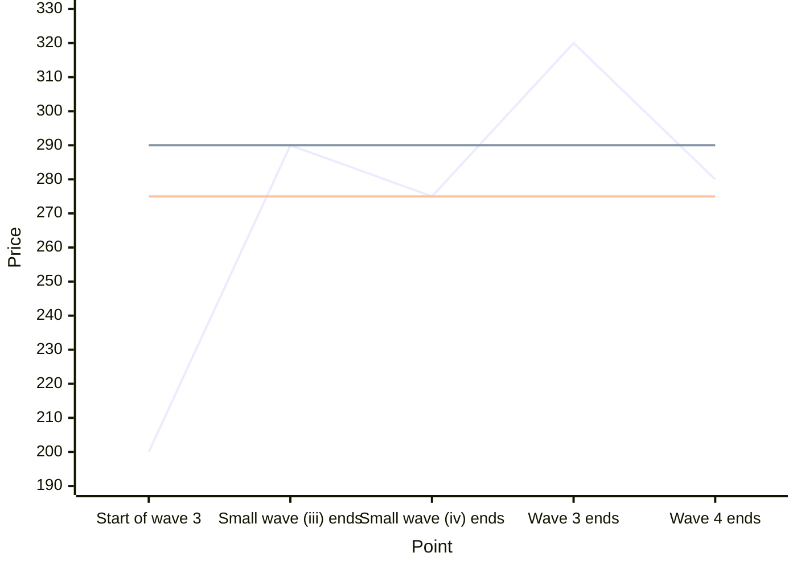
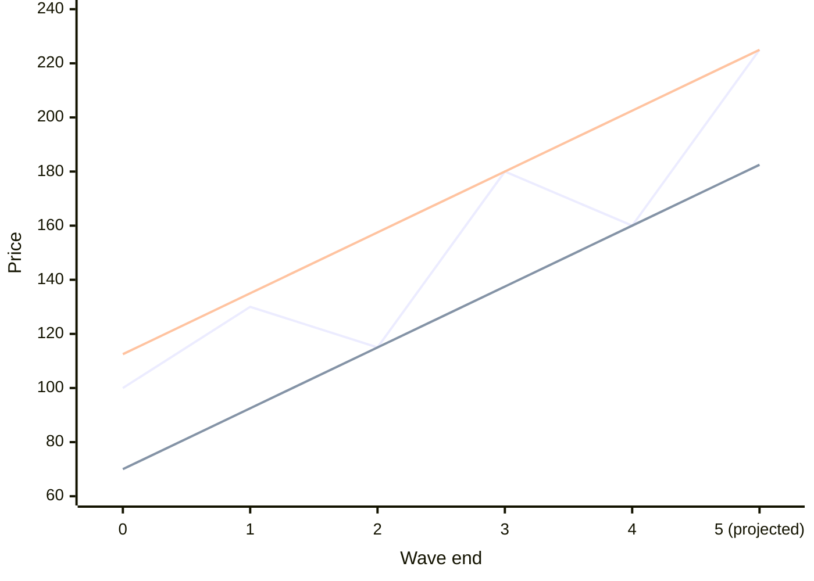
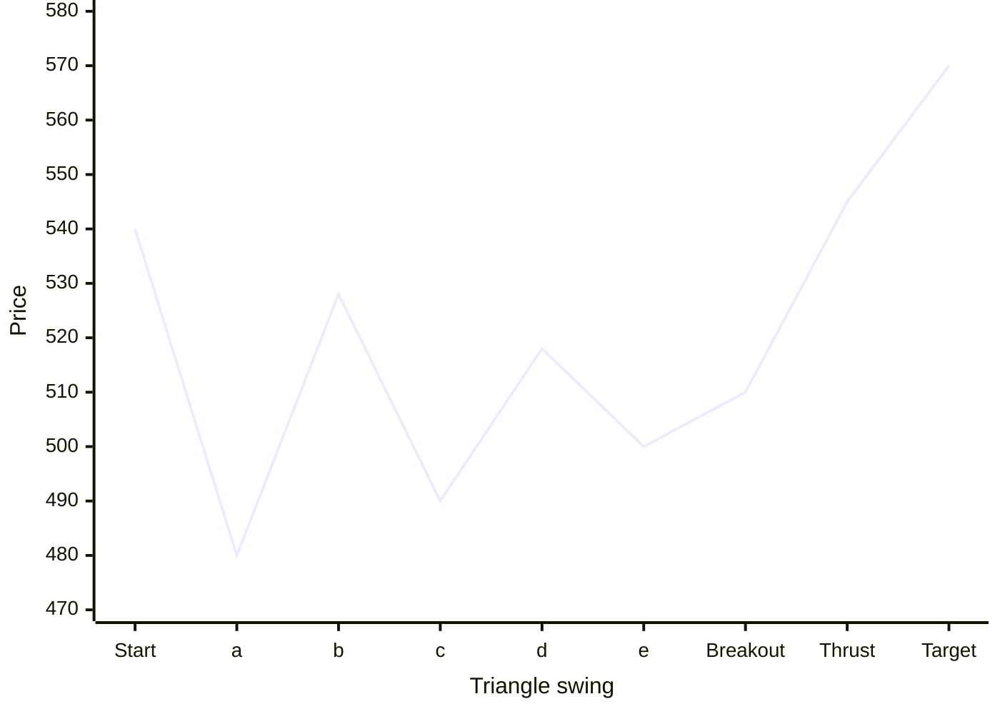
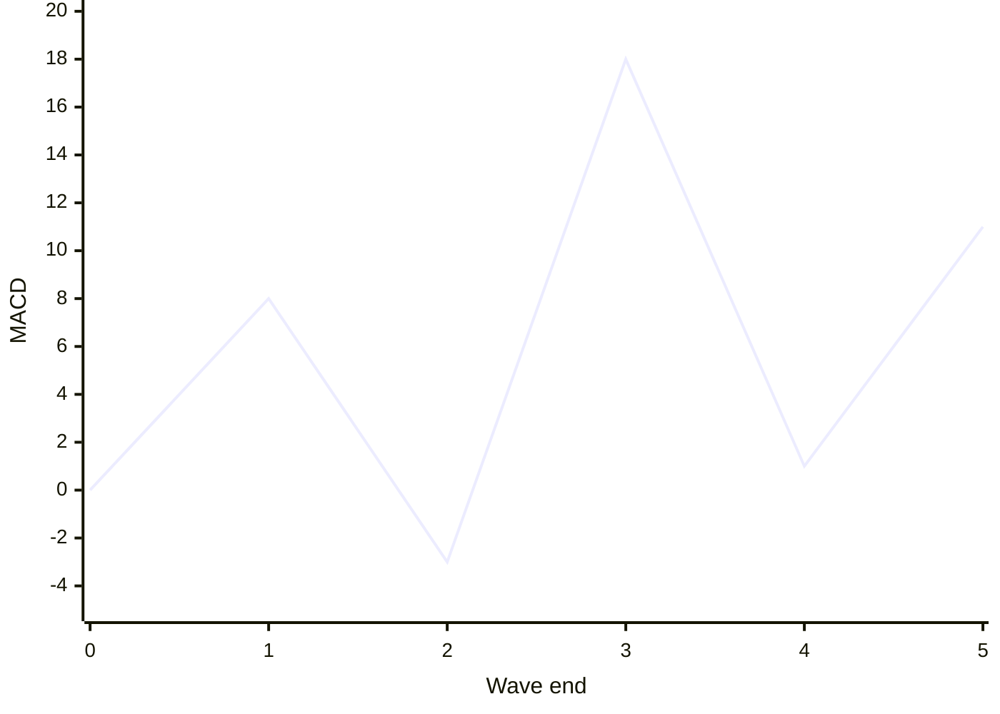

# Guidelines and Indicators

The three rules in the previous lesson are hard rules. The guidelines here are tendencies: they are true most of the time, not always. Use them to choose between possible counts and to set targets. Then use indicators to check the count.

---

## 1. Equality

In an impulse where one wave extends, the other two trend waves tend to be about equal in size and time.

- If wave 3 extends, waves 1 and 5 are often about the same length.
- If they are not equal, the next most likely relationship is 0.618 of each other.

```mermaid
xychart-beta
  x-axis "Wave end" ["0", "1", "2", "3", "4", "5"]
  y-axis "Price" 90 --> 260
  line [100, 140, 115, 235, 210, 250]
```

Wave 1 rises 40 points. Wave 3 extends and rises 120. Wave 5 rises 40 again, equal to wave 1.

**Number example.** Wave 1 rises 40 points. Wave 3 extends and rises 120 points. Wave 4 ends at 380. The first target for wave 5 is 380 + 40 = 420. The second is 380 + (40 × 0.618) ≈ 405.

---

## 2. Alternation

If one correction takes one form, the next correction of the same degree often takes a different form.

- If wave 2 is sharp and deep, like a zigzag, expect wave 4 to be sideways and shallow, like a flat or a triangle.
- If wave 2 is sideways, expect wave 4 to be sharp.



Wave 2 is a sharp, deep zigzag that gives back most of wave 1. Wave 4 is a slow, shallow, sideways triangle.

Alternation can also appear in time: a quick wave 2 and a slow wave 4, or the reverse.

Why it matters: after a deep, fast wave 2, do not expect wave 4 to offer the same deep entry. Plan to buy a shallow, sideways consolidation instead.

---

## 3. How deep corrections go

- A wave 4 correction usually ends near the end of the previous fourth wave of one smaller degree, meaning the small wave 4 inside wave 3. It often ends in that small wave's price range.
- After a completed five-wave move, the correction that follows often returns to the area of that move's wave 4.



The two flat lines mark the small fourth wave's range, 275 to 290. The big wave 4 ends inside it, at 280.

**Number example.** Inside a large wave 3 from 200 to 320, the small fourth wave ran from 290 down to 275. When the large wave 4 begins, the target zone for its end is 275 to 290.

---

## 4. Channeling

Impulse waves often move within parallel lines. Draw the channel to project where waves may end.

**Impulse channel.**

1. When wave 3 ends, join the ends of wave 1 and wave 3. Draw a parallel line through the end of wave 2. This projects where wave 4 may end.
2. When wave 4 ends, join the ends of waves 2 and 4. Draw a parallel line through the end of wave 3. This projects where wave 5 may end.



The zigzag is price. The lower line joins the ends of waves 2 and 4. The upper line is parallel to it and passes through the end of wave 3. Where the upper line meets the projected wave 5, about 225, is the channel target.

**Zigzag channel.** Join the start of wave A and the end of wave B. Draw a parallel line through the end of wave A. This projects where wave C may end.

**Throw-over.** Wave 5 sometimes overshoots the top of the channel. That is called a **throw-over**. Clues:

- If wave 4 pierced the lower channel line, expect wave 5 to pierce the upper line.
- Volume often spikes at the throw-over point.
- A throw-over is a sign that wave 5 is ending. Prepare to exit.

---

## 5. Volume

- In lower degrees, volume usually expands in wave 3 and is lower in wave 5.
- If volume in wave 5 is equal to or higher than in wave 3, wave 5 may be extending.
- In very large degrees, volume may still peak in wave 5, because more participants join late in a long trend.
- Volume usually contracts during corrections. In a bull market, volume that rises during rallies and falls during pullbacks confirms the trend.

---

## 6. Post-triangle thrust

When a triangle ends, price usually makes a quick, sharp move in the direction of the larger trend. This is called a **thrust**.

**Target.** Measure the widest part of the triangle, which is at its start. Add that distance to the breakout point. A shorter, more conservative target is 0.618 of that distance.



The triangle starts 60 points wide (540 to 480). Price breaks out at 510, and the full thrust target is 510 + 60 = 570.

**Number example.** A triangle in wave 4 starts 60 points wide. Price breaks upward from 510. The full thrust target is 510 + 60 = 570. The conservative target is 510 + 37 ≈ 547.

---

## 7. Fibonacci relationships between waves

Fibonacci ratios (0.382, 0.5, 0.618, 1.0, 1.618, 2.618) often describe how waves relate. These are common tendencies, not rules. Use them to set targets and to find where a correction may end.

| Wave | Common relationship |
|---|---|
| Wave 2 | Retraces 0.5 or 0.618 of wave 1 |
| Wave 3 | 1.618 × wave 1, sometimes 2.618 × wave 1, measured from the end of wave 2 |
| Wave 4 | Retraces 0.382 of wave 3, often ending near the small fourth wave inside wave 3 |
| Wave 5 | Equal to wave 1, or 0.618 × the distance from the start of wave 1 to the end of wave 3, measured from the end of wave 4 |
| Wave B | Retraces 0.5 to 0.618 of wave A in a zigzag, or about 1.0 of wave A in a flat |
| Wave C | Equal to wave A, or 1.618 × wave A |
| Triangle waves | Each wave is often about 0.618 of the one before it |

**Number example.** Wave 1 rises from 1,000 to 1,100 (100 points). Wave 2 falls to 1,040 (a 0.6 retracement). The first wave 3 target is 1,040 + 162 = 1,202. If price reaches 1,300, the next reference is 1,040 + 262 = 1,302.

To draw these, use the Fibonacci retracement and extension tools from Step 1.

---

## 8. Indicators on waves

### MACD and its histogram

The MACD line and histogram track momentum. Momentum follows a pattern through the waves:

- **Wave 3** shows the highest MACD reading and the tallest histogram bars of the move.
- **Wave 4** pulls MACD back to near the zero line. A MACD that returns to zero and then turns up is a wave 4 ending signal.
- **Wave 5** makes a higher price high than wave 3, but MACD makes a lower high. That is bearish divergence. It warns that the trend is ending.
- **Corrections.** At the end of wave C, watch for divergence between the lows of waves A and C: price makes a lower low in C, but MACD makes a higher low.
- **Diagonals.** The histogram shows converging highs and lows as the wedge narrows.
- **Triangles.** MACD flattens and toggles around the zero line.

```mermaid
xychart-beta
  x-axis "Wave end" ["0", "1", "2", "3", "4", "5"]
  y-axis "Price" 90 --> 200
  line [100, 130, 112, 180, 160, 195]
```



Price makes its highest high at wave 5 (195), but MACD peaked at wave 3 (18) and makes a lower high at wave 5 (11). MACD fell back to near zero during wave 4. That is the usual momentum footprint of a five-wave move.

### Reverse divergence

Ordinary divergence warns of a turn. **Reverse divergence**, also called hidden divergence, signals that a correction is ending and the trend will continue.

- **Bullish reverse divergence.** Price makes a higher low, but MACD or RSI makes a lower low. The pullback looked scary on the indicator, but price held up. Expect the uptrend to resume.
- **Bearish reverse divergence.** Price makes a lower high, but the indicator makes a higher high. Expect the downtrend to resume.

This is a useful signal for entries in waves 3 and 5.

### RSI

- RSI above 50 supports an uptrend. RSI below 50 supports a downtrend.
- RSI divergence between waves 3 and 5 confirms that wave 5 is ending.

### GMMA

The Guppy Multiple Moving Average uses two groups of exponential moving averages:

- **Short group:** 3, 5, 8, 10, 12, and 15 periods. It shows what short-term traders are doing.
- **Long group:** 30, 35, 40, 45, 50, and 60 periods. It shows what long-term investors are doing.

How to read it:

- In a strong trend, both groups spread out and slope the same way, with a clear gap between them.
- During a correction, the short group falls back toward the long group, while the long group stays spread out and pointed in the trend's direction.
- When the short group compresses and then expands again in the trend's direction, the correction is ending.
- When the long group itself compresses and crosses, the larger trend may be changing.

### Bollinger Bands on waves

- An **impulse** shows expanding bands, with price riding the band in the trend's direction.
- A **correction** shows contracting or flat bands.
- In an uptrend, price that falls to the lower band while the lower band does not turn down is a correction, not a new downtrend.
- Rising ADX with expanding bands confirms a dynamic impulse, often a wave 3.

---

## Practice

1. Wave 2 was a sharp zigzag. What kind of wave 4 do you expect?
2. Wave 1 runs from 200 to 250. Wave 2 ends at 220. What are the first two targets for wave 3?
3. Price makes a new high in wave 5, but MACD makes a lower high than in wave 3. What does that mean?
4. In an uptrend, price makes a higher low, but RSI makes a lower low. What does that suggest?
5. A triangle is 30 points wide at its start and breaks down at 180 in a downtrend. What are the targets?

### Answers

1. A sideways, shallow correction, such as a flat or a triangle, because of alternation.
2. Wave 1 is 50 points. Targets: 220 + 81 = 301 (1.618 × 50), then 220 + 131 = 351 (2.618 × 50).
3. Bearish divergence. Wave 5 is likely ending. Tighten stops or take profit.
4. Bullish reverse divergence. The correction is likely ending, and the uptrend should resume.
5. Full target: 180 − 30 = 150. Conservative target: 180 − 18.5 ≈ 161.5.
