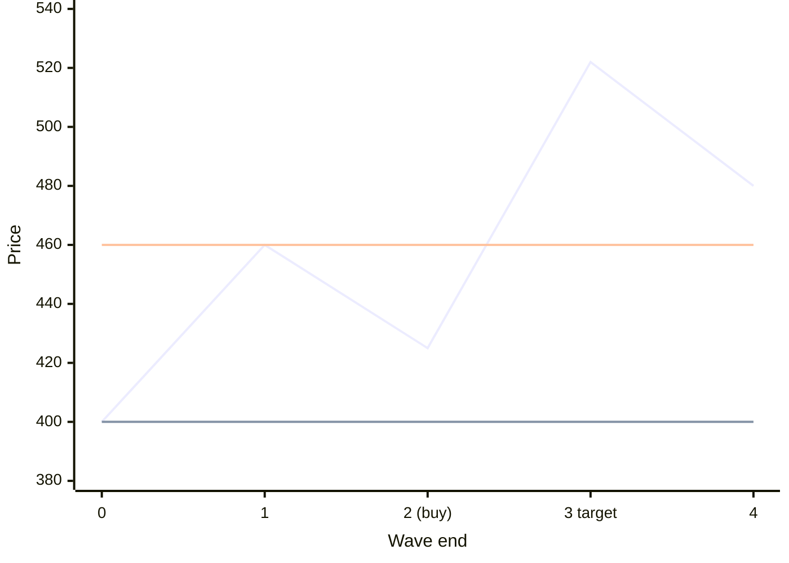
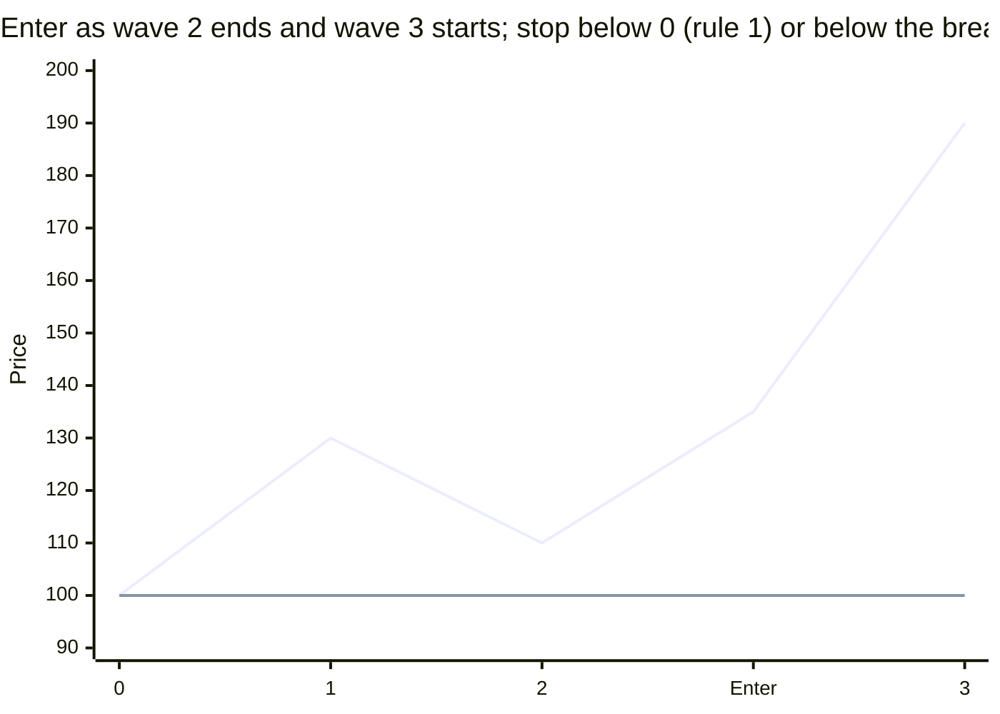
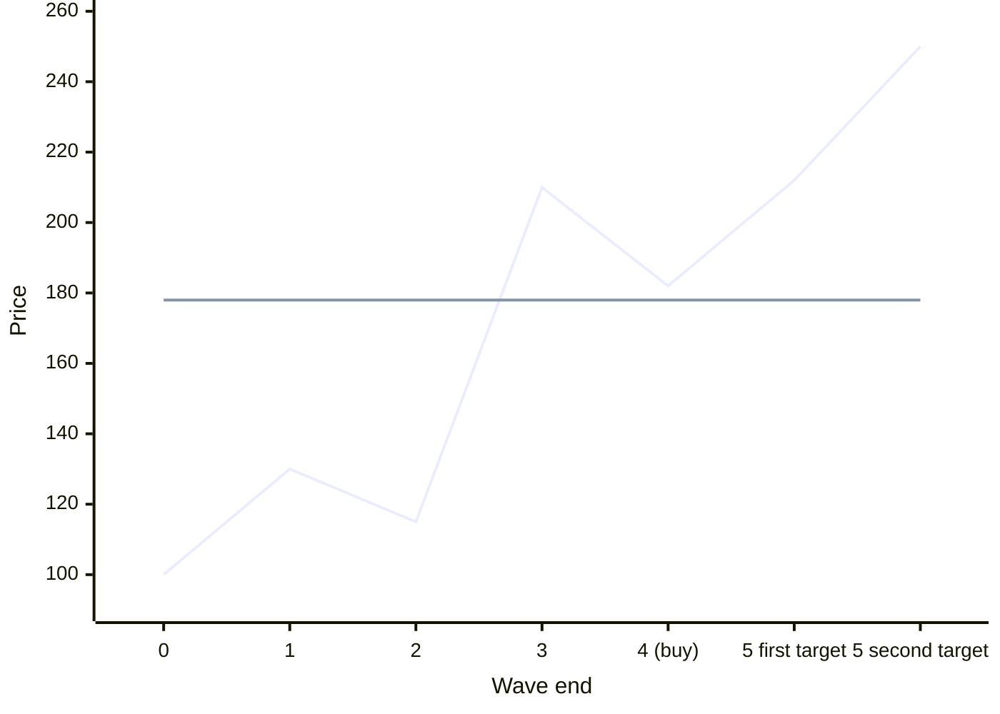
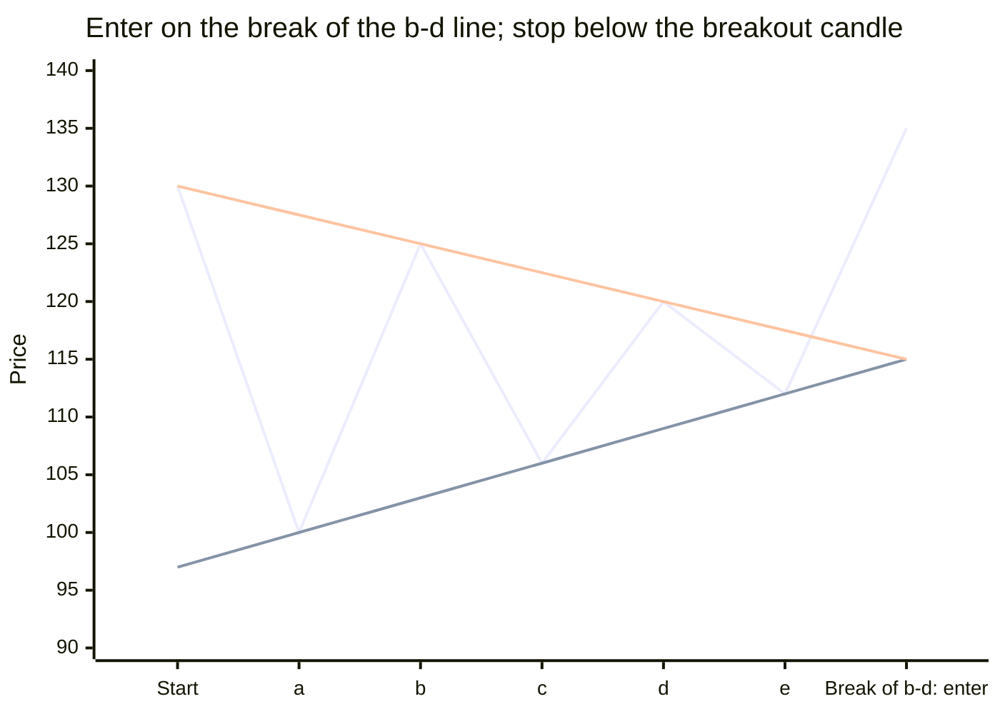
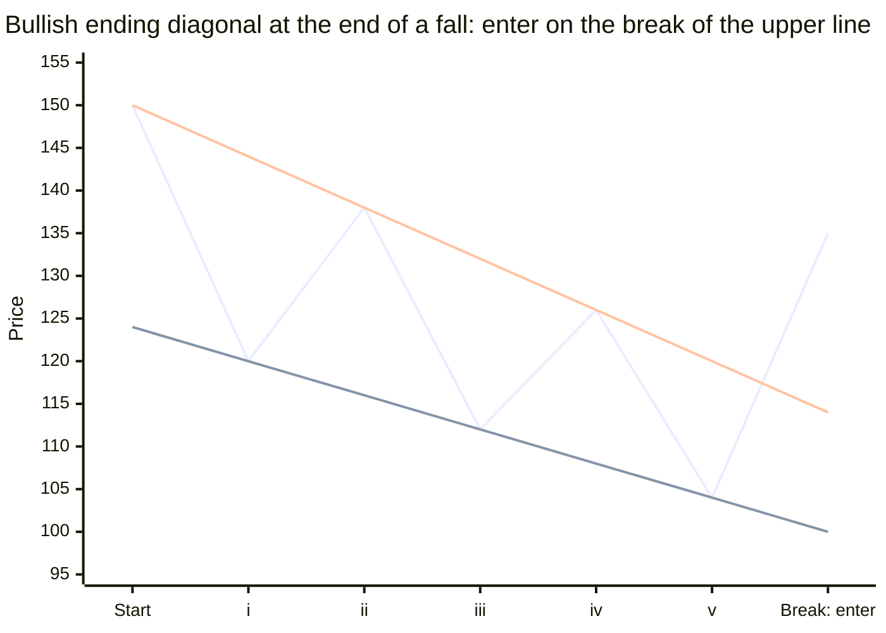
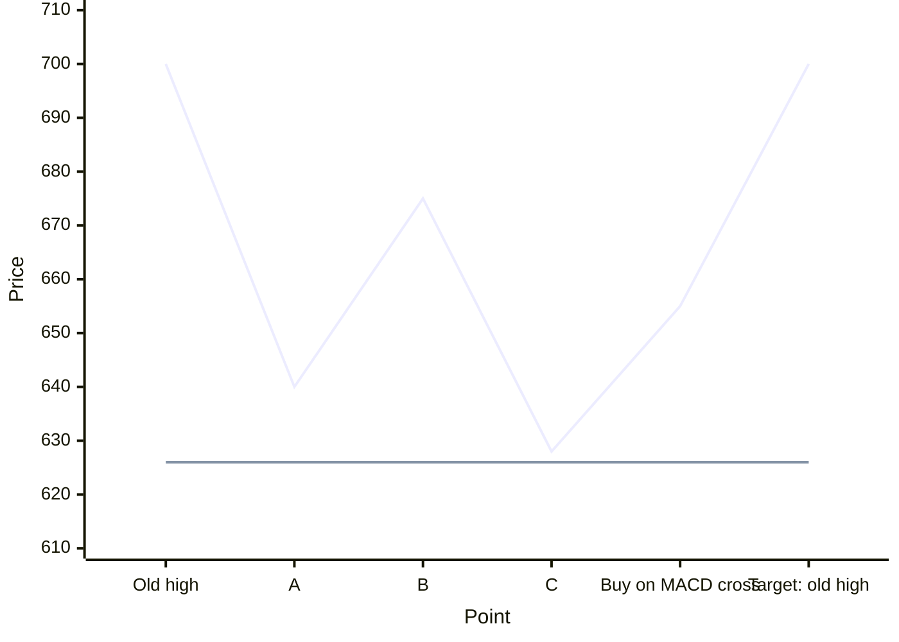
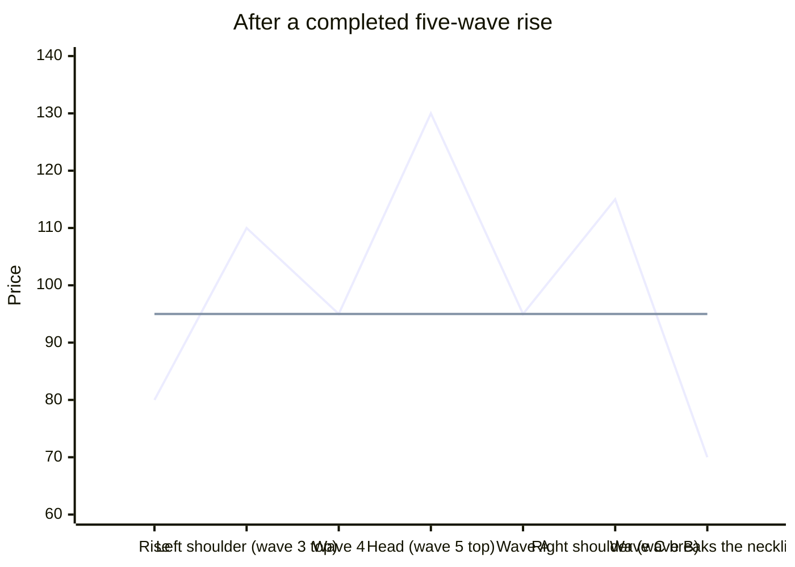
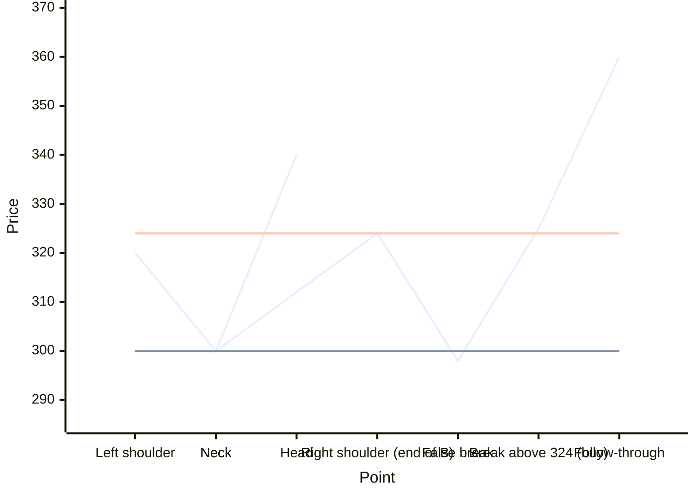
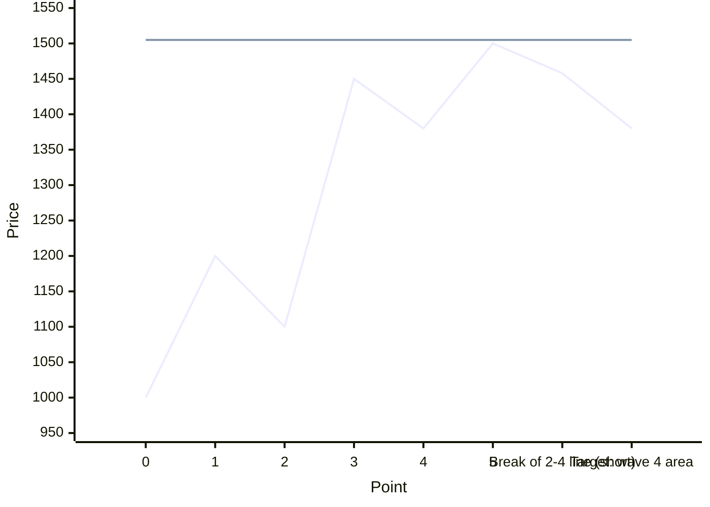

# High-Probability Wave Setups

This lesson turns wave structure into trades. Each setup has a checklist. The more boxes that are ticked, the better the odds. Boxes marked **must** are required.

Two charts are used, as in the three-screen method from Step 1:

- **Tide chart.** The slower chart, such as weekly for a daily trade. It sets the direction.
- **Trading chart.** The chart you trade on, such as daily. It holds the wave count and the entry signal.

Where the checklists mention a band breakout candle or a band that is not challenged, those are the Bollinger Band signals from [Step 4, Lesson 2](../04-price-action/02-confirmation-tools.md).

---

## 1. Where to stop out: three rules

The wave rules tell you the price at which your count is wrong. Put the stop there.

| Rule | Stop placement | Use it when |
|---|---|---|
| 1 | Below the start of wave 1 | Buying at the end of wave 2. If price goes below the start of wave 1, rule 1 breaks. |
| 2 | Below the end of wave 1 | Buying at the end of wave 4. If price enters wave 1's territory, rule 3 breaks. |
| 3 | At the price where wave 3 would become the shortest | Wave 1 was extended, and the count depends on wave 3 not being shorter than wave 1. |

For shorts, reverse the rules and place stops above.

**Number example.** Wave 1 rose from 400 to 460. Wave 2 is ending near 425, and a bullish signal appears. Buy at 430 with the stop just below 400 (rule 1). The risk is 30 points. If wave 3 reaches only 1.618 × 60 = 97 points above 425, the target is 522, a reward of 92 points for 30 of risk.

The flat line at 400 is the rule 1 stop for a buy at the end of wave 2. The flat line at 460 is the rule 2 stop for a buy at the end of wave 4: wave 4 must stay above the top of wave 1.

Often the wave-rule stop is far away. You can use a tighter stop below the entry candle, but know that the wave-rule stop is where the idea is truly dead.

---

## 2. Third-wave setup

`Trend continuation` · `Core`

**Why:** wave 3 is usually the strongest and longest wave. Catching it early gives the best reward for the risk.

**Checklist for a long.** For a short, reverse every condition.

Tide chart:

- [ ] MACD histogram is ticking up.
- [ ] The lower Bollinger Band is not being challenged: price is not falling to the lower band.
- [ ] RSI above 50 (nice to have).

Trading chart:

- [ ] Price has made two higher lows (the start of wave 1 and the end of wave 2).
- [ ] Price breaks a trendline, with a band breakout candle.
- [ ] RSI above 50.
- [ ] The tide and trading charts agree, per the two-screen check from Step 1.
- [ ] **Must:** above-average volume on the breakout candle.

**Other signs of a real third wave:** the MACD line keeps making new highs; there are gaps and fast, dynamic price moves; the Bollinger Bands confirm that the previous move was a correction and the new one is an impulse.

**Stop:** below the breakout candle, or, using rule 1, below the start of wave 1.

**Target:** 1.618 × wave 1, or at least equal to wave 1, measured from the end of wave 2. Use the Fibonacci extension tool.

**Number example.** Wave 1 rose from 800 to 880. Wave 2 fell to 835, and price then broke its falling trendline with a band breakout candle closing at 852 on twice the average volume. Buy at 852. The breakout candle's low is 834, so the stop is 833. Targets: 835 + 80 = 915 (equal to wave 1), and 835 + 129 ≈ 964 (1.618 × wave 1).

**When it fails:** if price falls back below the start of wave 1, the count was wrong. The rise was probably a B wave of a correction, not wave 1.

**Chart hunt:** find a market that bottomed after a long fall, rose sharply, then made a half to two-thirds pullback. Check whether the move after the pullback met the checklist.

---

## 3. Fifth-wave setup

`Trend continuation` · `Useful`

**Why:** after a wave 4 ends, one more push in the trend's direction usually follows. It is less powerful than wave 3, so take profits more quickly.

**Signs that wave 4 is ending:**

- [ ] MACD has pulled back to near the zero line and is turning back up. This is a zero-line reversal.
- [ ] Reverse divergence: price makes a higher low, while MACD makes a lower low.
- [ ] If wave 4 is a zigzag, there is divergence between the ends of its small waves A and C.
- [ ] If wave 2 was a sharp zigzag, expect a sideways wave 4, often a triangle (alternation).
- [ ] Wave 4 has reached the zone of the small fourth wave inside wave 3.

**Stop:** below the end of wave 4, or, using rule 2, below the end of wave 1.

**Target:** equal to wave 1, or 0.618 × the distance from the start of wave 1 to the end of wave 3, measured from the end of wave 4. Also use the top of the channel.

**Number example.** Wave 1 went from 100 to 130, and wave 3 ended at 210. Wave 4 is ending at 182, with MACD turning up from zero. Buy at 186, with the stop at 178, below wave 4. Targets: 182 + 30 = 212, and 182 + (110 × 0.618) ≈ 250.

The flat line is the stop at 178, just below the end of wave 4.

**Watch for:** divergence on RSI and MACD as wave 5 matures. That is the signal to exit.

---

## 4. Triangle breakout setup

`Trend continuation` · `Core`

**Why:** a triangle is usually wave 4 or wave B. The breakout starts the final wave (5 or C), and the thrust is quick.

**Checklist for an upside breakout.** For a downside breakout, reverse every condition.

Tide chart:

- [ ] MACD is ticking up and is above zero.
- [ ] The lower band is not being challenged.
- [ ] The tide and trading charts agree.
- [ ] RSI above 50.

Trading chart:

- [ ] Price breaks the upper trendline of the triangle with a band breakout candle.
- [ ] RSI above 50.
- [ ] The MACD histogram's swings have been converging and now break upward.
- [ ] Nice to have: reverse divergence in the trade's direction, or MACD toggling near zero during the triangle.
- [ ] **Must:** above-average volume on the breakout candle.

**Stop:** below the breakout candle.

**Target:** the width of the triangle at its start, added to the breakout point. The conservative target is 62 percent of that.

**Number example.** A triangle starts 90 points wide, between 1,210 and 1,300. After five swings it narrows. Price breaks the upper line at 1,262 with a strong candle on high volume. Buy at 1,264, with the stop at 1,248 below the candle. Targets: 1,262 + 90 = 1,352, and 1,262 + 56 ≈ 1,318.

**When it fails:** if price breaks out and then falls back inside the triangle and below the last swing low (wave e), the triangle count is wrong. Exit.

---

## 5. Ending diagonal setup

`Reversal` · `Core`

**Why:** an ending diagonal shows that the last wave of a move (wave 5 or wave C) is exhausted. When it breaks, price usually returns quickly to where the diagonal began.

**Checklist for a bullish reversal.** For a bearish reversal after a rising diagonal, reverse every condition.

Tide chart:

- [ ] MACD is ticking up, or has gone flat after a fall.
- [ ] The lower band is not being challenged.

Trading chart:

- [ ] Price breaks out of the diagonal's upper line.
- [ ] RSI shows bullish divergence: price makes a lower low in wave v, while RSI makes a higher low.
- [ ] A band breakout candle.
- [ ] The tide and trading charts agree.
- [ ] MACD crosses above its signal line.
- [ ] The MACD histogram's swings have been converging, and the trendline breaks.
- [ ] Nice to have: ordinary divergence on MACD or RSI in the trade's direction.
- [ ] **Must:** above-average volume on the breakout candle.

**Stop:** below the breakout candle.

**Target:** the start of the diagonal, or the depth of the earlier fourth wave.

**Number example.** A stock falls from 540 in a wedge: wave i to 520, ii to 530, iii to 505, iv to 524 (overlapping wave i, as diagonals allow), and finally v to 496. RSI makes a higher low at 496 than at 505. Price breaks the upper line at 510 with a strong candle on high volume. Buy at 511, with the stop at 494. The target is the diagonal's start at 540, a reward of 29 points for 17 of risk.

**Remember:** the final wave often throws over or under the line before the reversal. Do not enter on the throw-over. Enter on the break back through the opposite line.

---

## 6. Trading the main trend after wave C

`Trend continuation` · `Useful`

**Why:** wave C ends a correction. When it ends, the main trend resumes, often strongly.

**Look for:**

- [ ] Divergence at the end of wave C, against the end of wave A.
- [ ] An ending diagonal in wave C.
- [ ] EMAs on both the weekly and daily charts that support the main trend.
- [ ] MACD crossing above zero after the divergence.

**Entry:** on the MACD zero-line crossover, or on the ending diagonal breakout.

**Stop:** below the end of wave C.

**Number example.** An uptrend corrects in three waves: A falls from 700 to 640, B bounces to 675, and C falls to 628. At 628, MACD makes a higher low than at 640. The weekly EMAs are still rising. Two days later, MACD crosses above zero with price at 655. Buy at 655, with the stop at 626. The first target is the old high at 700.

The flat line is the stop at 626, just below the end of wave C.

---

## 7. Head and shoulders counted as waves

`Reversal` · `Useful`

A head and shoulders top can be counted as waves: the left shoulder, head, and right shoulder, followed by waves A, B, and C, with wave C breaking the neckline.

- **If the pattern forms after a completed five-wave advance,** it may be the start of a new downtrend. The neckline break begins a new count of 1, 2, 3.
- **MACD histogram clue:** at the neckline break, the histogram often shows less selling power than it did at the previous low. That tells you the sellers do not need much effort to push through.
- **Success factor:** follow-through. The histogram keeps ticking lower after the break.

For the full trade rules for head and shoulders, see [Step 3: Reversal patterns](../03-chart-patterns/01-reversal-patterns.md).

---

## 8. Failed head and shoulders

`Trend continuation` · `Useful`

A failed head and shoulders is a continuation of the trend of one larger degree. It traps traders who shorted the pattern.

- **When it fails.** Usually when the tide is not in favor of the pattern: for example, a head and shoulders top on the daily chart while the weekly EMAs are still rising strongly.
- **Entry.** Buy when price breaks above the end of wave B, which is usually the right shoulder's peak.
- **Early warning.** Watch for price, or the MACD histogram, breaking its divergence line upward.

**Number example.** On the daily chart, a stock forms a head and shoulders top with a neckline at 300 and a right shoulder at 324. The weekly trend is strongly up. Price dips to 298, then rebounds and breaks above 324. Buy at 325, with the stop at 297, below the failed break. The trapped shorts must cover, which adds fuel to the rally.

The lower flat line is the neckline at 300. The upper flat line is the right shoulder at 324. The pattern fails when price dips under the neckline, comes back, and breaks above the right shoulder.

---

## 9. Counter-trend trade after a fifth wave

`Reversal` · `Advanced`

**Why:** after a completed five-wave advance, a three-wave correction follows. You can trade it, but it goes against the larger trend. It is advanced, so use small size and quick profits.

**Checklist:**

- [ ] The five-wave advance is clearly complete. You can count all five waves, and the three rules hold.
- [ ] RSI and MACD show divergence between wave 3 and wave 5.
- [ ] Wave 5 is an ending diagonal (a strong extra sign).
- [ ] Price breaks the line from the end of wave 2 to the end of wave 4.

**Target:** the area of wave 4.

**Stop:** above the top of wave 5.

**Number example.** A five-wave rise ends at 1,500. Wave 4 had ended at 1,380. RSI peaked at 78 in wave 3 and only 66 in wave 5. Price breaks the 2-4 line at 1,460. Short at 1,458, with the stop at 1,505. Target: 1,380.

The flat line is the stop at 1,505, just above the top of wave 5.

---

## 10. Points to remember

- Use the three-screen method to decide. Use waves to filter and verify setups, and to fine-tune stops.
- Your first step is to decide whether price is in an impulse or a correction.
  - In an impulse, use Fibonacci multiples (1.0, 1.618, 2.618) to set targets.
  - In a correction, use Fibonacci retracements (0.382, 0.5, 0.618) to find where it may end.
- To make money, you need an impulse, whether it is a motive wave or the C wave of a correction.
- Always check the Bollinger Bands.
- If the tide is in an impulse, a moving average crossover on your trading chart is a simple exit.
- Most of what works is simple. Use simple tools.
- Trade only high-probability setups.
- When in doubt, do not trade. Wait patiently for the right setup.

---

## 11. Wave trade journal

Fill in one row for every market you study, whether or not you trade it. After 20 rows, review which setups worked.

| Column | What to write |
|---|---|
| Date | The date of the analysis |
| Market | The stock, index, or commodity |
| Close | The latest closing price |
| Phase | Impulse or correction |
| Three-screen decision | Buy, sell, or wait |
| Wave setup | Third wave, fifth wave, triangle, ending diagonal, after wave C, failed head and shoulders, or none |
| Target, from channel | The channel projection |
| Target, from Fibonacci | The Fibonacci projection |
| Target, from guidelines | Equality, post-triangle thrust, or depth of wave 4 |
| Stop, from wave rules | Rule 1, 2, or 3 |
| Stop, from support or resistance | The nearest level beyond the entry |
| Reward | Target minus entry |
| Risk | Entry minus stop |
| Reward-to-risk ratio | Reward divided by risk |
| Decision | Trade, or no trade and why |
| Option strategy | If trading with options, which strategy from Step 6 |

**Sample row.**

| Date | Market | Close | Phase | Decision | Setup | Target | Stop | Reward | Risk | Ratio | Trade? |
|---|---|---|---|---|---|---|---|---|---|---|---|
| Day 1 | Stock X | 852 | Impulse | Buy | Third wave | 915 and 964 | 833 | 63 | 19 | 3.3 | Yes, bull call spread |

---

## Practice

1. You are buying at the end of wave 2. Where is the wave-rule stop?
2. A triangle breakout has a band breakout candle, but volume is below average. Do you take the trade?
3. A daily head and shoulders top forms while the weekly EMAs are rising strongly. What might happen?
4. Wave 1 rose 50 points. Wave 2 ended at 310. What is the 1.618 target for wave 3?
5. A five-wave rise shows RSI divergence between waves 3 and 5, and wave 5 is a rising wedge. What trade might set up?

### Answers

1. Below the start of wave 1 (rule 1).
2. No. Above-average volume is a must for this setup.
3. The pattern may fail. Watch for a break above the right shoulder, the end of wave B, as a buy signal.
4. 310 + (50 × 1.618) ≈ 391.
5. A counter-trend short after the wedge breaks down, targeting the area of wave 4, with the stop above the top of wave 5.
