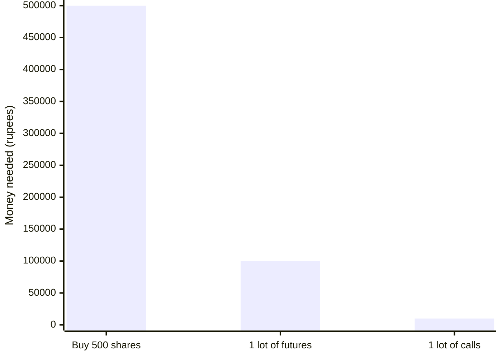
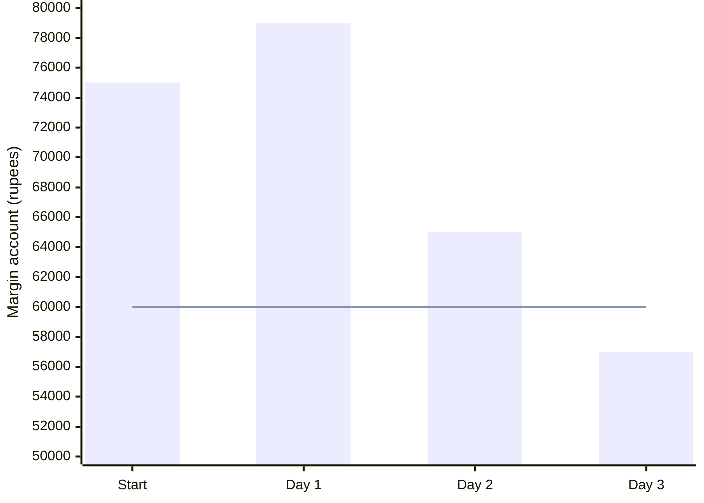
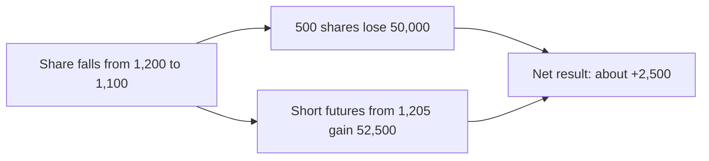
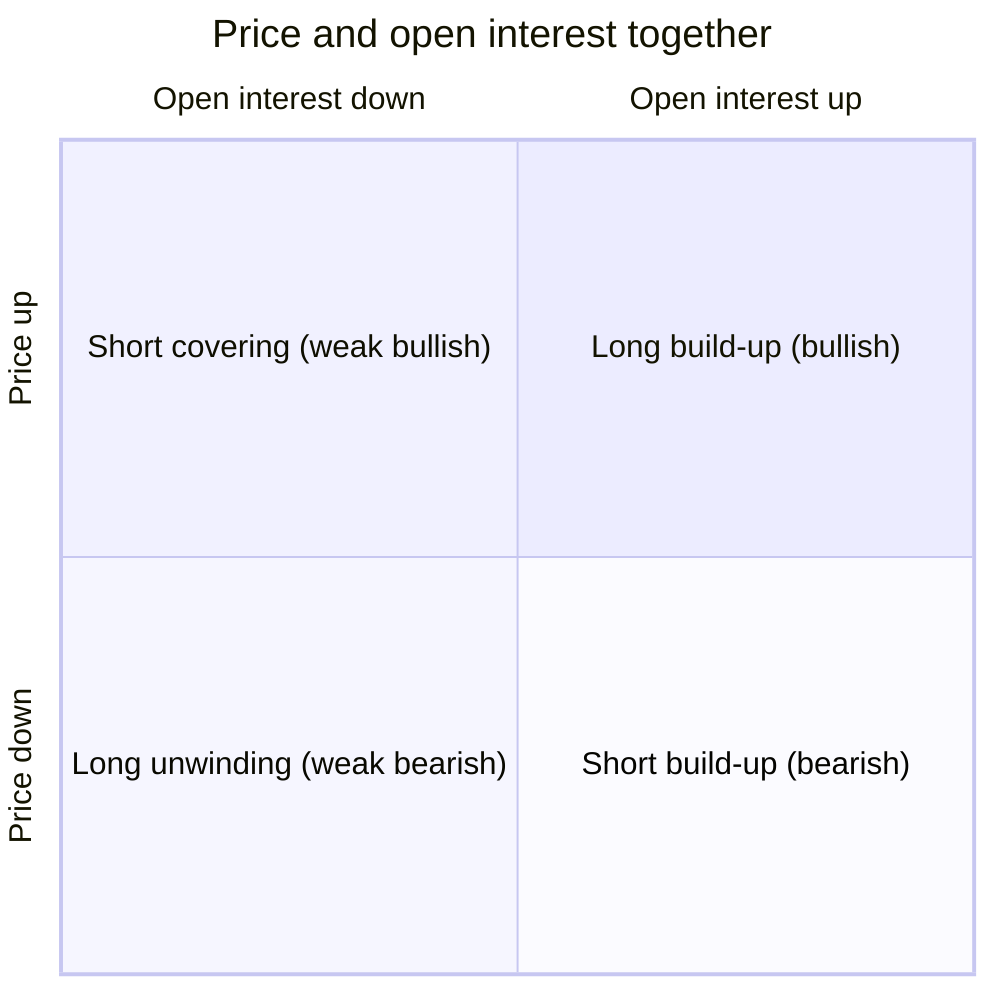
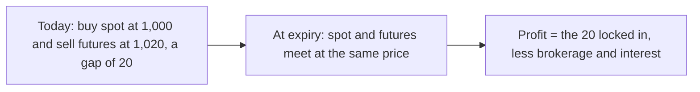
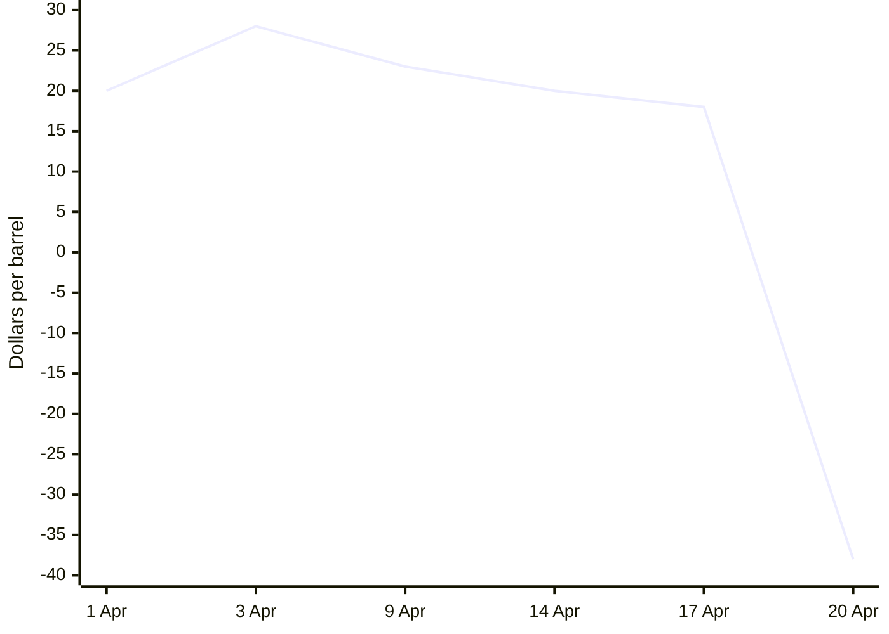

# Futures and Currency

This lesson explains what futures are, how they are priced, how margin works, and the main ways traders use them. It ends with currency futures.

---

## 1. What a derivative is

A **derivative** is a contract that has no value of its own. Its value comes from something else, called the **underlying asset**. The underlying can be:

- A stock
- A stock index
- A commodity, such as crude oil, gold, or natural gas
- A currency pair, such as the US dollar against the Indian rupee
- An interest rate

The two main exchange-traded derivatives are **futures** and **options**. On most exchanges both are standardized: the exchange fixes the quantity, the expiry date, and the rules, so anyone can buy or sell them freely.

| Underlying | Futures | Options |
|---|---|---|
| Stocks | Yes | Yes |
| Indices | Yes | Yes |
| Commodities | Yes | Yes, on some contracts |
| Currencies | Yes | Yes, on some pairs |

### Why traders use derivatives

1. **Less money up front.** You pay a margin or a premium instead of the full value.
2. **Hedging.** You can protect an investment you already hold against a fall.
3. **Speculation.** You can trade a view on the market or a stock, for a few days (positional trading) or within the day (day trading).
4. **Income.** You can earn a kind of rent on shares you hold by selling options against them.
5. **Arbitrage.** You can profit from price gaps between the cash and futures markets.

**Number example.** A share trades at 1,000. The futures lot is 500 shares.

- Buying 500 shares in the cash market costs 1,000 × 500 = 5,00,000.
- Buying 1 lot of futures at a 20 percent margin needs about 1,00,000.
- Buying 1 lot of a call option at a premium of 20 costs 20 × 500 = 10,000.



The exposure is similar. The money you put down is very different, and so is the risk, as the rest of this step shows.

---

## 2. Equity compared with derivatives

| | Equity (cash) market | Derivatives market |
|---|---|---|
| Ownership | You own part of the company. | You own a contract, not the shares. |
| Money needed | The full cost of the shares | A margin for futures; a premium, or a margin, for options |
| Quantity | Any number, even one share | Fixed lots only |
| Holding period | As long as you like | Until the contract expires, usually within one to three months |
| Short selling | Usually intraday only | Intraday and positional |
| Return on a 10% move in the stock | About 10% | Much larger with futures, and larger still with options, both up and down |
| Price quoted | The spot price | The futures price (at a premium or discount to spot) or the option premium |

---

## 3. Futures and their terms

A **futures contract** is an agreement to buy or sell a fixed quantity of an underlying asset at an agreed price on a set future date. **Both sides are obligated.** The buyer must buy, and the seller must sell, or they must close the position before expiry.

- **Long.** You bought futures. You profit if the price rises.
- **Short.** You sold futures first, hoping to buy back lower. You profit if the price falls.
- **Spot price.** The price of the underlying in the cash market. On expiry, open futures positions are settled against the spot price.
- **Futures price.** The price of the futures contract.
  - **Premium.** The futures price is above spot. This is normal, and a large premium shows strong demand.
  - **Discount.** The futures price is below spot. This often shows heavy selling or bearish sentiment.
- **Cost of carry.** The gap between the futures price and spot. It mainly reflects the interest cost of holding the asset until expiry, minus any income such as dividends. It shrinks to zero as expiry nears.
- **Lot, or contract size.** The fixed quantity in one contract.
- **Contract months.** Usually three are open at once:
  - The near, or current, month is the most liquid.
  - The next, or middle, month is less liquid.
  - The far month often has very little trading.
- **Expiry.** The last day of the contract. Each exchange sets its own expiry day, and these change. Check the exchange calendar.
- **Rollover.** Closing a position in the contract that is about to expire and opening the same position in the next month's contract.
- **Open interest.** The total number of contracts still open at a point in time. Every open contract has one buyer and one seller.
- **Volume.** The number of contracts traded in a period.

**Number example: cost of carry.** Spot is 2,000. Interest is 7 percent a year, and 30 days are left. The fair premium is about 2,000 × 0.07 × 30 ÷ 365 ≈ 11.5, so futures should trade near 2,011.5.

If spot stays at 2,000, the premium shrinks day by day and reaches zero at expiry, when futures and spot meet:

```mermaid
xychart-beta
  x-axis "Days to expiry" [30, 25, 20, 15, 10, 5, 0]
  y-axis "Futures premium over spot (points)" 0 --> 12
  line [11.5, 9.6, 7.7, 5.8, 3.8, 1.9, 0]
```

---

## 4. Margin and mark-to-market

- **Initial margin.** The deposit your broker needs before you open a futures position. It is often 12 to 25 percent of the contract value, depending on the asset's volatility and exchange rules.
- **Maintenance margin.** The minimum balance you must keep. If losses take your account below it, you get a **margin call**, and you must add money, usually before the next session. If you do not, the broker can close your position.
- **Mark-to-market.** At the end of each day, the exchange settles every open position at that day's closing price. Your account is credited with the day's gains or debited with the day's losses in cash, every day, not only when you close.

Exchanges raise margins when volatility rises or when positions in a contract get crowded. When positions reach an exchange's limit, it may stop new positions in that contract until open interest falls.

**Number example.** You buy 1 lot of 100 units at 5,000. The contract is worth 5,00,000. The initial margin is 15 percent, or 75,000, and the maintenance margin is 60,000.

| Day | Close | Daily profit or loss | Account balance |
|---|---|---|---|
| 1 | 5,040 | +4,000 | 79,000 |
| 2 | 4,900 | −14,000 | 65,000 |
| 3 | 4,820 | −8,000 | 57,000: below 60,000, so you get a margin call to add 18,000 |



The bars are the account balance. The flat line is the maintenance margin of 60,000. On day 3 the bar drops below the line, and the margin call follows.

A move of just 3.6 percent against you ate almost a quarter of your margin. That is leverage.

---

## 5. Risk, hedging, and trading strategies

### Risk and reward

- In futures, both risk and reward are **unlimited** for both the buyer and the seller.
- Watch open positions every day. Losses reduce your margin quickly, and the broker can close the position if your funds fall short.
- **Limit your risk with a stop-loss.** Use the position-size formula and the loss limits from Step 1: at most 2 percent of capital on one trade, and a monthly loss cap.

### Hedging

If you hold shares and sell futures on the same quantity, a fall in the shares is offset by a gain on the futures. Both risk and reward become limited. Many brokers let you pledge shares you hold as collateral for margin, which you can use for futures and for selling options.

**Number example.** You hold 500 shares at 1,200 and expect a short-term fall, but do not want to sell. Sell 1 lot of 500 in futures at 1,205. The share falls to 1,100. The shares lose 50,000 and the futures gain 52,500. You are protected, and you still own the shares.



### Trading futures on technical analysis

1. Set the target and stop from your chart.
2. Size the position with your money-management rules.
3. Stick to the 2 percent and monthly loss limits.

### Reading futures open interest

| Price | Open interest | Meaning |
|---|---|---|
| Up | Up | **Long build-up.** New buyers are entering. Bullish. |
| Down | Up | **Short build-up.** New sellers are entering. Bearish. |
| Up | Down | **Short covering.** Sellers are closing positions. Bullish, but it may fade once covering ends. |
| Down | Down | **Long unwinding.** Buyers are closing positions. Bearish, but it may fade once unwinding ends. |



The right half is where open interest rises: new money is backing the move, so those signals are the strongest.

Use open interest to support a chart signal, not as a signal on its own.

### Arbitrage

When the futures price moves too far from its fair value, traders can lock in the gap.

- **Futures well above fair value.** Buy in the cash market and sell futures. At expiry the two prices meet, and you keep the difference minus costs.
- **Futures below spot.** If you already own the shares, sell them and buy futures, then buy the shares back at expiry.

**Number example.** Spot is 1,000, and fair futures value is 1,006, but futures trade at 1,020. Buy the shares at 1,000 and sell futures at 1,020. At expiry both prices meet, say at 1,040: the shares gain 40 and the futures lose 20. The locked-in profit is 20 points, whatever the expiry price, minus costs.



These gaps are usually small and are quickly closed by large players with low costs.

---

## 6. Real case: the negative oil price, April 2020

In April 2020, lockdowns crushed oil demand, and US oil storage was nearly full. The May 2020 WTI crude oil futures contract was close to expiry. Holders of long contracts who could not take delivery of physical oil rushed to sell, and almost no one wanted to buy. On 20 April 2020 the contract settled at about **−37.63 dollars a barrel**. Sellers paid buyers to take the oil.

The May 2020 WTI contract's settlement price in April 2020, rounded and approximate:



**Lessons**

- Futures risk really is unlimited. Few people thought the price could go below zero.
- Close or roll positions **before** the final days of a contract. Liquidity can disappear near expiry, especially in physically settled commodities.
- Know how your contract is settled: in cash or by delivery.

---

## 7. Currency futures

The currency market is the largest financial market in the world. Currencies trade in **pairs**. In the US dollar against Indian rupee pair, the price is the number of rupees for one dollar.

On Indian exchanges, individuals usually trade currencies through futures and options:

- **Lot size.** For the dollar-rupee pair it is 1,000 dollars. At a price of 83.00, one lot is worth 83,000 rupees.
- **Tick size.** The smallest price change is 0.0025 rupees. Traders often call this a pip, although in the global forex market a pip usually means a different unit. One tick on one lot is worth 0.0025 × 1,000 = 2.50 rupees.
- **Margin.** Much lower than for stocks, because currencies move less. It is set by the exchange and changes over time.
- **Expiry.** Monthly contracts usually expire a couple of working days before the last business day of the month, and weekly contracts exist on some pairs. Check the exchange calendar.
- **Mark-to-market.** The same daily settlement as other futures.

**Number example.** You buy 5 lots of dollar-rupee futures at 83.1000 and sell at 83.2500.

- The move is 0.15 rupees, which is 60 ticks.
- The profit per lot is 0.15 × 1,000 = 150 rupees.
- The total profit is 150 × 5 = 750 rupees, before costs.

A 10-paise move (0.10 rupees) is worth 100 rupees per lot. Use that to size positions quickly.

---

## Practice

1. Futures trade at 2,030 while spot is 2,000. Is that a premium or a discount?
2. Price is falling and open interest is rising. What is happening?
3. Your margin balance falls below the maintenance level. What happens?
4. You hold shares and fear a short-term fall. How can futures help?
5. How much is a 25-paise move worth on 4 lots of dollar-rupee futures?

### Answers

1. A premium of 30.
2. A short build-up. New sellers are entering, which is bearish.
3. You get a margin call. Add funds, or the broker may close your position.
4. Sell futures on the same quantity. Losses on the shares are offset by gains on the futures.
5. 0.25 × 1,000 × 4 = 1,000 rupees.
