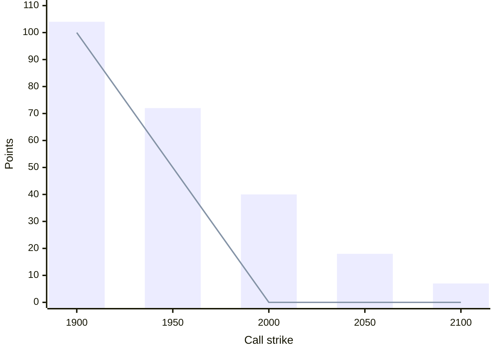
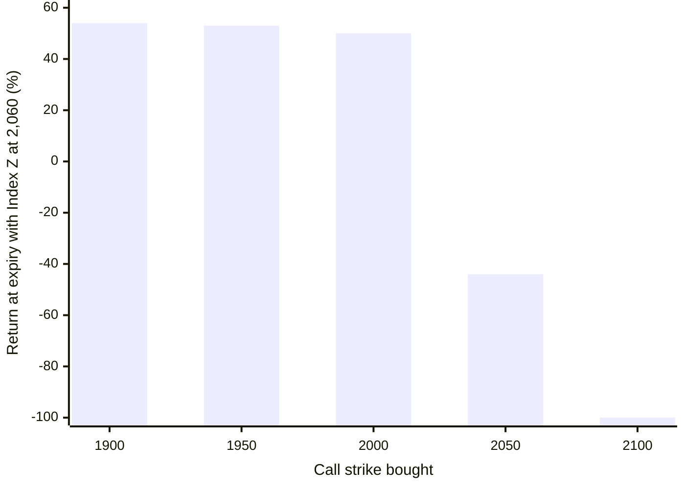
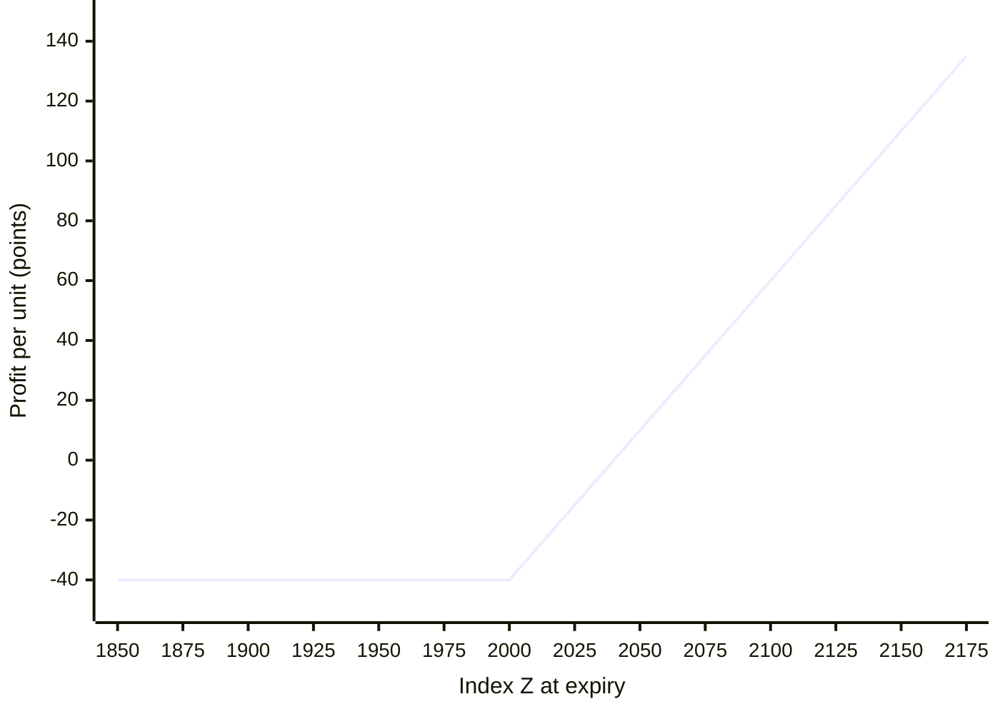
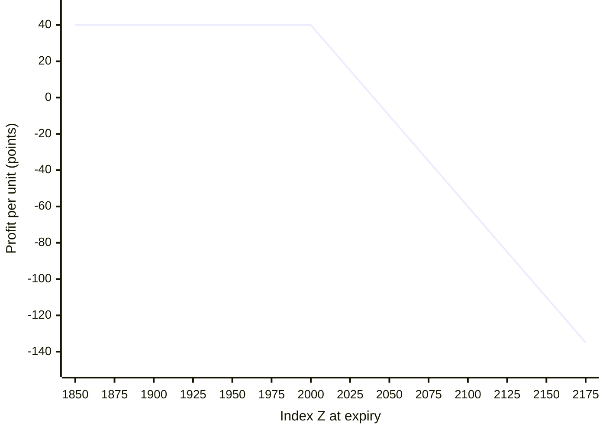
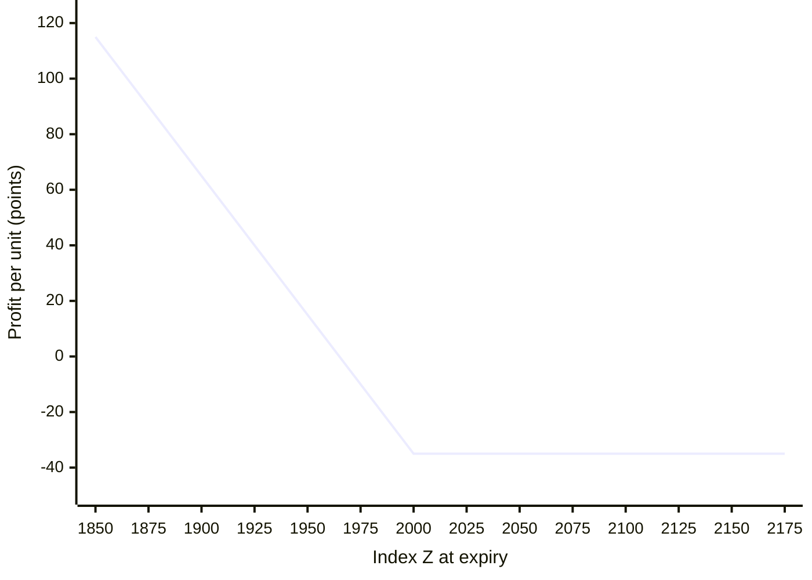
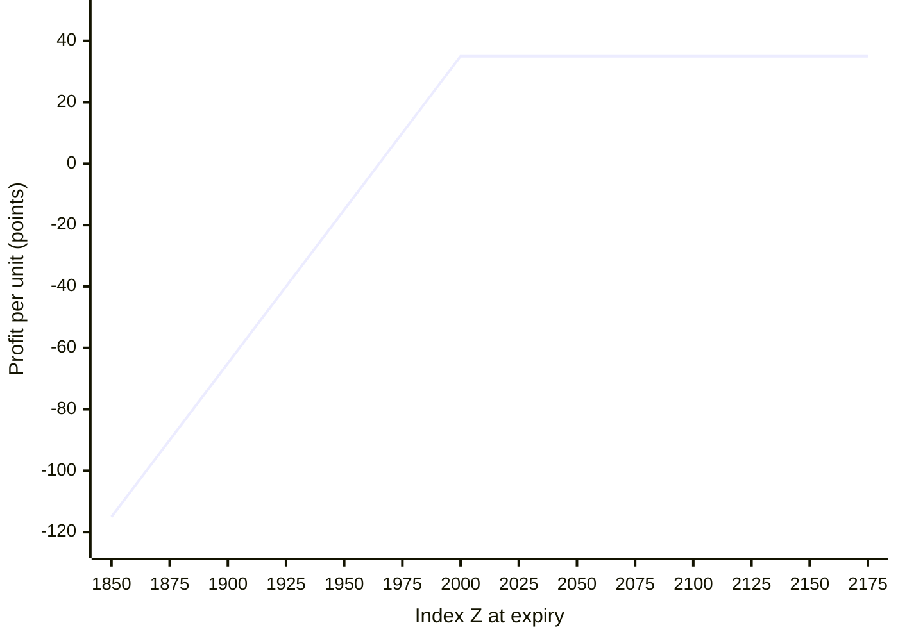

# Options and Open Interest

This lesson explains how options work, what drives their price, how to read option open interest, and how to choose a strike.

All examples in this lesson and the next use the same made-up market, so you can compare strategies.

**Practice market.** Index Z is at 2,000. The lot size is 50. There are 20 days to expiry. Premiums, in points:

| Strike | Call premium | Put premium |
|---|---|---|
| 1,900 | 104 | 6 |
| 1,950 | 72 | 15 |
| 2,000 | 40 | 35 |
| 2,050 | 18 | 65 |
| 2,100 | 7 | 105 |

To turn points into money, multiply by the lot size. A premium of 40 on one lot costs 40 × 50 = 2,000.

---

## 1. Calls, puts, buyers, and writers

An **option** is a contract that gives its buyer the **right, but not the obligation**, to buy or sell an underlying asset at a fixed price, on or before a fixed date. Options were designed for hedging, and they are also used to speculate.

- A **call option** gives the right to **buy** at the strike price. Buyers of calls are bullish.
- A **put option** gives the right to **sell** at the strike price. Buyers of puts are bearish.

Every option has two sides.

| | Buyer, or holder | Seller, or writer |
|---|---|---|
| Pays or receives | Pays the premium | Receives the premium |
| Right or obligation | Has the right | Has the obligation, if the buyer exercises |
| Margin | None needed beyond the premium | Must deposit margin |
| Best case | Large, and unlimited for a call | Limited to the premium received |
| Worst case | Limited to the premium paid | Can be much larger than the premium |

Selling options is like selling insurance: you collect a small premium, most of the time you keep it, and occasionally you pay out a big claim.

### Why use options

- **Flexibility.** One view can be traded several ways. If you are bullish, you can buy a call, sell a put, or build a spread.
- **Leverage.** A small premium controls a large position.
- **Known risk for buyers.** The most a buyer can lose is the premium.
- **Income for sellers.** Sellers earn premium, especially when the market goes sideways.

### Futures compared with options

| | Futures | Options |
|---|---|---|
| Money needed | Margin, for both buying and selling | Buyer pays the full premium. Seller pays margin and receives the premium. |
| How to trade a view | Bullish: buy. Bearish: sell. | Bullish: buy a call, or sell a put. Bearish: buy a put, or sell a call. |
| Effect of time | None | Large. The time value falls to zero at expiry. |
| Pledged shares as margin | Usually allowed | Usually allowed only for selling options |
| Break-even | The entry price | Strike plus or minus the premium |
| Risk and reward | Unlimited both ways | Buyer: limited risk. Seller: limited reward, larger risk. |

---

## 2. Option styles and settlement

- **American options** can be exercised on any day up to expiry. They are common in the United States.
- **European options** can be exercised only at expiry. Indian exchanges use European options for indices, stocks, currencies, and commodities. Their symbols end in **CE** for a call and **PE** for a put.

**Settlement.**

- Index options are settled in cash.
- In India, stock options that expire in the money are settled by physical delivery of the shares. A call buyer must take delivery, and a put buyer must deliver. To avoid this, close the position before expiry, or offset it with futures or a spread.
- Commodity options may settle into futures or into physical delivery, depending on the contract.

**Contract months.** Stock options usually have three monthly contracts open, and the near month is by far the most liquid. Index options often add weekly contracts and longer-dated ones. Some commodities, such as gold and silver, have more monthly contracts open.

---

## 3. The premium: intrinsic value and time value

**Premium = intrinsic value + time value**

- **Intrinsic value** is how much the option would be worth if exercised right now.
  - For a call: spot − strike, if positive, otherwise zero.
  - For a put: strike − spot, if positive, otherwise zero.
- **Time value** is the rest of the premium. It is what buyers pay for the chance that the option gains value before expiry. The more time left, the higher the time value. At expiry, time value is zero.

**Number example.** Index Z is at 2,000.

- The 1,950 call costs 72. Its intrinsic value is 2,000 − 1,950 = 50. Its time value is 72 − 50 = 22.
- The 2,050 call costs 18. Its intrinsic value is 0, because the strike is above spot. All 18 is time value.
- The 2,050 put costs 65. Its intrinsic value is 2,050 − 2,000 = 50. Its time value is 15.

**How time value melts.** The chart follows the at-the-money 2,000 call if Index Z stays at 2,000. Its premium is all time value.

```mermaid
xychart-beta
  x-axis "Days to expiry" [30, 25, 20, 15, 10, 5, 2, 0]
  y-axis "Premium (points)" 0 --> 50
  line [49, 45, 40, 35, 28, 20, 13, 0]
```

The first 10 days cost the buyer 9 points. The last 5 days cost 20. Decay is slow at first and fast at the end, which is why sellers like the final weeks and buyers should avoid holding cheap options into expiry.

**Premium = intrinsic value + time value, strike by strike** (practice market, Index Z at 2,000):



The bars are the full premium. The line is the intrinsic value. The gap between them is time value. It is largest at the money (40) and shrinks for both deep in-the-money and far out-of-the-money strikes.

### What moves the premium

1. **The underlying price.** Calls gain when it rises. Puts gain when it falls.
2. **Volatility.** The more the underlying swings, the higher both call and put premiums are.
3. **The strike.** Lower strikes make calls dearer. Higher strikes make puts dearer.
4. **Time to expiry.** More time means more time value.
5. **Interest rates.** Higher rates slightly raise call premiums and lower put premiums.

### Implied volatility

**Implied volatility** is the future volatility that the current premium implies. It is worked back from the option's price with a pricing model.

- High implied volatility makes options expensive. That favors sellers.
- Low implied volatility makes options cheap. That favors buyers.
- Implied volatility usually rises when markets fall, because traders pay up for protection. It usually falls in calm rising markets.
- Before big scheduled events, such as results or central bank decisions, implied volatility rises. Right after the event it often collapses. This is called a **volatility crush**, and it can make a buyer lose money even when the direction is right.

---

## 4. In, at, and out of the money

| Term | Call | Put | What it means |
|---|---|---|---|
| In the money (ITM) | Strike below spot | Strike above spot | Has intrinsic value |
| At the money (ATM) | Strike nearest spot | Strike nearest spot | Mostly time value, and the most actively traded |
| Out of the money (OTM) | Strike above spot | Strike below spot | Only time value |

```levels
title: Index Z at 2,000
2100 | Call OTM · Put ITM | put intrinsic value 100
2050 | Call OTM · Put ITM | put intrinsic value 50
2000 | ATM for both | spot | info
1950 | Call ITM · Put OTM | call intrinsic value 50
1900 | Call ITM · Put OTM | call intrinsic value 100
```

Strikes near spot are the most liquid and have the tightest price quotes.

---

## 5. Break-even points

The **break-even point** is the price at expiry where you make no profit and no loss.

| Instrument | Break-even at expiry |
|---|---|
| Shares or futures | The entry price |
| Call, bought or sold | Strike + premium |
| Put, bought or sold | Strike − premium |

**Number example.** Buy the 2,000 call at 40. The break-even is 2,040. Index Z must be above 2,040 at expiry for you to profit. Buy the 2,000 put at 35. The break-even is 1,965.

```levels
title: Buy the 2,000 call at 40, or the 2,000 put at 35
band: 2040 2080 | Call buyer profits | good
band: 1965 2040 | Neither buyer profits | neutral
band: 1925 1965 | Put buyer profits | good
2040 | Call break-even | 2,000 + 40 | info
2000 | Strike
1965 | Put break-even | 2,000 − 35 | info
```

---

## 6. The option chain and option open interest

An **option chain** is a table listing all strikes for one expiry, with calls on one side and puts on the other. For each strike it shows the premium, the change in premium, volume, open interest, the change in open interest, and implied volatility. Exchanges and brokers publish it free.

### Build-up and covering

- **Build-up.** Open interest rises. Traders are opening new positions.
- **Covering.** Open interest falls. Traders are closing existing positions.

### What the highest open interest shows

Focus on the at-the-money strike and the next two or three strikes on each side.

- The call strike with the **highest open interest** often acts as **resistance**. Many call writers are betting price stays below it.
- The put strike with the **highest open interest** often acts as **support**. Many put writers are betting price stays above it.

**Example option chain** for Index Z at 2,000. Open interest is in contracts, and the change is since yesterday.

| Call OI | Call OI change | Call premium | **Strike** | Put premium | Put OI change | Put OI |
|---|---|---|---|---|---|---|
| 2,100 | −150 | 104 | **1,900** | 6 | +900 | 9,800 |
| 3,400 | −400 | 72 | **1,950** | 15 | +1,600 | 14,200 |
| 8,900 | +700 | 40 | **2,000** | 35 | +2,100 | 11,500 |
| 12,600 | +1,900 | 18 | **2,050** | 65 | −300 | 4,100 |
| 16,800 | +2,400 | 7 | **2,100** | 105 | −100 | 1,900 |

```levels
title: Where option writers expect Index Z to stay
band: 1950 2100 | Expected range | neutral
2100 | Highest call open interest (16,800) | likely resistance | bad
2000 | Spot | | info
1950 | Highest put open interest (14,200) | likely support | good
```

Read it like this: writers expect Index Z to stay between about 1,950 and 2,100 until expiry. Fresh put writing at 1,950 and 2,000 (big positive changes) makes that support stronger. If price closes above 2,100 and call open interest there starts falling, the call writers are covering, and the ceiling is breaking.

### Reading changes in open interest

Writers are usually larger and better funded than buyers, so their actions often matter more.

**Calls**

| Call open interest | Call premium | Likely meaning |
|---|---|---|
| Up | Up | New call buying. Bullish, but watch closely. |
| Down | Up | Call writers are covering. Strongly bullish. |
| Down | Down | Call buyers are exiting. Bearish. |
| Up | Down | New call writing. Strongly bearish. |

**Puts**

| Put open interest | Put premium | Likely meaning |
|---|---|---|
| Up | Up | New put buying. Bearish, but watch closely. |
| Down | Up | Put writers are covering. Strongly bearish. |
| Down | Down | Put buyers are exiting. Bullish. |
| Up | Down | New put writing. Strongly bullish. |

**Number example.** Over two days, Index Z rises from 1,980 to 2,020. At the 2,000 put, open interest rises by 40 percent and the premium falls. At the 2,000 and 1,950 calls, open interest falls. Put writers are adding positions and call writers are leaving, so this supports the rally, and 2,000 becomes support.

---

## 7. The Greeks

The Greeks measure how an option's premium responds to changes in the market.

- **Delta.** How much the premium moves for a 1-point move in the underlying.
  - Calls: between 0 and 1. Puts: between 0 and −1.
  - At-the-money options have a delta near 0.5, or −0.5 for puts. Deep in-the-money options approach 1. Far out-of-the-money options approach 0.
  - Delta = change in premium ÷ change in the underlying.
- **Gamma.** How fast delta changes. It is highest for at-the-money options near expiry, which is why their premiums can jump wildly in the last days.
- **Theta.** How much premium the option loses per day from time decay. It works against buyers and for sellers. It speeds up near expiry.
- **Vega.** How much the premium changes for a 1-point change in implied volatility. Buyers want volatility to rise, and sellers want it to fall.

**How delta changes with the strike** (calls in the practice market, Index Z at 2,000, approximate):

```mermaid
xychart-beta
  x-axis "Call strike" [1900, 1950, 2000, 2050, 2100]
  y-axis "Delta" 0 --> 1
  line [0.9, 0.75, 0.52, 0.28, 0.12]
```

A deep in-the-money call moves almost point for point with the index. A far out-of-the-money call barely moves until the index gets close to its strike.

**Number example: delta.** A stock rises from 500 to 540, a move of 40. The 500 call's premium rises from 18 to 44, a move of 26. Delta = 26 ÷ 40 = 0.65.

**Using delta for targets and stops.** If your chart target is 30 points above the current price and the delta is 0.6, expect the premium to rise by about 30 × 0.6 = 18. If your chart stop is 15 points below, expect the premium to fall by about 9. Delta changes as the price moves, so treat this as an estimate.

---

## 8. Choosing a strike

For option buyers, the at-the-money strike, the nearest in-the-money strike, or the next out-of-the-money strike usually works best. They are liquid, and they give a better return than far out-of-the-money strikes, which often expire worthless.

**Number example.** Using the practice market, suppose you buy calls and Index Z is at 2,060 at expiry.

| Strike | State now | Premium paid | Value at expiry | Gain | Return |
|---|---|---|---|---|---|
| 1,900 | Deep ITM | 104 | 160 | 56 | 54% |
| 1,950 | ITM | 72 | 110 | 38 | 53% |
| 2,000 | ATM | 40 | 60 | 20 | 50% |
| 2,050 | OTM | 18 | 10 | −8 | −44% |
| 2,100 | Far OTM | 7 | 0 | −7 | −100% |



A 3 percent rise was not enough for the out-of-the-money calls. They lost money even though the direction was right, because the premium was all time value. The in-the-money and at-the-money calls all made money.

If Index Z had risen to 2,150, the 2,050 call would have returned 100 − 18 = 82 on 18, which is 456 percent. Out-of-the-money options pay off only when the move is large and fast. Match the strike to the size and speed of the move you expect.

---

## 9. Naked option buying and selling

A **naked** option is a single option position with no other leg to limit its risk.

**Using a chart view**

1. Use technical analysis to find a target and a stop for the underlying.
2. Bullish view: buy a call, or sell a put.
3. Bearish view: buy a put, or sell a call.

### Payoffs at expiry

**Buy the 2,000 call at 40.** Break-even 2,040. The most you can lose is 40, if Index Z is at or below 2,000. Above 2,040 the profit keeps growing.



**Sell the 2,000 call at 40.** The mirror image. You keep 40 if Index Z is at or below 2,000 at expiry. Above 2,040 you lose, without limit.



**Buy the 2,000 put at 35.** Break-even 1,965. The most you can lose is 35, if Index Z is at or above 2,000. Below 1,965 the profit grows as the price falls.



**Sell the 2,000 put at 35.** You keep 35 if Index Z is at or above 2,000. Below 1,965 you lose, and the loss grows until the index reaches zero.



The buyer's chart and the seller's chart are mirror images. Whatever one side gains, the other side loses.

**Key points**

- A call seller profits as long as the price stays below the strike plus the premium.
- A put seller profits as long as the price stays above the strike minus the premium.
- Sellers must keep margin with the broker.

---

## 10. Margin for option sellers

- Sellers pay margin because their risk can be large. It is often 15 to 60 percent of the contract value, depending on the underlying, its volatility, and the strike.
- Hedged positions, such as covered calls and spreads, need much less margin because their risk is limited.
- The margin is returned when the position is closed.
- Margins rise when volatility rises, and when positions across the market get crowded.

---

## 11. Exits and rolling

- **Hold to expiry** when the trade is working and the market is trending in your favor.
- **Exit early** as soon as your chart-based exit rule is met.
- **Roll.** Close the current option and open one at a different strike, or in a later month. For example, a covered call seller can roll down to a lower strike after a fall to collect more premium.
- **Lock in gains with futures.** If a deep in-the-money option becomes illiquid, take the opposite position in futures to lock in the profit.

---

## 12. Tips

- Do not trade options until you understand technical analysis and the options basics in this lesson, and have practiced on paper.
- Avoid illiquid options. Wide gaps between buy and sell quotes eat your profit.
- Avoid far out-of-the-money options as a buyer.
- Always be aware of time decay.

---

## Practice

1. A call with strike 2,000 costs 55 while spot is 2,030. What are its intrinsic value and time value?
2. You buy the 1,950 put at 15. What is the break-even at expiry?
3. Call open interest falls sharply at a strike while the call's premium rises. What does that suggest?
4. Why can an option buyer lose money even when the market moves in the right direction?
5. The 2,000 call has a delta of 0.5, and your target is 40 points higher. Roughly how much should the premium rise?

### Answers

1. Intrinsic value 30. Time value 25.
2. 1,950 − 15 = 1,935.
3. Call writers are covering their positions. Strongly bullish.
4. Because of time decay and falling implied volatility. If the move is too small or too slow, the loss of time value can outweigh the gain in intrinsic value.
5. About 20 points, though delta will rise as the price moves up, so the real gain may be a little larger.
