# Strategy Chooser and Cards

Start from your chart view. The chooser tells you which strategies fit it. Each card then shows how to build the strategy, what it can make and lose, and a worked example.

All examples use the practice market from [Lesson 2](02-options-and-open-interest.md): Index Z at 2,000, lot size 50, 20 days to expiry.

| Strike | Call premium | Put premium |
|---|---|---|
| 1,900 | 104 | 6 |
| 1,950 | 72 | 15 |
| 2,000 | 40 | 35 |
| 2,050 | 18 | 65 |
| 2,100 | 7 | 105 |

Profits and losses are in points per unit at expiry. Multiply by 50 for one lot.

---

## 1. The strategy chooser

The whole chooser in one picture. Steps A to C below give the detail.

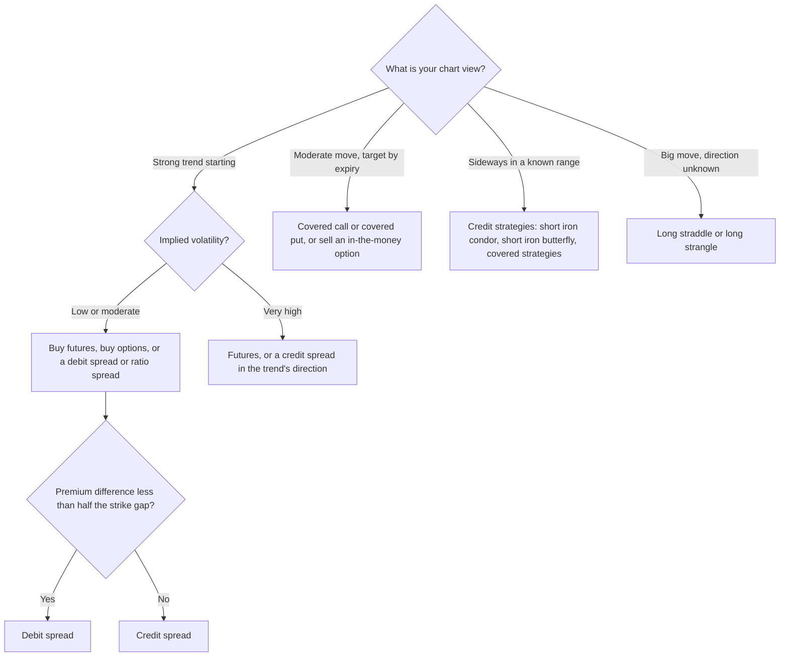
```mermaid
flowchart TD
  view{What is your chart view?}
  view -->|Strong trend starting| trend{Implied volatility?}
  view -->|Moderate move, target by expiry| moderate[Covered call or covered put, or sell an in-the-money option]
  view -->|Sideways in a known range| range[Credit strategies: short iron condor, short iron butterfly, covered strategies]
  view -->|Big move, direction unknown| bigMove[Long straddle or long strangle]
  trend -->|Low or moderate| buyPremium[Buy futures, buy options, or a debit spread or ratio spread]
  trend -->|Very high| sellPremium[Futures, or a credit spread in the trend's direction]
  buyPremium --> spreadRule{Premium difference less than half the strike gap?}
  spreadRule -->|Yes| debit[Debit spread]
  spreadRule -->|No| credit[Credit spread]
```

### Step A: What is your view?

| View | Strategy | Margin | Premium | Risk / reward |
|---|---|---|---|---|
| **Bullish** | Buy futures | High | None | Unlimited / unlimited |
| | Buy a call | None | Paid | Limited / unlimited |
| | Sell a put | High | Received | Large / limited |
| | Covered call | Low | Received | Large / limited |
| | Bull call spread | Low | Paid | Limited / limited |
| | Bull put spread | Low | Received | Limited / limited |
| | Bull put ladder | Low | Received | Limited / limited in the trade's direction, unlimited on a crash |
| | Long collar | Low | Small, either way | Limited / limited |
| **Bearish** | Sell futures | High | None | Unlimited / unlimited |
| | Buy a put | None | Paid | Limited / large |
| | Sell a call | High | Received | Unlimited / limited |
| | Covered put | Low | Received | Unlimited / limited |
| | Bear put spread | Low | Paid | Limited / limited |
| | Bear call spread | Low | Received | Limited / limited |
| | Bear call ladder | Low | Received | Limited / limited in the trade's direction, unlimited on a spike |
| | Short collar | Low | Small, either way | Limited / limited |
| **Sideways, in a known range** | Covered call, after a fall to support | Low | Received | Large / limited, so keep a stop below support |
| | Covered put, after a rally to resistance | Low | Received | Unlimited / limited, so keep a stop above resistance |
| | Short straddle or short strangle | High | Received | Unlimited / limited |
| | Short iron butterfly | Low | Received | Limited / limited |
| | Short iron condor | Low | Received | Limited / limited |
| **Big move expected, direction unknown** | Long straddle or long strangle | None | Paid | Limited / unlimited |
| | Long iron butterfly or long iron condor | Low | Paid | Limited / limited |

### Step B: Check the trend, open interest, and volatility

| Check | What you see | What to do |
|---|---|---|
| **Strong uptrend starting** | Tide chart MACD rising; a trendline breakout with a band breakout candle; RSI above 60; the start of an impulse wave. Supporting: at-the-money puts building open interest, at-the-money and in-the-money calls shedding it, and a long build-up in futures. | Buy futures, buy calls, or use a call ratio spread. |
| **Strong downtrend starting** | Tide chart MACD falling; a trendline breakdown with a band breakout candle; RSI below 40; the start of a falling impulse wave. Supporting: at-the-money and in-the-money puts shedding open interest, at-the-money calls building it, and a short build-up in futures. | Sell futures, buy puts, or use a put ratio spread. |
| **Sideways** | Tide chart MACD flat; ADX low and flat or falling; Bollinger Bands flat; failed breakouts and failed breakdowns near the range edges. Supporting: open interest building at the at-the-money calls, puts, or both. | Avoid buying naked options. Use credit or covered strategies. |
| **Bullish, moderate target by expiry** | For example, a double bottom, or a fake breakdown that was reclaimed. | Covered call, or sell an in-the-money put. |
| **Bearish, moderate target by expiry** | For example, a double top, or a fake breakout that was rejected. | Covered put, or sell an in-the-money call. |
| **Choosing the type of spread** | Premium difference between the two strikes is less than half the gap between the strikes. | Use a debit spread. |
| | Premium difference is more than half the gap. | Use a credit spread. |
| **Volatility and time value** | Very high | Use credit strategies (sell). |
| | Moderate or low | Use debit strategies (buy). |
| **Timing** | You are in the last week before expiry, and your target is likely to be reached only next month. | Use a calendar spread. |

### Step C: Compare returns

- **Credit strategy return** = premium received ÷ margin deposited
- **Debit strategy return** = maximum possible profit ÷ (premium paid + any margin)
- **Futures return** = expected profit ÷ margin deposited

Choose the strategy with the best return for the risk, not the one with the biggest possible profit.

---

## 2. Futures cards

### Buy futures

`Bullish` · `Core`

Profit or loss at expiry, in points per unit:

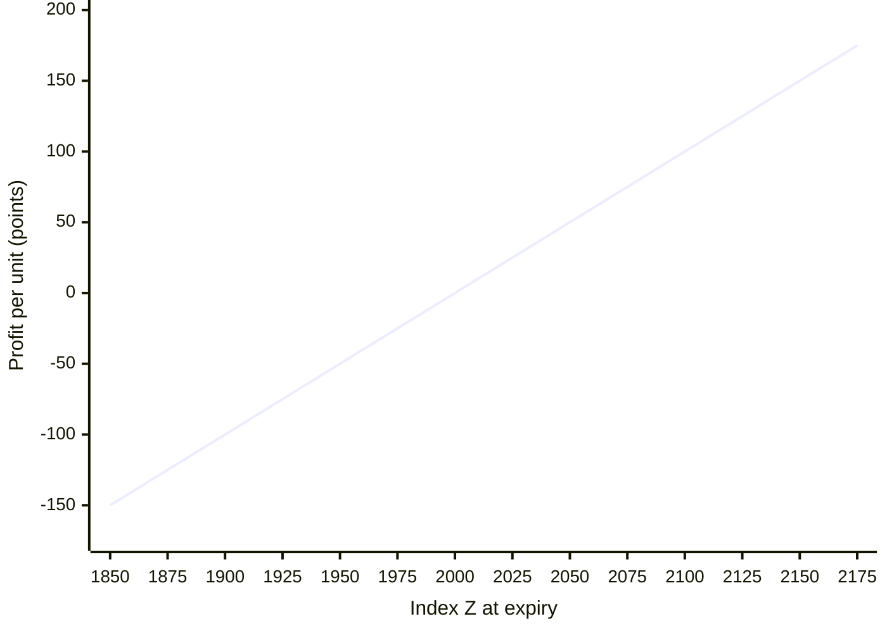
```mermaid
xychart-beta
  x-axis "Index Z at expiry" [1850, 1875, 1900, 1925, 1950, 1975, 2000, 2025, 2050, 2075, 2100, 2125, 2150, 2175]
  y-axis "Profit per unit (points)" -175 --> 200
  line [-150, -125, -100, -75, -50, -25, 0, 25, 50, 75, 100, 125, 150, 175]
```

- **Build:** buy 1 lot of futures.
- **Max profit:** unlimited. **Max loss:** unlimited, so always use a stop.
- **Break-even:** the entry price.
- **Example:** buy at 2,008 with a 15 percent margin of 2,008 × 50 × 0.15 = 15,060. The target is 2,080, and the stop is 1,972. The reward is 72 × 50 = 3,600, and the risk is 36 × 50 = 1,800. The return on margin if the target is hit is about 24 percent.

### Sell futures

`Bearish` · `Core`

- **Build:** sell 1 lot of futures.
- **Max profit and loss:** both unlimited. Use a stop.
- **Example:** sell at 2,008, target 1,940, stop 2,044. Reward 68, risk 36.

---

## 3. Naked option cards

### Buy a call

`Bullish` · `Core`

Profit or loss at expiry, in points per unit:

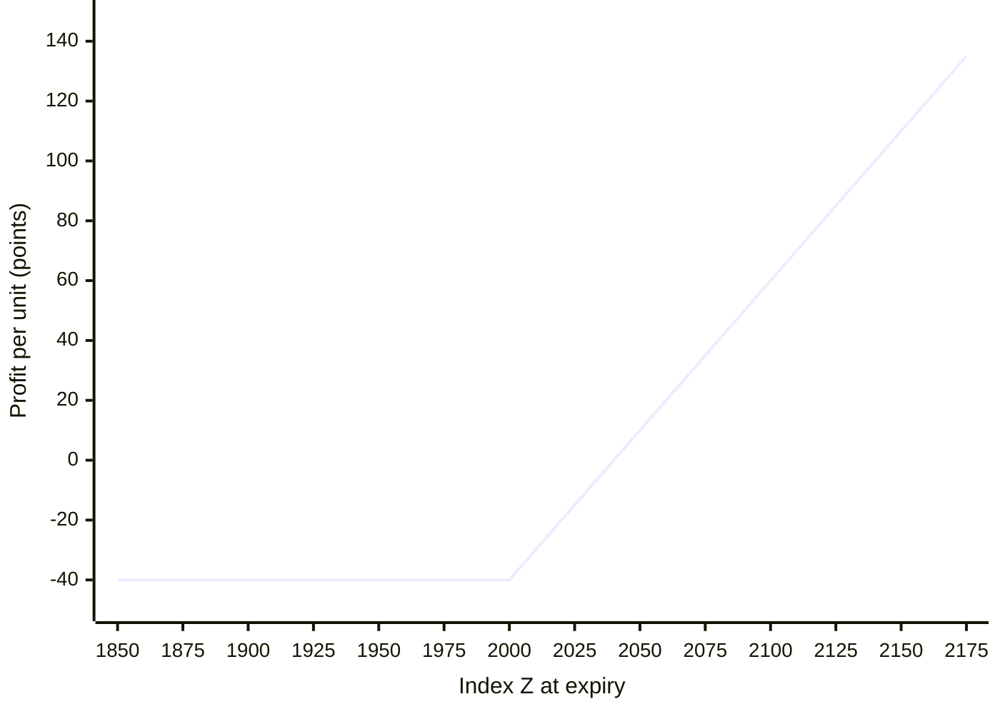
```mermaid
xychart-beta
  x-axis "Index Z at expiry" [1850, 1875, 1900, 1925, 1950, 1975, 2000, 2025, 2050, 2075, 2100, 2125, 2150, 2175]
  y-axis "Profit per unit (points)" -50 --> 150
  line [-40, -40, -40, -40, -40, -40, -40, -15, 10, 35, 60, 85, 110, 135]
```

- **Build:** buy the 2,000 call at 40.
- **Max loss:** 40. **Max profit:** unlimited.
- **Break-even:** 2,040.
- **Example:** Index Z is at 2,080 at expiry. The call is worth 80, a profit of 40, or 100 percent on the premium.
- **Use when:** you expect a strong, fast rise and implied volatility is not high.

### Buy a put

`Bearish` · `Core`

Profit or loss at expiry, in points per unit:

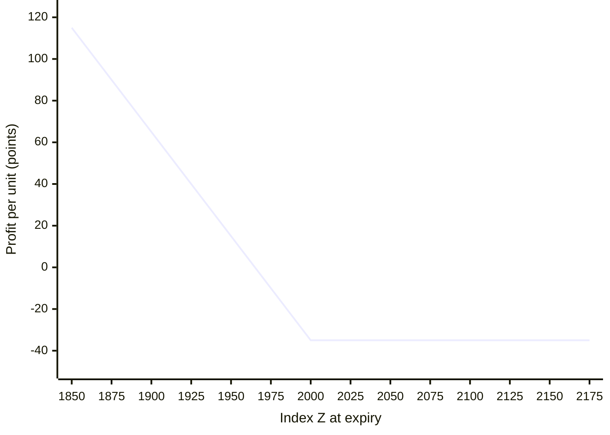
```mermaid
xychart-beta
  x-axis "Index Z at expiry" [1850, 1875, 1900, 1925, 1950, 1975, 2000, 2025, 2050, 2075, 2100, 2125, 2150, 2175]
  y-axis "Profit per unit (points)" -50 --> 125
  line [115, 90, 65, 40, 15, -10, -35, -35, -35, -35, -35, -35, -35, -35]
```

- **Build:** buy the 2,000 put at 35.
- **Max loss:** 35. **Max profit:** large, up to the strike minus the premium.
- **Break-even:** 1,965.

### Sell a put

`Bullish` · `Useful`

Profit or loss at expiry, in points per unit:

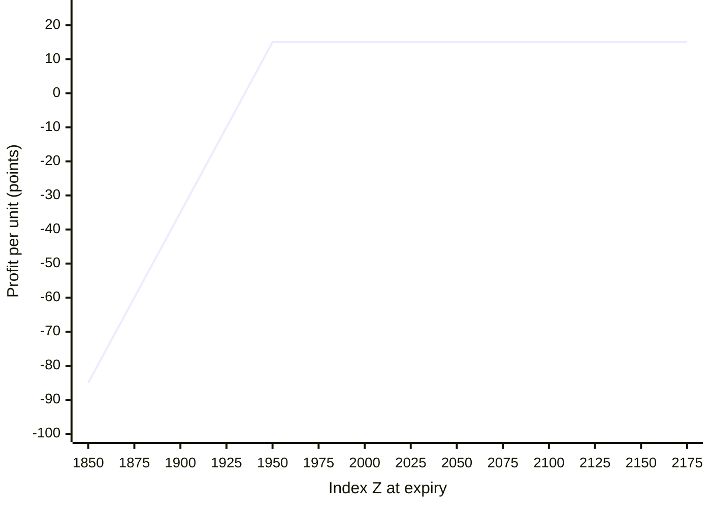
```mermaid
xychart-beta
  x-axis "Index Z at expiry" [1850, 1875, 1900, 1925, 1950, 1975, 2000, 2025, 2050, 2075, 2100, 2125, 2150, 2175]
  y-axis "Profit per unit (points)" -100 --> 25
  line [-85, -60, -35, -10, 15, 15, 15, 15, 15, 15, 15, 15, 15, 15]
```

- **Build:** sell the 1,950 put at 15.
- **Max profit:** 15. **Max loss:** large, if the price collapses.
- **Break-even:** 1,935.
- **Example:** the margin is about 15 percent of 1,950 × 50, or 14,625. If Index Z stays above 1,950, you keep 15 × 50 = 750, about 5 percent in 20 days.
- **Use when:** you are bullish or expect the price to hold above support, and implied volatility is high.

### Sell a call

`Bearish` · `Useful`

Profit or loss at expiry, in points per unit:

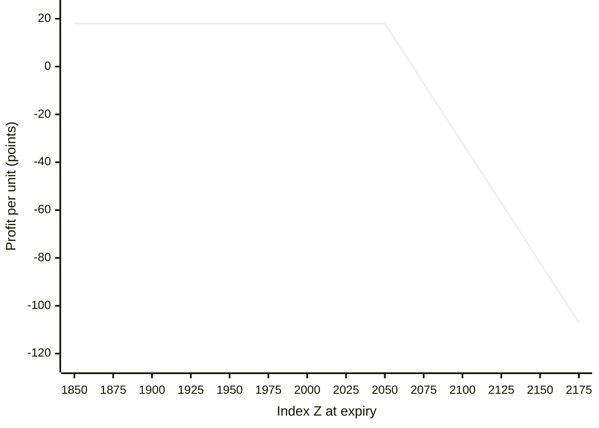
```mermaid
xychart-beta
  x-axis "Index Z at expiry" [1850, 1875, 1900, 1925, 1950, 1975, 2000, 2025, 2050, 2075, 2100, 2125, 2150, 2175]
  y-axis "Profit per unit (points)" -125 --> 25
  line [18, 18, 18, 18, 18, 18, 18, 18, 18, -7, -32, -57, -82, -107]
```

- **Build:** sell the 2,050 call at 18.
- **Max profit:** 18. **Max loss:** unlimited.
- **Break-even:** 2,068.

---

## 4. Covered and protective cards

### Covered call

`Bullish or sideways` · `Core`

Profit or loss at expiry, in points per unit:

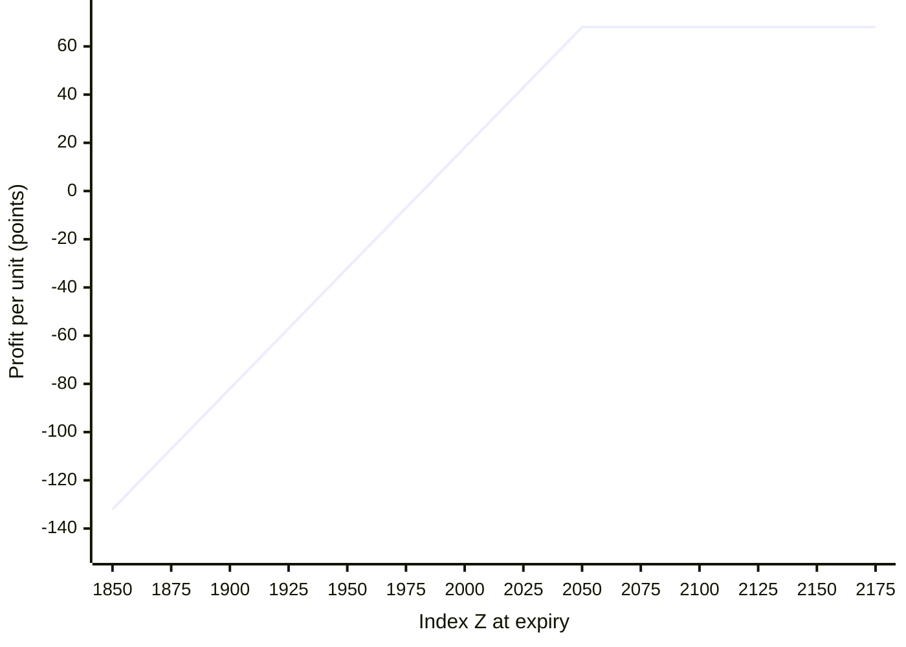
```mermaid
xychart-beta
  x-axis "Index Z at expiry" [1850, 1875, 1900, 1925, 1950, 1975, 2000, 2025, 2050, 2075, 2100, 2125, 2150, 2175]
  y-axis "Profit per unit (points)" -150 --> 75
  line [-132, -107, -82, -57, -32, -7, 18, 43, 68, 68, 68, 68, 68, 68]
```

Own the underlying, or be long futures, and sell an at-the-money or the next out-of-the-money call. It is like renting out a property you are holding anyway.

- **Build:** long at 2,000. Sell the 2,050 call at 18.
- **Max profit:** (2,050 − 2,000) + 18 = 68, if Index Z is at or above 2,050 at expiry.
- **Break-even:** 2,000 − 18 = 1,982.
- **Max loss:** below 1,982, you lose as you would on the underlying.

**Why it works:** near-month calls have only a few weeks of life. As time passes and volatility settles, their premium shrinks, and the seller keeps the difference. If the price is at or below the strike at expiry, the seller keeps the whole premium.

**Choosing the underlying**

- Choose markets in an uptrend or a range, where you know the support and resistance levels, and where price has pulled back to support.
- Avoid bearish patterns, overbought markets that could drop sharply, stocks driven by operators, and very volatile stocks.

**Choosing the strike**

- After a recent rally, sell the nearest in-the-money call. It pays more premium and protects more on the downside. For example, selling the 1,950 call at 72 makes the break-even 1,928, but caps the profit at 22.
- After a correction, sell the best out-of-the-money call.
- To protect gains on a long-term holding, sell a far out-of-the-money call.

**Follow-up**

- **Price rises above the strike:** do nothing. You already have the maximum gain. After expiry, sell another at-the-money or out-of-the-money call if you are still bullish.
- **Price falls:** roll down. Buy back the call you sold and sell a lower strike to collect more premium.
- **Stop:** if price breaks all important supports, close the whole position.

### Covered put

`Bearish or sideways` · `Core`

Profit or loss at expiry, in points per unit:

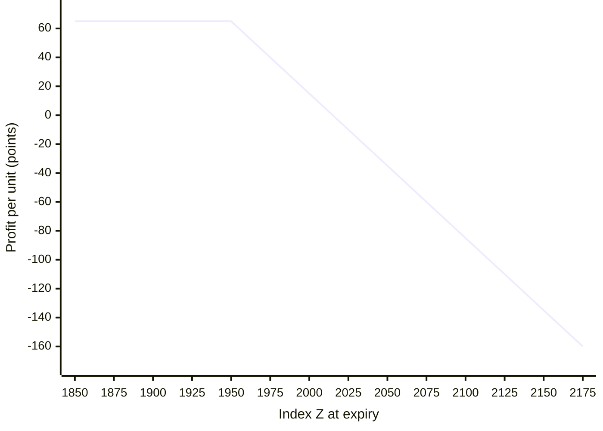
```mermaid
xychart-beta
  x-axis "Index Z at expiry" [1850, 1875, 1900, 1925, 1950, 1975, 2000, 2025, 2050, 2075, 2100, 2125, 2150, 2175]
  y-axis "Profit per unit (points)" -175 --> 75
  line [65, 65, 65, 65, 65, 40, 15, -10, -35, -60, -85, -110, -135, -160]
```

Short the underlying, and sell an at-the-money or the next out-of-the-money put.

- **Build:** short at 2,000. Sell the 1,950 put at 15.
- **Max profit:** (2,000 − 1,950) + 15 = 65, if Index Z is at or below 1,950.
- **Break-even:** 2,015.
- **Max loss:** unlimited above 2,015. Use a stop.

**Choosing the underlying:** markets in a downtrend or a range, after a rally to resistance. Avoid bullish patterns, oversold markets that could jump, and stocks driven by operators.

**Choosing the strike:** after a recent fall, sell the nearest in-the-money put for more premium and more protection. After a rally, sell the best out-of-the-money put. In a very bearish market, sell a far out-of-the-money put to keep more of the downside.

### Protective put

`Insurance` · `Core`

Profit or loss at expiry, in points per unit:

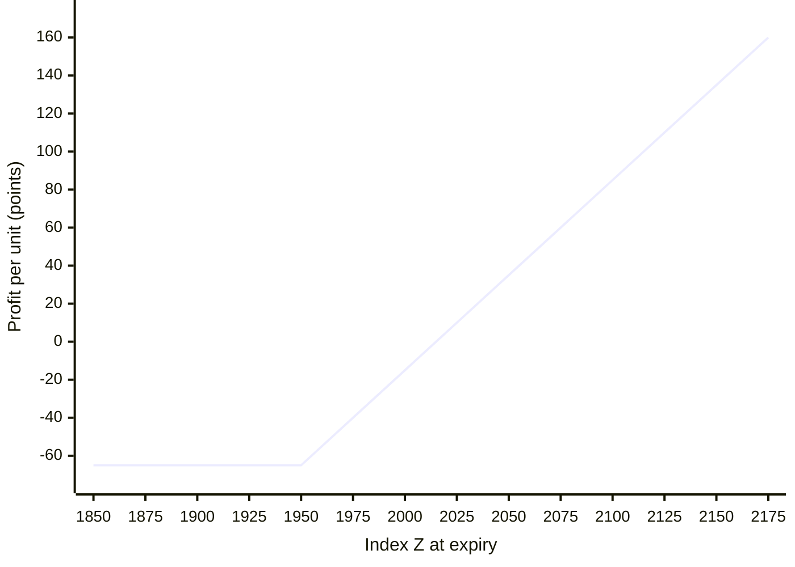
```mermaid
xychart-beta
  x-axis "Index Z at expiry" [1850, 1875, 1900, 1925, 1950, 1975, 2000, 2025, 2050, 2075, 2100, 2125, 2150, 2175]
  y-axis "Profit per unit (points)" -75 --> 175
  line [-65, -65, -65, -65, -65, -40, -15, 10, 35, 60, 85, 110, 135, 160]
```

- **Build:** own the underlying at 2,000. Buy the 1,950 put at 15.
- **Max loss:** (2,000 − 1,950) + 15 = 65, however far the price falls.
- **Break-even:** 2,015.
- **Use when:** you want to keep a holding through a risky period, such as results or an election.

---

## 5. Vertical spread cards

A **vertical spread** means buying one option and selling another of the same type (both calls or both puts) and the same expiry, but at different strikes.

- **Debit spread:** you pay the difference. Examples are the bull call spread and the bear put spread.
- **Credit spread:** you receive the difference. Examples are the bull put spread and the bear call spread.
- **Why spreads:** the option you sell cuts the cost, lowers the margin, and limits the risk. In exchange, the profit is capped.
- **Debit or credit?** If the premium difference is less than half the gap between strikes, the debit spread gives the better reward for the risk. If it is more than half, the credit spread does.

### Bull call spread (debit)

`Bullish` · `Core`

Profit or loss at expiry, in points per unit:

```mermaid
xychart-beta
  x-axis "Index Z at expiry" [1850, 1875, 1900, 1925, 1950, 1975, 2000, 2025, 2050, 2075, 2100, 2125, 2150, 2175]
  y-axis "Profit per unit (points)" -25 --> 50
  line [-22, -22, -22, -22, -22, -22, -22, 3, 28, 28, 28, 28, 28, 28]
```

- **Build:** buy the 2,000 call at 40. Sell the 2,050 call at 18.
- **Net debit:** 22. This is the max loss, if Index Z ends at or below 2,000.
- **Max profit:** 50 − 22 = 28, at or above 2,050.
- **Break-even:** 2,000 + 22 = 2,022.
- The difference of 22 is less than half the 50-point gap, so a debit spread is the right choice here.

### Bear put spread (debit)

`Bearish` · `Core`

Profit or loss at expiry, in points per unit:

```mermaid
xychart-beta
  x-axis "Index Z at expiry" [1850, 1875, 1900, 1925, 1950, 1975, 2000, 2025, 2050, 2075, 2100, 2125, 2150, 2175]
  y-axis "Profit per unit (points)" -25 --> 50
  line [30, 30, 30, 30, 30, 5, -20, -20, -20, -20, -20, -20, -20, -20]
```

- **Build:** buy the 2,000 put at 35. Sell the 1,950 put at 15.
- **Net debit:** 20, the max loss.
- **Max profit:** 50 − 20 = 30, at or below 1,950.
- **Break-even:** 2,000 − 20 = 1,980.

### Bull put spread (credit)

`Bullish` · `Core`

Profit or loss at expiry, in points per unit:

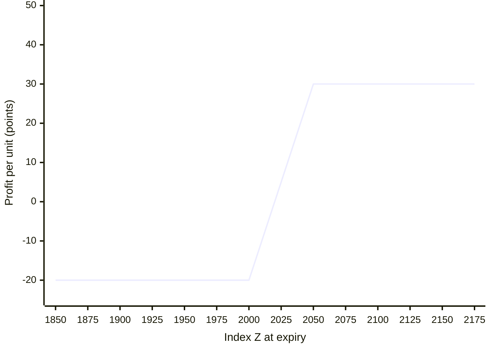
```mermaid
xychart-beta
  x-axis "Index Z at expiry" [1850, 1875, 1900, 1925, 1950, 1975, 2000, 2025, 2050, 2075, 2100, 2125, 2150, 2175]
  y-axis "Profit per unit (points)" -25 --> 50
  line [-20, -20, -20, -20, -20, -20, -20, 5, 30, 30, 30, 30, 30, 30]
```

- **Build:** sell the 2,050 put at 65. Buy the 2,000 put at 35.
- **Net credit:** 30, the max profit, if Index Z ends at or above 2,050.
- **Max loss:** 50 − 30 = 20, at or below 2,000.
- **Break-even:** 2,050 − 30 = 2,020.
- The credit of 30 is more than half the 50-point gap, so a credit spread is the right choice here.

### Bear call spread (credit)

`Bearish` · `Core`

Profit or loss at expiry, in points per unit:

```mermaid
xychart-beta
  x-axis "Index Z at expiry" [1850, 1875, 1900, 1925, 1950, 1975, 2000, 2025, 2050, 2075, 2100, 2125, 2150, 2175]
  y-axis "Profit per unit (points)" -25 --> 50
  line [32, 32, 32, 32, 32, 7, -18, -18, -18, -18, -18, -18, -18, -18]
```

- **Build:** sell the 1,950 call at 72. Buy the 2,000 call at 40.
- **Net credit:** 32, the max profit, if Index Z ends at or below 1,950.
- **Max loss:** 50 − 32 = 18, at or above 2,000.
- **Break-even:** 1,950 + 32 = 1,982.

---

## 6. Ratio spread card

`Strong trend expected` · `Useful`

Profit or loss at expiry, in points per unit:

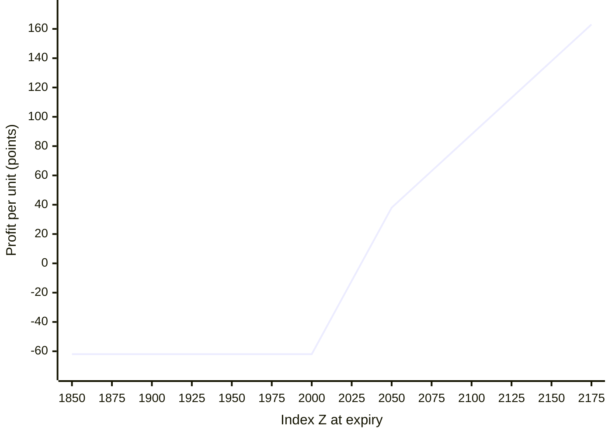
```mermaid
xychart-beta
  x-axis "Index Z at expiry" [1850, 1875, 1900, 1925, 1950, 1975, 2000, 2025, 2050, 2075, 2100, 2125, 2150, 2175]
  y-axis "Profit per unit (points)" -75 --> 175
  line [-62, -62, -62, -62, -62, -62, -62, -12, 38, 63, 88, 113, 138, 163]
```

Buy and sell options of the same type in unequal numbers, such as 2 bought for every 1 sold, or 3 for every 2. Use it when you expect a sharp move and want uncapped profit at a lower cost than buying options outright.

- **Build (bullish):** buy 2 of the 2,000 call at 40. Sell 1 of the 2,050 call at 18.
- **Net debit:** 80 − 18 = 62 for the pair.
- **Max loss:** 62, if Index Z ends at or below 2,000.
- **Break-even:** 2,000 + 31 = 2,031. Buying two calls without the sold call would have a break-even of 2,040.
- **Above 2,050:** one bought call is offset by the sold call, and the other keeps gaining without limit. At 2,100 the profit is 88.
- **Bearish version:** buy 2 of the 2,000 put at 35, and sell 1 of the 1,950 put at 15. The net debit is 55, and the break-even is 1,972.5.

---

## 7. Straddle and strangle cards

### Long straddle

`Big move, either way` · `Useful`

Profit or loss at expiry, in points per unit:

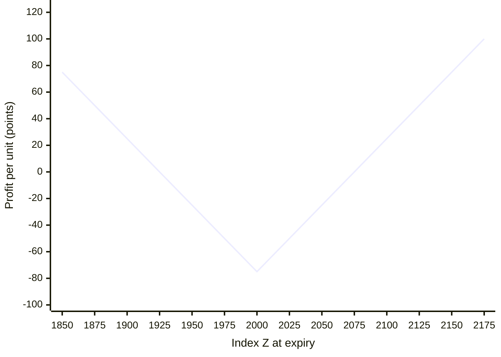
```mermaid
xychart-beta
  x-axis "Index Z at expiry" [1850, 1875, 1900, 1925, 1950, 1975, 2000, 2025, 2050, 2075, 2100, 2125, 2150, 2175]
  y-axis "Profit per unit (points)" -100 --> 125
  line [75, 50, 25, 0, -25, -50, -75, -50, -25, 0, 25, 50, 75, 100]
```

- **Build:** buy the 2,000 call at 40 and the 2,000 put at 35.
- **Cost and max loss:** 75, if Index Z ends exactly at 2,000.
- **Break-evens:** 2,075 and 1,925.
- **Use when:** big news is due and could move price sharply either way, or price is at a major turning point while volatility is still low. Beware of volatility crush after the news.

### Long strangle

`Big move, either way` · `Useful`

Profit or loss at expiry, in points per unit:

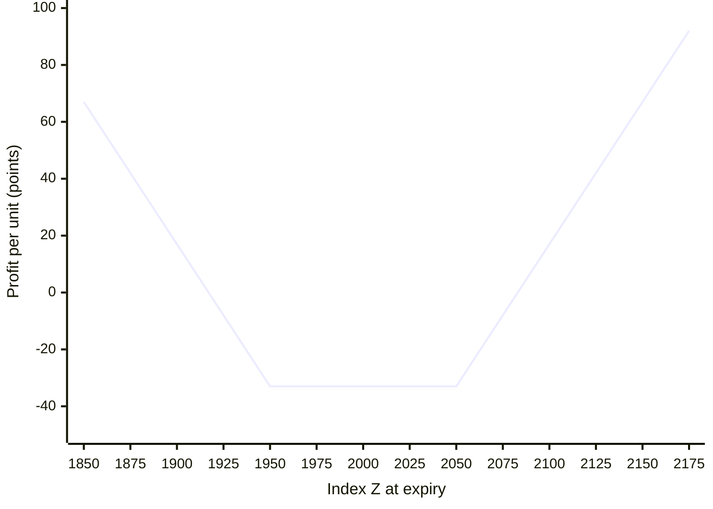
```mermaid
xychart-beta
  x-axis "Index Z at expiry" [1850, 1875, 1900, 1925, 1950, 1975, 2000, 2025, 2050, 2075, 2100, 2125, 2150, 2175]
  y-axis "Profit per unit (points)" -50 --> 100
  line [67, 42, 17, -8, -33, -33, -33, -33, -33, -8, 17, 42, 67, 92]
```

A cheaper version of the straddle, using out-of-the-money strikes.

- **Build:** buy the 2,050 call at 18 and the 1,950 put at 15.
- **Cost and max loss:** 33, if Index Z ends between 1,950 and 2,050.
- **Break-evens:** 2,083 and 1,917.
- **Use when:** you expect a breakout from a long range, but do not know which way.

### Short straddle

`Range` · `Advanced`

Profit or loss at expiry, in points per unit:

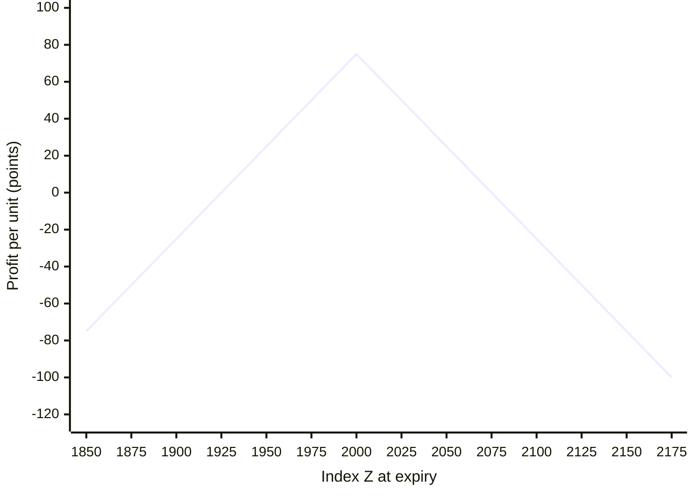
```mermaid
xychart-beta
  x-axis "Index Z at expiry" [1850, 1875, 1900, 1925, 1950, 1975, 2000, 2025, 2050, 2075, 2100, 2125, 2150, 2175]
  y-axis "Profit per unit (points)" -125 --> 100
  line [-75, -50, -25, 0, 25, 50, 75, 50, 25, 0, -25, -50, -75, -100]
```

- **Build:** sell the 2,000 call at 40 and the 2,000 put at 35.
- **Max profit:** 75, if Index Z ends exactly at 2,000.
- **Break-evens:** 2,075 and 1,925. **Risk:** unlimited beyond them.
- **Use when:** you are confident the market will stay in a tight range. Low-volatility stocks that usually trade sideways suit it. Keep a strict stop.

### Short strangle

`Range` · `Advanced`

Profit or loss at expiry, in points per unit:

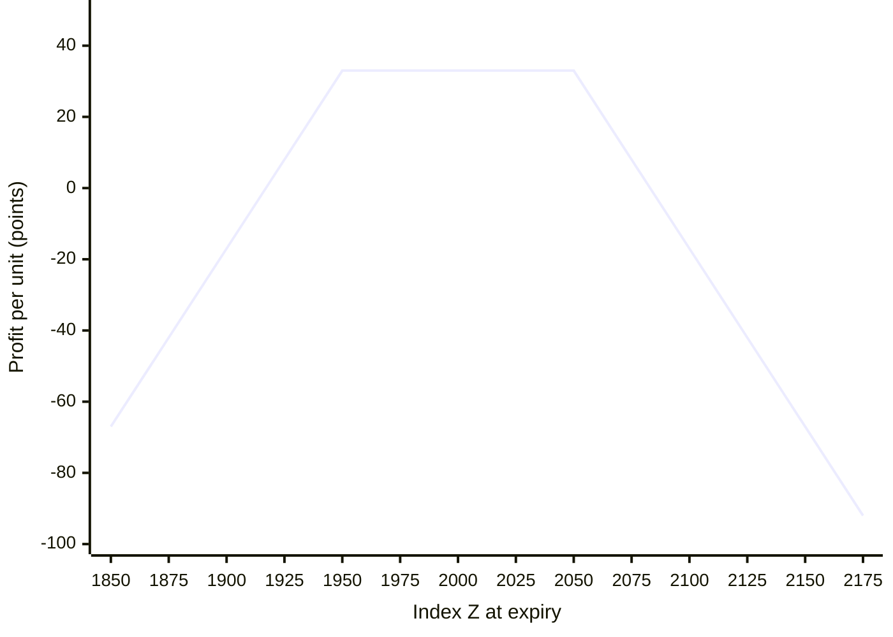
```mermaid
xychart-beta
  x-axis "Index Z at expiry" [1850, 1875, 1900, 1925, 1950, 1975, 2000, 2025, 2050, 2075, 2100, 2125, 2150, 2175]
  y-axis "Profit per unit (points)" -100 --> 50
  line [-67, -42, -17, 8, 33, 33, 33, 33, 33, 8, -17, -42, -67, -92]
```

- **Build:** sell the 2,050 call at 18 and the 1,950 put at 15.
- **Max profit:** 33, if Index Z ends between 1,950 and 2,050.
- **Break-evens:** 2,083 and 1,917. **Risk:** unlimited beyond them.

---

## 8. Collar cards

A collar is for when you want to ride a steady trend in a choppy market, but keep getting stopped out. Instead of a stop-loss, you buy protection and pay for it by selling an option.

### Long collar

`Bullish, choppy` · `Useful`

Profit or loss at expiry, in points per unit:

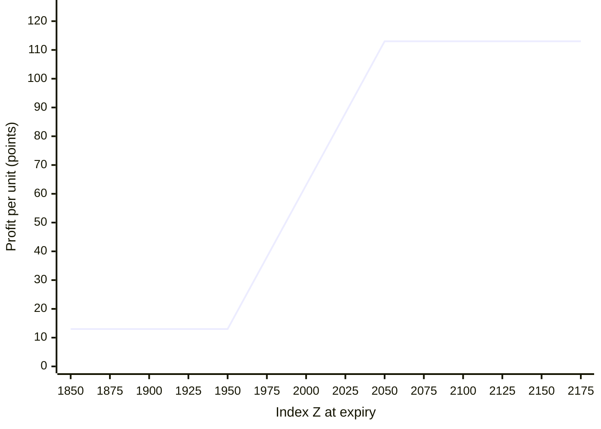
```mermaid
xychart-beta
  x-axis "Index Z at expiry" [1850, 1875, 1900, 1925, 1950, 1975, 2000, 2025, 2050, 2075, 2100, 2125, 2150, 2175]
  y-axis "Profit per unit (points)" 0 --> 125
  line [13, 13, 13, 13, 13, 38, 63, 88, 113, 113, 113, 113, 113, 113]
```

- **Situation:** you bought at 1,940, and Index Z is now at 2,000.
- **Build:** buy the 1,950 put at 15. Sell the 2,050 call at 18. Net credit 3.
- **Worst case:** at or below 1,950, the profit is (1,950 − 1,940) + 3 = 13. The profit is locked in.
- **Best case:** at or above 2,050, the profit is (2,050 − 1,940) + 3 = 113.
- **Why it works:** in an uptrend, calls are relatively expensive and puts are relatively cheap, so the call pays for the put. No stop-loss is needed.

### Short collar

`Bearish, choppy` · `Useful`

Profit or loss at expiry, in points per unit:

```mermaid
xychart-beta
  x-axis "Index Z at expiry" [1850, 1875, 1900, 1925, 1950, 1975, 2000, 2025, 2050, 2075, 2100, 2125, 2150, 2175]
  y-axis "Profit per unit (points)" 0 --> 125
  line [107, 107, 107, 107, 107, 82, 57, 32, 7, 7, 7, 7, 7, 7]
```

- **Situation:** you shorted at 2,060, and Index Z is now at 2,000.
- **Build:** buy the 2,050 call at 18. Sell the 1,950 put at 15. Net debit 3.
- **Worst case:** at or above 2,050, the profit is (2,060 − 2,050) − 3 = 7.
- **Best case:** at or below 1,950, the profit is (2,060 − 1,950) − 3 = 107.

---

## 9. Ladder cards

### Bull put ladder

`Bullish, with a crash hedge` · `Advanced`

Profit or loss at expiry, in points per unit:

```mermaid
xychart-beta
  x-axis "Index Z at expiry" [1850, 1875, 1900, 1925, 1950, 1975, 2000, 2025, 2050, 2075, 2100, 2125, 2150, 2175]
  y-axis "Profit per unit (points)" -50 --> 25
  line [14, -11, -36, -36, -36, -11, 14, 14, 14, 14, 14, 14, 14, 14]
```

Use when the market is bullish, but a sharp fall is possible. Aim for a net credit. It works best when volatility is moderate or low and premiums are cheap.

- **Build:** sell 1 of the 2,000 put at 35. Buy 1 of the 1,950 put at 15. Buy 1 of the 1,900 put at 6.
- **Net credit:** 35 − 15 − 6 = 14.
- **At or above 2,000:** keep the credit of 14.
- **Max loss:** (2,000 − 1,950) − 14 = 36, between 1,900 and 1,950.
- **Break-evens:** upper 2,000 − 14 = 1,986; lower 1,900 − 36 = 1,864.
- **Below 1,864:** profit grows as the price falls.
- It is a bull put spread plus an extra long put. You lose only if the market drifts moderately lower.

### Bear call ladder

`Bearish, with a spike hedge` · `Advanced`

Profit or loss at expiry, in points per unit:

```mermaid
xychart-beta
  x-axis "Index Z at expiry" [1850, 1875, 1900, 1925, 1950, 1975, 2000, 2025, 2050, 2075, 2100, 2125, 2150, 2175]
  y-axis "Profit per unit (points)" -50 --> 50
  line [15, 15, 15, 15, 15, 15, 15, -10, -35, -35, -35, -10, 15, 40]
```

Use when the market is bearish, but a sharp rally is possible.

- **Build:** sell 1 of the 2,000 call at 40. Buy 1 of the 2,050 call at 18. Buy 1 of the 2,100 call at 7.
- **Net credit:** 40 − 18 − 7 = 15.
- **At or below 2,000:** keep the credit of 15.
- **Max loss:** (2,050 − 2,000) − 15 = 35, between 2,050 and 2,100.
- **Break-evens:** lower 2,000 + 15 = 2,015; upper 2,100 + 35 = 2,135.
- **Above 2,135:** profit grows without limit.

---

## 10. Iron butterfly and iron condor cards

These use four options: a call spread and a put spread together. The "long" versions pay a debit and profit from a move. The "short" versions receive a credit and profit from a range. Some books use the opposite names, so always check the legs, not just the name.

### Long iron butterfly

`Sharp move expected, but limited` · `Advanced`

Profit or loss at expiry, in points per unit:

```mermaid
xychart-beta
  x-axis "Index Z at expiry" [1850, 1875, 1900, 1925, 1950, 1975, 2000, 2025, 2050, 2075, 2100, 2125, 2150, 2175]
  y-axis "Profit per unit (points)" -75 --> 50
  line [38, 38, 38, 13, -12, -37, -62, -37, -12, 13, 38, 38, 38, 38]
```

- **Build:** buy the 2,000 call at 40 and the 2,000 put at 35. Sell the 2,100 call at 7 and the 1,900 put at 6.
- **Net debit:** 75 − 13 = 62, the max loss, if Index Z ends at 2,000.
- **Max profit:** 100 − 62 = 38, at or beyond 2,100 or 1,900.
- **Break-evens:** 2,062 and 1,938.
- It is a long straddle with a short strangle sold against it to cut the cost. Manage it actively: when price moves one way, you can close the losing half.

### Short iron butterfly

`Sideways` · `Advanced`

Profit or loss at expiry, in points per unit:

```mermaid
xychart-beta
  x-axis "Index Z at expiry" [1850, 1875, 1900, 1925, 1950, 1975, 2000, 2025, 2050, 2075, 2100, 2125, 2150, 2175]
  y-axis "Profit per unit (points)" -50 --> 75
  line [-38, -38, -38, -13, 12, 37, 62, 37, 12, -13, -38, -38, -38, -38]
```

- **Build:** sell the 2,000 call at 40 and the 2,000 put at 35. Buy the 2,100 call at 7 and the 1,900 put at 6.
- **Net credit:** 62, the max profit, if Index Z ends exactly at 2,000.
- **Max loss:** 100 − 62 = 38, at or beyond 2,100 or 1,900.
- **Break-evens:** 2,062 and 1,938.
- It is a short straddle with protection bought on both sides. It earns time decay in a frustrating sideways market.

### Long iron condor

`Sharp move expected, but limited` · `Advanced`

Profit or loss at expiry, in points per unit:

```mermaid
xychart-beta
  x-axis "Index Z at expiry" [1850, 1875, 1900, 1925, 1950, 1975, 2000, 2025, 2050, 2075, 2100, 2125, 2150, 2175]
  y-axis "Profit per unit (points)" -25 --> 50
  line [30, 30, 30, 5, -20, -20, -20, -20, -20, 5, 30, 30, 30, 30]
```

- **Build:** buy the 2,050 call at 18 and the 1,950 put at 15. Sell the 2,100 call at 7 and the 1,900 put at 6.
- **Net debit:** 33 − 13 = 20, the max loss, if Index Z ends between 1,950 and 2,050.
- **Max profit:** 50 − 20 = 30, at or beyond 2,100 or 1,900.
- **Break-evens:** 2,070 and 1,930.

### Short iron condor

`Sideways` · `Advanced`

Profit or loss at expiry, in points per unit:

```mermaid
xychart-beta
  x-axis "Index Z at expiry" [1850, 1875, 1900, 1925, 1950, 1975, 2000, 2025, 2050, 2075, 2100, 2125, 2150, 2175]
  y-axis "Profit per unit (points)" -50 --> 25
  line [-30, -30, -30, -5, 20, 20, 20, 20, 20, -5, -30, -30, -30, -30]
```

- **Build:** sell the 2,050 call at 18 and the 1,950 put at 15. Buy the 2,100 call at 7 and the 1,900 put at 6.
- **Net credit:** 20, the max profit, if Index Z ends between 1,950 and 2,050.
- **Max loss:** 50 − 20 = 30, at or beyond 2,100 or 1,900.
- **Break-evens:** 2,070 and 1,930.
- **Use when:** you expect a range, here roughly 1,950 to 2,050, and want to earn time decay with capped risk.

---

## 11. Calendar spread card

`Target is next month` · `Useful`

Use when the current expiry is only days away, and your target will probably be reached only in the next month.

- **Situation:** 4 days are left in the current expiry. You expect Index Z to fall below support at 1,900, but not in the next 4 days.
- **Build:** sell the current-month 2,000 put at 14. Buy the next-month 2,000 put at 48.
- **Net debit:** 34 instead of 48, a saving of about 30 percent.

```mermaid
flowchart LR
  today["Today: buy the next-month put for 48, sell the current-expiry put for 14. Net cost 34"] --> current["Current expiry, in 4 days: the sold put expires, mostly worthless"]
  current --> next["Next expiry, about a month away: the bought put works toward the target below 1,900"]
```

- **How it plays out:** if Index Z stays near 2,000 for 4 days, the sold put loses most of its value to time decay, and you hold the next-month put at a lower cost. If the fall comes early, the sold put loses money too, so the spread gains less than a plain put would.

---

## 12. Swing trading and momentum trading with options

| | Swing trading | Momentum trading |
|---|---|---|
| Market | Range: ADX below 20, or falling | Trend: ADX rising from 15 or above |
| Idea | Sell rallies near resistance, preferably with a covered put. Buy dips near support, preferably with a covered call. | Trade in the direction of the trend. For a long, price is in the upper half of the Bollinger Bands, and the bands point up. For a short, the reverse. |
| Instruments | Covered and credit strategies | Buying options outright, or ratio spreads to cut the cost |
| Best timing | When time value is high: early in the contract, or in a volatile market | When time value is moderate: middle to late in the contract, while volatility is low and expected to rise |

---

## 13. Rules for buying options

- Prefer in-the-money options. They suffer less from time decay and move almost as much as the underlying.
- Be ready to change positions. Hope is not a strategy.
- Reduce your net cost by selling options against the ones you buy, wherever possible.
- Keep reasonable profit targets, unless the market is trending strongly.
- Do not put more than 5 to 8 percent of your account into bought options at any time, and use stops so that no trade loses more than 2 percent of your account.
- Where possible, use credit strategies, such as far out-of-the-money options sold with protection, or bull put and bear call spreads.

---

## 14. Things never to forget

- **Time is against the buyer.** Trading options on fundamental analysis alone is very hard, because a correct view that arrives late still loses.
- **The odds favor sellers,** but sellers carry the large, rare losses.
- **Many options expire worthless,** especially far out-of-the-money ones. The popular claim that 80 or 90 percent expire worthless is overstated. Exchange data suggest about a third expire worthless, and most of the rest are closed before expiry. Still, never buy far out-of-the-money options hoping for a jackpot.
- **Writers are often large, well-funded players.** They do not control prices, but their positions show up in open interest.
- **Sell options when volatility is high and the trend is in your favor.** High volatility is usually followed by lower volatility.
- **Markets spend much of their time in ranges.** Use range strategies too, not only trend strategies.
- **Good options trading can feel boring.** That is fine.

---

## 15. Futures and options decision worksheet

Fill this in before every derivatives trade. The first two blocks come from your chart work in Steps 1 to 5.

| Section | Field | What to write |
|---|---|---|
| Input | Date | |
| | Market | |
| | Last close | |
| | Technical view | Direction, target, stop, and setup name |
| Conclusion | Trend decision | Strong up, strong down, or sideways (from the Step B table) |
| | Covered strategy? | Yes or no, and which |
| | Spread type | Debit or credit, using the half-the-gap rule |
| | Time value and volatility | High (sell) or low (buy) |
| Futures | Entry and break-even | |
| | Investment | Price × lot × margin percentage |
| | Target gain | (Target − entry) × lot |
| | Return | Target gain ÷ investment |
| Options, debit | Strike, entry, and break-even | |
| | Investment | Premium paid × lot |
| | Target gain | |
| | Return | Target gain ÷ investment |
| Options, credit | Strike and entry | |
| | Investment | Margin − premium received |
| | Target gain | Premium you expect to keep |
| | Return | Target gain ÷ investment |
| Final | Decision | The instrument with the best return for the risk, or no trade |

**Filled example.** Technical view: Index Z is bullish after a double bottom, with a target of 2,060 by expiry and a stop at 1,970.

| Choice | Investment | Target gain | Return |
|---|---|---|---|
| Buy futures at 2,008 | 15,060 margin | (2,060 − 2,008) × 50 = 2,600 | 17% |
| Buy the 2,000 call at 40 | 2,000 | (60 − 40) × 50 = 1,000 | 50% |
| Bull call spread, 2,000 and 2,050, at 22 | 1,100 | (50 − 22) × 50 = 1,400 | 127% |
| Bull put spread, 2,050 and 2,000, credit 30 | About 3,000 margin, minus 1,500 received = 1,500 | 1,500 | 100% |

The bull call spread gives the best return for a move to 2,060, and its risk is capped at 1,100. The bull put spread is close behind, and has the smaller maximum loss (1,000). Decision: bull call spread, or the bull put spread if you want to risk less.

---

## Practice

1. You are bullish with a moderate target by expiry, after a double bottom. Which two approaches does the chooser suggest?
2. In a bear call spread, you sell the 2,000 call at 40 and buy the 2,050 call at 18. What are the max profit, max loss, and break-even?
3. Implied volatility is very high and the market is ranging. Buy or sell premium?
4. The premium difference between two call strikes 100 points apart is 30. Debit or credit spread?
5. Why does a long collar not need a stop-loss?

### Answers

1. A covered call, or selling an in-the-money put.
2. Credit 22 is the max profit, at or below 2,000. The max loss is 50 − 22 = 28, at or above 2,050. The break-even is 2,022.
3. Sell premium, using a credit strategy with limited risk, such as a short iron condor.
4. 30 is less than half of 100, so a debit spread.
5. The bought put sets a floor under the position, so the worst case is already known.
