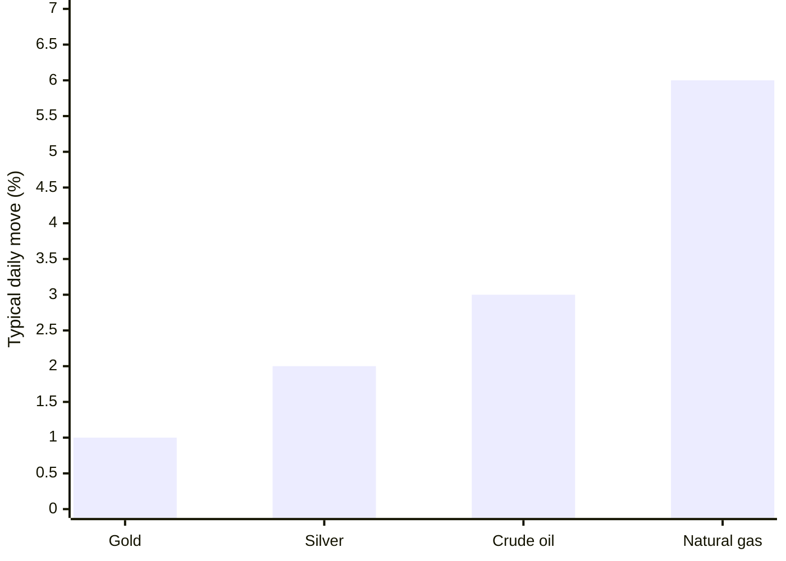
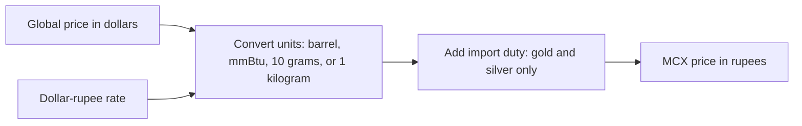
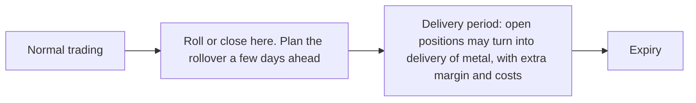
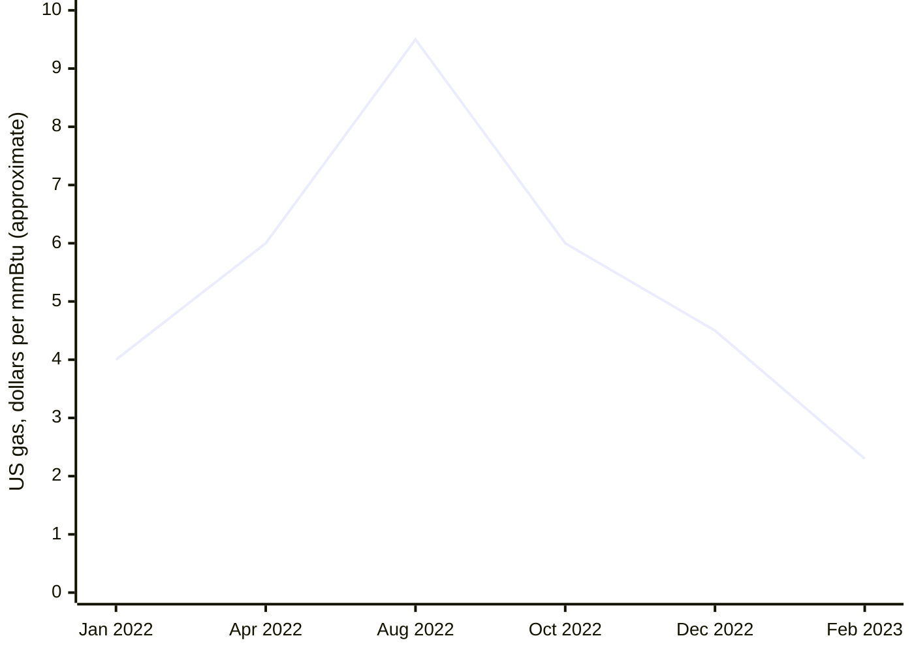

# Crude Oil, Natural Gas, Gold, and Silver

This lesson applies Step 6 to the four commodities traded most on India's commodity exchange, MCX: crude oil, natural gas, gold, and silver. For each one you learn the contracts, how the price is quoted, what moves it, when the big news lands, and how the futures and options strategies from this step fit it.

The same chart rules from Steps 1 to 5 apply to all four. What changes is the contract size, the news calendar, and how wildly each one moves. Once you have a breakout or breakdown idea, the [MCX Intraday Breakout Playbook](../mcx_intraday_breakout_playbook.md) is the live form for these four markets.

**Check before you trade.** Lot sizes, tick sizes, margins, expiry dates, and settlement rules below are the usual MCX terms, but the exchange revises them. Always confirm them in the current MCX contract specifications and expiry calendar.

---

## 1. The four markets at a glance

| | Crude oil | Natural gas | Gold | Silver |
|---|---|---|---|---|
| Quoted in | Rupees per barrel | Rupees per mmBtu (a unit of heat energy) | Rupees per 10 grams | Rupees per kilogram |
| Main global price | WTI crude on the US exchange (NYMEX) | Henry Hub gas on NYMEX | Gold in dollars per troy ounce | Silver in dollars per troy ounce |
| Main drivers | Supply decisions, inventories, the economy, war and sanctions | Weather, storage, the season | Interest rates, the dollar, fear, central bank buying | Gold's drivers, plus industrial demand |
| How wild it is | High | Very high | Low to moderate | High |
| Settlement of futures | Cash | Cash | Physical delivery | Physical delivery |
| Weekly US data | Oil inventories, Wednesday | Gas storage, Thursday | None weekly; US inflation and jobs data monthly | Same as gold |

How far each one typically moves in a normal day, using the middle of the ranges given later in this lesson:

A stop that suits gold is far too tight for natural gas. Size every trade from its own stop distance, as section 7 shows.

### Trading hours

MCX trades these four from 9:00 am to about 11:30 pm India time. In the months when the US is on standard time (roughly November to March), the close extends to about 11:55 pm. Most of the big moves happen in the evening, when US markets are open and US data is released.

India time, during US daylight time. Add one hour when the US is on standard time.

Federal Reserve decisions land around 11:30 pm India time, close to the MCX close, and move all four markets.

### How the MCX price links to the global price

MCX prices follow the global price, converted into rupees. That means the dollar-rupee rate moves them too.

- **Crude oil.** MCX price ≈ WTI price in dollars × dollar-rupee rate.
  - Example: WTI at 75 dollars and the rupee at 83 gives about 75 × 83 = 6,225 rupees a barrel.
- **Gold.** One troy ounce is 31.1035 grams, so 10 grams is 0.3215 ounces. MCX price ≈ dollar price × 0.3215 × dollar-rupee rate, plus import duty.
  - Example: gold at 2,000 dollars and the rupee at 83 gives 2,000 × 0.3215 × 83 ≈ 53,370 rupees per 10 grams before duty. With a 6 percent duty it is about 56,570.
- **Silver.** One kilogram is 32.15 troy ounces. MCX price ≈ dollar price × 32.15 × dollar-rupee rate, plus import duty.
  - Example: silver at 25 dollars and the rupee at 83 gives 25 × 32.15 × 83 ≈ 66,710 rupees per kilogram before duty.

**Why it matters:** if the global price is flat but the rupee weakens, MCX prices rise. If the government changes the import duty on gold or silver, MCX prices jump or drop at once, even with no global move.

---

## 2. Contracts and the value of one tick

The **tick** is the smallest price step. The **value per tick** is how much one lot gains or loses when price moves one tick. Use it to size positions.

| Contract | Lot size | Tick | Value of one tick per lot | Value of a 100-rupee move per lot |
|---|---|---|---|---|
| Crude Oil | 100 barrels | 1 rupee | 100 | 10,000 |
| Crude Oil Mini | 10 barrels | 1 rupee | 10 | 1,000 |
| Natural Gas | 1,250 mmBtu | 0.10 rupee | 125 | 1,25,000 (a 10-rupee move is 12,500) |
| Natural Gas Mini | 250 mmBtu | 0.10 rupee | 25 | 25,000 (a 10-rupee move is 2,500) |
| Gold | 1 kilogram, quoted per 10 grams | 1 rupee | 100 | 10,000 |
| Gold Mini | 100 grams, quoted per 10 grams | 1 rupee | 10 | 1,000 |
| Gold Guinea | 8 grams, quoted per 8 grams | 1 rupee | 1 | 100 |
| Gold Petal | 1 gram, quoted per gram | 1 rupee | 1 | 100 |
| Silver | 30 kilograms | 1 rupee | 30 | 3,000 |
| Silver Mini | 5 kilograms | 1 rupee | 5 | 500 |
| Silver Micro | 1 kilogram | 1 rupee | 1 | 100 |

**How to work out the value of a move.** Value = points moved × units per lot, adjusted for how the price is quoted.

- Crude Oil: a 40-rupee move × 100 barrels = 4,000 rupees per lot.
- Natural Gas: an 8-rupee move × 1,250 mmBtu = 10,000 rupees per lot.
- Gold: the lot is 1 kilogram, which is 100 units of 10 grams. A 500-rupee move × 100 = 50,000 rupees per lot.
- Silver: a 1,000-rupee move × 30 kilograms = 30,000 rupees per lot.

The mini and micro contracts exist so that smaller accounts can follow the 2 percent rule. Start with them.

### Expiry and contract months

- **Crude oil and natural gas** have a contract for every month. They expire before the matching US contract, usually in the second half of the month before delivery. Crude often expires around the 19th or 20th. Natural gas expires a few business days before the month ends.
- **Gold and silver** big contracts trade only in selected months. The mini and micro versions have more months. Gold and silver futures usually expire around the 5th of the contract month.
- **Options** usually expire a few days before the futures contract they are based on.

Always look up the exact dates in the MCX calendar, and plan rollovers a few days ahead.

### Settlement and delivery

- **Crude oil and natural gas futures settle in cash**, at a price based on the US benchmark. There is no oil or gas to deliver, but the April 2020 case below shows that cash settlement does not protect you from extreme prices.
- **Gold and silver futures settle by physical delivery.** If you hold a position into the delivery period, you may have to take or give delivery of metal, with extra margin, taxes, and paperwork. Traders should close or roll positions before the delivery period starts.
- **Options.** Many MCX options are options on the futures contract. At expiry, an in-the-money option turns into a futures position, which is called devolvement. Some newer contracts settle differently. Read the contract note, and close options before expiry unless you want the resulting position.

---

## 3. Crude oil

### What moves it

- **Supply decisions.** OPEC and its partners (OPEC+) meet regularly to set output targets. Cuts push prices up, and increases push them down.
- **US inventories.** The US Energy Information Administration (EIA) publishes crude stocks every Wednesday at 10:30 am New York time. That is 8:00 pm India time when the US is on daylight time, and 9:00 pm on standard time. A private survey (API) comes out late Tuesday New York time, which is early Wednesday morning in India. A bigger-than-expected build in stocks is bearish, and a bigger-than-expected draw is bullish.
- **The economy.** Strong growth means more fuel demand. Recession fears pull prices down.
- **War, sanctions, and shipping routes.** These can cause sudden gaps.
- **The dollar-rupee rate.** A weaker rupee lifts MCX crude.

### Character

Crude trends well for weeks at a time, but it reacts sharply to news. Moves of 2 to 4 percent in a day are common, and gaps appear on weekend news.

### How to trade it with this course

- The trend setups, including breakouts, flags, and third waves, work well in crude because it trends.
- Check the EIA report time before every evening trade. Do not enter a fresh position in the 15 minutes before the release. The first spike often reverses.
- Before the report, implied volatility is high, and it falls right after. Buying straddles just before the report often loses to the volatility crush. Selling premium before the report risks a big move. Many traders simply wait for the report, then trade the chart.
- Crude options are among the most liquid options on MCX. Stick to strikes near the money in the near month.

**Number example.** Crude is at 6,500 and breaks resistance on the one-hour chart. Your stop is 40 points below, at 6,460, and your target is 6,580. On one full lot the risk is 40 × 100 = 4,000 rupees, and the reward is 8,000. On one mini lot, the risk is 400 rupees.

**Options example.** Instead of the futures, buy a bull call spread: buy the 6,500 call at 110, and sell the 6,600 call at 65. The net debit is 45 points, which is 4,500 rupees on one lot of 100 barrels. The maximum profit is 55 points, or 5,500 rupees, above 6,600. The break-even is 6,545.

### Real case: April 2020

When the US May 2020 WTI contract settled at about −37.63 dollars on 20 April 2020 (see [Lesson 1](01-futures-and-currency.md)), MCX's April crude contract, which settles against that price, also settled below zero, at about −2,884 rupees a barrel. Traders holding long positions lost more than the whole value of the contract. The lesson: close or roll crude positions before the final days of a contract when conditions are extreme, and never assume a price cannot fall below zero.

---

## 4. Natural gas

### What moves it

- **Weather.** Cold winters raise heating demand. Hot summers raise demand for power for air conditioning. Weather forecasts change daily, and prices change with them.
- **Storage.** The EIA publishes US gas storage every Thursday at 10:30 am New York time, which is 8:00 pm or 9:00 pm India time. A smaller-than-expected injection, or a bigger withdrawal, is bullish.
- **The season.** Demand peaks in winter, and storage is refilled from spring to autumn.
- **Exports and production.** Liquefied gas exports and output levels.

### Character

Natural gas is the wildest of the four. Daily moves of 4 to 8 percent are common, and trends can reverse violently. Gaps are frequent after weather updates.

### How to trade it with this course

- Use smaller size than in crude. Start with the mini contract.
- Use wider stops placed beyond real structure, and cut the position size to keep the 2 percent rule. A tight stop in natural gas is usually hit by noise.
- Prefer confirmed setups, such as a close beyond the level or a retest, over anticipating a breakout.
- Avoid selling naked options. The sudden jumps can wipe out months of premium. Use spreads instead.
- Check the Thursday storage report time before evening trades.

**Number example.** Natural gas is at 240 and forms a fake breakdown below support at 232. Your stop is 226, and your target is 256. The risk on one full lot is (240 − 226) × 1,250 = 17,500 rupees. On a capital of 5,00,000, the 2 percent limit is 10,000, so a full lot is too big. One mini lot risks 14 × 250 = 3,500 rupees. Take two mini lots, risking 7,000.

### Real case: 2022 to 2023

US natural gas rose to near 10 dollars per mmBtu in August 2022, its highest level in over a decade, as Europe scrambled for supply. By early 2023, after a mild winter and full storage, it had fallen to around 2 dollars, a drop of about 80 percent. Traders who kept buying dips because "gas is scarce" were crushed.

The trend on the chart had already turned down, with lower highs and lower lows, long before the story changed.

---

## 5. Gold

### What moves it

- **Real interest rates.** Gold pays no interest. When interest rates after inflation rise, gold usually falls. When they fall, gold usually rises.
- **The US dollar.** A stronger dollar usually means weaker gold in dollars.
- **Fear.** Wars, banking stress, and market crashes send buyers to gold as a safe place.
- **Central bank buying.** Large, steady purchases by central banks support the price.
- **US data.** Inflation (CPI) and the monthly jobs report (nonfarm payrolls, usually the first Friday of the month) are released at 8:30 am New York time. That is 6:00 pm India time on US daylight time, and 7:00 pm on standard time. Federal Reserve rate decisions come out at 2:00 pm New York time, which is late night in India.
- **India-specific factors.** Import duty changes in the Union Budget, the dollar-rupee rate, and wedding and festival demand.

### Character

Gold is the calmest of the four. Daily moves of 0.5 to 1.5 percent are typical. It forms clean support and resistance levels and trends for months. It can still spike on US data and on geopolitical news.

### How to trade it with this course

- Chart patterns, weekly support and resistance, and wave counts work well in gold because its trends are long and orderly.
- Because moves are smaller, a full 1-kilogram lot is large for most accounts. Gold Mini, Guinea, and Petal let you size correctly.
- Gold options are less liquid than crude options. Use near-month strikes close to the money, and prefer spreads, so you are not stuck with a wide gap between buy and sell quotes.
- Close futures positions before the delivery period.

**Number example.** Gold Mini is at 72,000 per 10 grams and has pulled back to a rising 13 EMA with a hammer. Your stop is 71,500, and your target is 73,200. On one Gold Mini lot the risk is 500 × 10 = 5,000 rupees, and the reward is 12,000. With a 10,000-rupee risk limit, take two lots.

### Real case: the July 2024 duty cut

In India's Union Budget on 23 July 2024, the government cut the customs duty on gold and silver from 15 percent to 6 percent. MCX gold fell by roughly 4,000 rupees per 10 grams, about 5 to 6 percent, within hours, while the global gold price barely moved. Traders with long positions and tight margins were hit by a move that no chart could have shown. Lesson: on Budget day, and whenever a duty change is possible, reduce size or stay out.

---

## 6. Silver

### What moves it

- **Everything that moves gold.** Silver usually moves in the same direction as gold.
- **Industrial demand.** Silver is used in solar panels, electronics, and electric vehicles, so it also responds to the economic outlook.
- **Smaller market.** Silver's market is much smaller than gold's, so moves are bigger.

### Character

Silver typically moves one and a half to two times as much as gold in percentage terms, in both directions. It often lags gold at the start of a rally, then catches up fast. It also falls harder in sell-offs.

**The gold-to-silver ratio** is the gold price divided by the silver price, both in dollars per ounce. It has mostly stayed between about 60 and 90 in recent decades. It spiked above 120 in the March 2020 crash, when silver fell much harder than gold. A very high ratio means silver is cheap compared with gold, and a very low ratio means it is expensive. Use it as background, not as a trade signal.

### How to trade it with this course

- Use the same setups as gold, with wider stops and smaller size.
- Silver Mini and Silver Micro allow correct sizing.
- When gold breaks out and silver has not yet followed, watch silver for a delayed breakout. When gold is weak, silver is usually weaker.
- The 3-standard-deviation Bollinger Band rule from Step 4 is especially useful in silver, because blow-off spikes are common.

**Number example.** Silver is at 88,000 per kilogram and breaks out of a flag. Your stop is 86,800, and your target is 90,400. On a full 30-kilogram lot, the risk is 1,200 × 30 = 36,000 rupees, which is too big for a 10,000-rupee limit. One Silver Mini lot risks 1,200 × 5 = 6,000. Or take eight Silver Micro lots, risking 1,200 × 8 = 9,600.

**Real case:** silver's April 2011 blow-off to near 50 dollars, followed by a fall of about a quarter in a week, is covered in [Step 4, Lesson 2](../04-price-action/02-confirmation-tools.md).

---

## 7. Sizing across the four markets

Use the position-size formula from Step 1: number of lots = money you can risk ÷ (stop distance × value per point per lot).

**Example.** Capital is 5,00,000 rupees, and the risk limit is 2 percent, or 10,000 rupees per trade.

| Market | Stop distance | Loss per full lot | Full lots allowed | Loss per mini or micro lot | Mini or micro lots allowed |
|---|---|---|---|---|---|
| Crude Oil | 40 | 4,000 | 2 | Mini: 400 | 25 |
| Natural Gas | 8 | 10,000 | 1 | Mini: 2,000 | 5 |
| Gold | 500 | 50,000 | 0 | Mini: 5,000 | 2 |
| Silver | 1,200 | 36,000 | 0 | Mini: 6,000, micro: 1,200 | 1 mini, or 8 micro |

A "0" means even one full lot breaks the rule. Use the smaller contract, or skip the trade.

Also check the **margin**. Crude oil and natural gas margins are much higher, as a percentage, than gold margins, and margins rise sharply when volatility jumps. Keep spare cash in the account so that a margin increase does not force you out of a good position.

---

## 8. Choosing futures or options in these markets

| Situation | Better choice |
|---|---|
| Clear trend setup in crude or natural gas, liquid options available | Futures with a stop, or a debit spread in the near month |
| Big scheduled report in the next hour (EIA, US inflation, jobs) | Wait for the report, then trade the chart. Avoid buying premium just before it. |
| Range-bound gold or silver | Covered strategies or credit spreads, only if the options are liquid enough |
| Natural gas in any condition | Never naked option selling. Use spreads or small futures positions. |
| Target is likely only next month | Calendar spread, or roll the futures early |
| Holding gold or silver near expiry | Close or roll before the delivery period |

---

## 9. Checklist before any trade in these four

- [ ] I know the contract, the lot size, and the value of one tick.
- [ ] I know the expiry date, and for gold and silver, when the delivery period starts.
- [ ] I have checked today's scheduled events: EIA reports for crude and gas, US inflation, jobs, or Federal Reserve decisions for gold and silver, and any Budget or duty announcement.
- [ ] My stop is beyond real structure, not a random number of points.
- [ ] My position size keeps the loss under my per-trade limit, using a mini or micro contract if needed.
- [ ] I have spare margin in case the exchange raises it.
- [ ] If I use options, they are near the money, in the near month, and liquid enough that the gap between buy and sell quotes is small.

---

## Practice

1. WTI is at 80 dollars, and the rupee is at 84. Roughly where should MCX crude trade?
2. Natural gas moves 6 rupees. How much does one full lot gain or lose? One mini lot?
3. Why should you close a gold futures position before the delivery period?
4. It is Wednesday, 7:50 pm India time, in June. Why should you wait before entering a crude oil trade?
5. Your risk limit is 8,000 rupees, and your silver stop is 1,500 rupees per kilogram away. What can you trade?

### Answers

1. About 80 × 84 = 6,720 rupees a barrel.
2. Full lot: 6 × 1,250 = 7,500 rupees. Mini lot: 6 × 250 = 1,500 rupees.
3. Gold futures settle by physical delivery. Holding into the delivery period can mean taking or giving delivery of metal, with extra margin and costs.
4. The US is on daylight time in June, so the EIA crude inventory report is due at 8:00 pm India time. Price can spike either way on the release.
5. A full lot risks 1,500 × 30 = 45,000, and a mini lot risks 7,500. One Silver Mini lot fits (7,500), or five Silver Micro lots (7,500).
