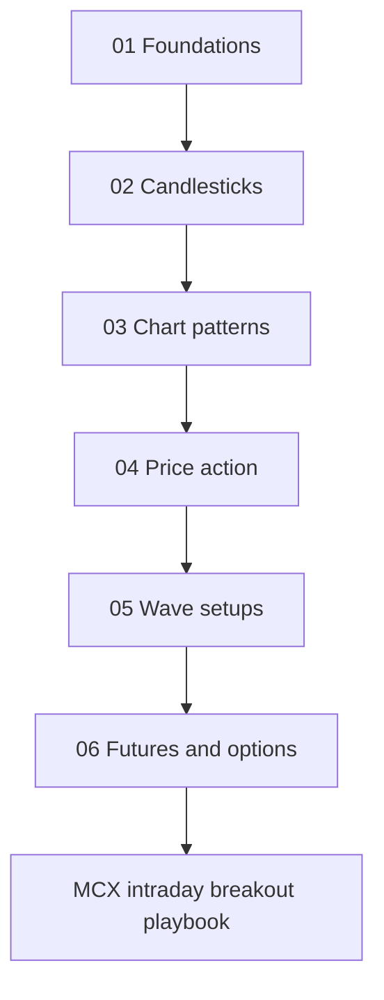

# Technical Analysis Course: From Chart to Trade

This course teaches you to read a price chart, name what you see, and turn it into a trade with a clear entry, stop, and target. It works for stocks, indexes, commodities, and currencies. The same rules apply on a weekly chart for a swing trade and on a 15-minute chart for a day trade.

Every idea is explained in plain words and followed by an example. You do not need any earlier knowledge of trading.

The course also includes the [MCX Intraday Breakout Playbook](mcx_intraday_breakout_playbook.md), the live form for breakout trades in MCX Crude Oil, Natural Gas, Gold, and Silver. If you are new, start with the course. If you already trade, go straight to the playbook.

Read the course and the playbook online at [engineerkv.github.io/stock-market-course](https://engineerkv.github.io/stock-market-course/).

## How the course is ordered

You learn in the order a trader actually reads a chart. First the big picture, then single candles, then larger shapes, then how candles and shapes combine into setups. Wave counting comes after that, because it uses those shapes. Choosing futures or options comes last, because you choose the contract only after you already have a setup.

| Step | Folder | What you will be able to do |
|---|---|---|
| 1 | [01-foundations](01-foundations/README.md) | Tell an uptrend from a downtrend, mark support and resistance, read moving averages and oscillators, and size a trade so one loss cannot hurt you badly. |
| 2 | [02-candlesticks](02-candlesticks/README.md) | Name single candles and two- and three-candle patterns, and know when a pattern counts and when to ignore it. |
| 3 | [03-chart-patterns](03-chart-patterns/README.md) | Spot reversal shapes such as head and shoulders and double bottoms, and continuation shapes such as flags and triangles, and measure their targets. |
| 4 | [04-price-action](04-price-action/README.md) | Combine candles and levels into setups: accumulation, failed breakouts, mother candles, gaps, and confirmation with Bollinger Bands, ADX, and Heikin-Ashi. |
| 5 | [05-wave-setups](05-wave-setups/README.md) | Use a simple wave count to judge whether a trend is young or tired, and trade the few wave setups that have a clear stop. |
| 6 | [06-futures-and-options](06-futures-and-options/README.md) | Choose between futures, option buying, option selling, and spreads for the view you already have, and fill a trade worksheet. Apply all of it to MCX crude oil, natural gas, gold, and silver. |

## Trading MCX commodities

When you trade MCX Crude Oil, Natural Gas, Gold, or Silver, read [Crude oil, natural gas, gold, and silver](06-futures-and-options/04-crude-gas-gold-silver.md) in Step 6 first. It covers contract sizes, event times, and sizing for these four markets.

Then use the [MCX Intraday Breakout Playbook](mcx_intraday_breakout_playbook.md) when you already know the trade is a breakout above resistance or a breakdown below support. It uses a fixed order of charts. The one-hour chart sets the direction and the major support and resistance. The 30-minute chart confirms that direction with the MACD. The 15-minute chart is where you take the entry and manage the exit. The playbook is the live form you fill in before the trade and the journal you fill in after it.

For reversal trades at an important bottom or top, use [Step 4: Price action](04-price-action/README.md) and [Step 5: Wave setups](05-wave-setups/README.md).

## How to read a pattern card

Most lessons are pattern cards. Every card uses the same order, so you can compare two patterns quickly.

1. **Tags.** What the pattern signals (bullish or bearish, reversal or continuation) and how important it is to learn.
2. **Picture.** A small text drawing of the shape.
3. **Story.** What buyers and sellers did to print this shape. If you understand the story, you do not need to memorize the rule.
4. **Where it counts.** The location that makes the pattern meaningful. The same shape in the wrong place means nothing.
5. **Trigger, stop, and target.** When you enter, where you are proven wrong, and where you plan to take profit.
6. **Checklist.** Tick every box before you act.
7. **Number example.** A made-up example with round prices, walked through step by step.
8. **Real case.** A well-known move on a public market, with the approximate date and price area, so you can find it on a free chart. Some cards give a chart hunt instead, where you find your own example.
9. **When it fails.** What a failure looks like, so a failure does not surprise you.

The priority tags mean:

- **Core.** Learn these first. They appear often and have clear rules.
- **Useful.** Learn after the core set. They add detail.
- **Advanced.** Rare, or needing more experience to read well.

## Three rules that apply to every lesson

**Location before shape.** A pattern matters only at the right place: a bullish reversal after a fall and near support, a bearish reversal after a rise and near resistance, a continuation inside a clear trend. The same shape in the middle of a range is noise.

**Wait for confirmation.** A pattern is a question the market is asking. The next candle, or a close beyond a level, is the answer. Enter on the answer, not on the question.

**Know where you are wrong before you enter.** Every card gives a stop. If you cannot place a stop at a logical price, you do not have a trade.

## How to practice

Reading about patterns is not enough. Public studies of thousands of chart patterns show that even well-known patterns fail often, and they fail more in fast, crowded markets. The skill is in picking the good ones and keeping losses small on the rest.

Use this routine for each new pattern:

1. Open a free chart and hide the right side, so you cannot see what happened next.
2. Scroll forward one candle at a time. When you think you see the pattern, write down the trigger, the stop, and the target before you scroll further.
3. Scroll forward and record whether the trade hit the target or the stop.
4. Collect at least 20 examples, including the failures, before you trust the pattern with money.
5. Review the losers. Most losses come from the wrong location, a missing confirmation, or a trade against the bigger trend.

Each lesson file ends with practice questions and answers.

## About the prices in this course

The number examples use made-up round prices. The real cases describe well-known public moves, with approximate dates and price areas. Check them on a chart before you rely on them. Nothing in this course or the playbook promises a profit. Test every rule on your own market, on its own history, and include brokerage, taxes, and slippage before you trade with real money.
