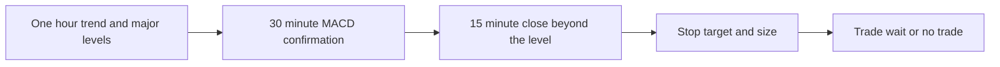
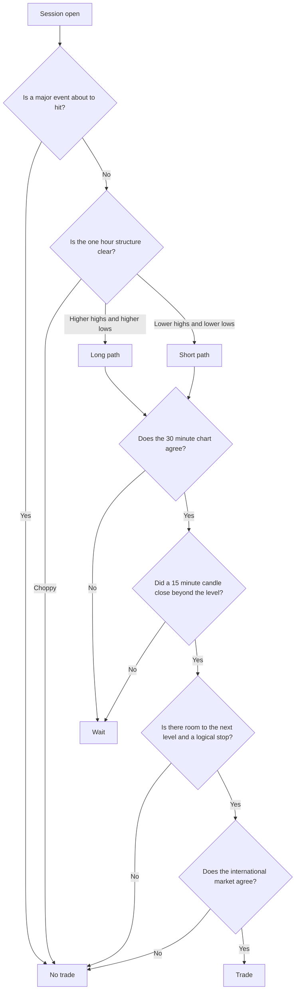
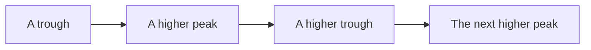
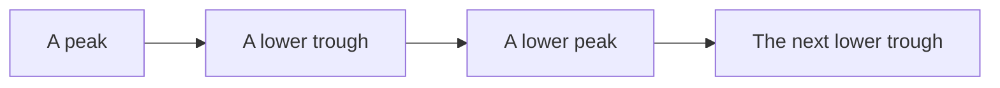
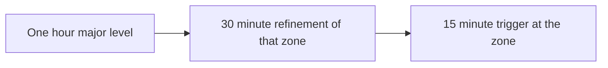
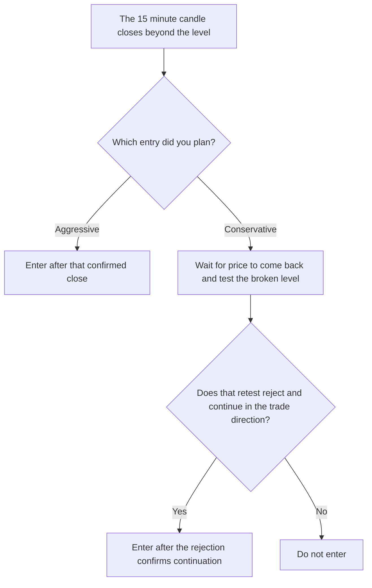
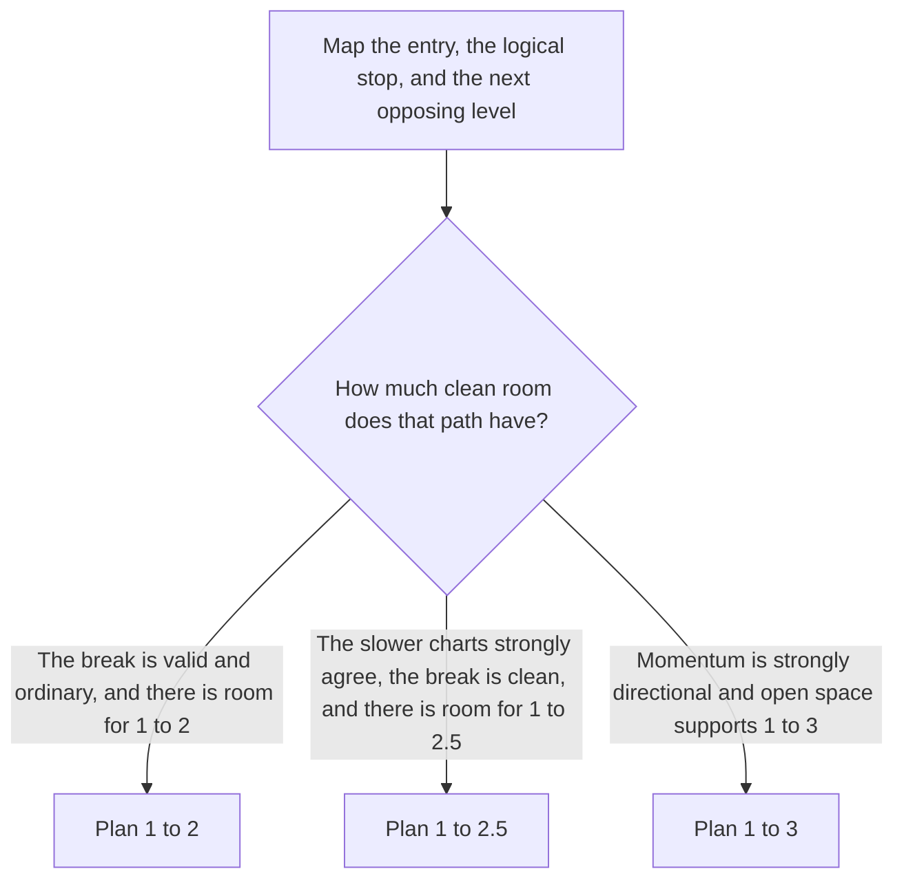

# MCX Intraday Breakout Playbook

This is the live form for an intraday breakout on MCX Crude Oil, Natural Gas, Gold, and Silver. You fill it in before the trade, and you fill the journal in after the trade.

A **breakout** means price breaks a resistance level to the upside, and you are looking for a long. A **breakdown** means price breaks a support level to the downside, and you are looking for a short. The rest of this playbook uses those two words in that exact way.

Price structure and support and resistance come first. Indicators only confirm what the structure is already saying. An indicator by itself is not a reason to buy or sell.

If the trade is a reversal at a bottom or a top, rather than a break of a level, use the reversal setups in the course, starting with [Step 4: Price action](04-price-action/README.md). This playbook stays with the breakout and the breakdown.

The one-hour chart, the 30-minute chart, and the 15-minute chart each have one job. You do not skip ahead to the 15-minute chart until the slower charts have given you a direction.

Read the one-hour chart first, because that is where the trend and the important support and resistance live. Then check the 30-minute chart to see whether the MACD agrees with that direction. Only then look at the 15-minute chart for the candle that actually closes beyond the level. After that close, you still need a logical stop, a realistic target, and a position size that matches the distance to the stop. If any of those pieces is missing, the decision is to wait or to stand aside.

Start from the top of this path every time. If a major scheduled event is about to create abnormal volatility, you do not enter, even when the indicators look lined up. If the one-hour structure is choppy, you do not invent a direction. A higher-high and higher-low structure sends you down the long path. A lower-high and lower-low structure sends you down the short path. The 30-minute chart has to agree with that path. The 15-minute candle has to close beyond the level, not merely wick through it. There has to be room to the next opposing level, and the stop has to sit where the idea is actually wrong. The international benchmark has to agree. Only then is the decision a trade.

## Core rules to keep in front of you

1. The one-hour chart decides the trend direction and the major support and resistance for the session.
2. The 30-minute chart confirms that direction. It does not invent a new one.
3. The 15-minute chart is where the breakout or breakdown happens, and where you manage the entry and the exit.
4. Higher highs and higher lows, or lower highs and lower lows, are the primary structure. Everything else is secondary to that.
5. Indicators confirm the structure. They do not override a clear price structure when they disagree with it.
6. For a long, the short-term averages line up as the 5 EMA above the 13 EMA, and the 13 EMA above the 26 EMA.
7. For a short, the short-term averages line up as the 5 EMA below the 13 EMA, and the 13 EMA below the 26 EMA.
8. You trade a break of a meaningful support or resistance level. You do not trade a random price movement that has no level under it.
9. The stop-loss sits at the price where the breakout idea, or the breakdown idea, is no longer valid.
10. After you are in the trade, you do not widen the stop just to avoid taking the loss.
11. You do not push the target further away only so the reward number looks larger. The chart has to support the target.
12. You check the international benchmark for that commodity before you enter.
13. The position size has to change when volatility changes, and it has to fit the distance from the entry to the stop.
14. When the conditions are unclear, you wait. Standing aside is a completed decision.
15. Before you change a live setting, you test that commodity on its own history, with realistic costs included. Crude Oil, Natural Gas, Gold, and Silver are not one market.

---

## Trade ticket

Fill this in before you look for reasons to talk yourself into the trade. If you cannot fill the stop, the target, and the reason, you are not ready to enter.

- Date:
- Commodity: [ ] Crude Oil  [ ] Natural Gas  [ ] Gold  [ ] Silver
- Contract:
- Direction: [ ] Long  [ ] Short
- Entry time:
- Entry price:
- Planned stop-loss:
- Planned target:
- Planned reward compared with risk:
- Position size:
- Reason for the trade:

---

## Gate 1 — What is happening around this market

You check the world outside the MCX chart before you check the indicators. The international market is a confirmation. It is not the chart you execute on. Your entry, stop, and target are calculated on the MCX contract you are actually trading.

| MCX commodity | International market you check |
|---|---|
| Crude Oil | WTI on NYMEX |
| Natural Gas | Henry Hub on NYMEX |
| Gold | COMEX Gold |
| Silver | COMEX Silver |

- [ ] The international market for this commodity is open, or active enough, that its direction is useful.
- [ ] That international direction broadly agrees with the direction you want to trade on MCX.
- [ ] You are not ignoring a clear disagreement between MCX and the international market.
- [ ] If the two markets disagree, you can say why, in your own words, before you enter.

A major scheduled event can cancel a setup in one candle. Do not enter only because the indicators have lined up when that event is moments away.

- [ ] No major scheduled event is about to create abnormal volatility.
- [ ] For Crude Oil, you have checked the important inventory and energy-market events.
- [ ] For Natural Gas, you have checked the important storage, weather, and supply-and-demand events.
- [ ] For Gold and Silver, you have checked the important US macro, interest-rate, and dollar events.

Each commodity also has its own extra care. The shared checks above still apply. These notes are what is different.

| Commodity | Extra care for this market |
|---|---|
| Crude Oil | WTI should agree. Assess a sudden spike in volatility. Do not take a breakout that is already stretched far from the level. |
| Natural Gas | Henry Hub should agree. The planned stop has to be wide enough for this market's volatility, and the position size comes down when that width is large. Do not chase an unusually large breakout candle. |
| Gold | COMEX Gold should agree. When MCX gold and international gold diverge, check USD/INR before you explain the gap away. Check US macro and rate risk. Mark the previous day's high and low. |
| Silver | COMEX Silver should agree. Also look at gold's direction as a second piece of context. The planned stop has to fit silver's volatility. Mark the previous day's high and low. |

---

## Gate 2 — The one-hour trend and the major levels

The one-hour chart answers two questions. Which way is the market stepping, and which levels actually matter today? A higher high is a peak that is higher than the peak before it. A higher low is a trough that is higher than the trough before it. Together they describe a rising structure. A lower high and a lower low describe a falling structure.

In a bullish one-hour structure, each meaningful trough holds above the important trough before it, and each meaningful peak prints higher than the peak before it. You want that staircase intact before you look for a long breakout.

In a bearish one-hour structure, each meaningful peak is lower than the peak before it, and each meaningful trough is lower than the trough before it. You want that staircase intact before you look for a short breakdown.

### Bullish one-hour bias

A bullish bias is preferred when the structure and the slower averages agree with each other.

- [ ] The one-hour chart is making higher highs.
- [ ] The one-hour chart is making higher lows.
- [ ] The latest meaningful swing is holding above the previous important swing low.
- [ ] Price is broadly above the 20 EMA.
- [ ] The 20 EMA is broadly above the 50 EMA.

When those are true together, the one-hour bullish bias is higher highs, higher lows, and the averages lined up in the same direction.

### Bearish one-hour bias

A bearish bias is preferred when the structure and the slower averages agree with each other.

- [ ] The one-hour chart is making lower highs.
- [ ] The one-hour chart is making lower lows.
- [ ] The latest meaningful swing is holding below the previous important swing high.
- [ ] Price is broadly below the 20 EMA.
- [ ] The 20 EMA is broadly below the 50 EMA.

When those are true together, the one-hour bearish bias is lower highs, lower lows, and the averages lined up in the same direction.

### Which levels you mark

Mark only the levels that matter for this session. The one-hour chart supplies the major levels. The 30-minute chart refines those zones so you know whether the area is still respected. The 15-minute chart is only the trigger area around that level. Do not promote every small 15-minute swing into a new major level.

You start with the one-hour level, because that is the level the session is actually trading around. You use the 30-minute chart to see the edges of that zone more clearly. You use the 15-minute chart only to time the break, the retest, and the entry. A minor 15-minute wiggle does not become a new major support or resistance.

Mark what is relevant:

- [ ] The previous important one-hour swing high.
- [ ] The previous important one-hour swing low.
- [ ] A clear rejection zone, where price has already been turned away.
- [ ] A clear breakout zone or breakdown zone from earlier in the structure.
- [ ] The previous day's high.
- [ ] The previous day's low.
- [ ] The previous day's close, when you want it as extra context.

**Nearest resistance:**

**Nearest support:**

Do not take the trade when the path is blocked immediately in front of the entry.

- [ ] You are not planning a long with the entry sitting directly under a major resistance.
- [ ] You are not planning a short with the entry sitting directly above a major support.

---

## Gate 3 — The 30-minute chart confirms the direction

The 30-minute MACD is the confirmation, not a separate trade idea. A positive crossover, written as PCO, means the MACD has crossed in the bullish direction. A negative crossover, written as NCO, means the MACD has crossed in the bearish direction. You prefer the crossover to sit on the same side of the zero line as the trade, because that says the momentum is already living in that direction rather than only just flipping.

### Long confirmation

- [ ] The 30-minute MACD has made a bullish crossover (PCO).
- [ ] That MACD is preferably above the zero line.
- [ ] The 30-minute structure does not contradict the bullish bias you took from the one-hour chart.
- [ ] Price is not showing a strong reversal against the long you want to take.

### Short confirmation

- [ ] The 30-minute MACD has made a bearish crossover (NCO).
- [ ] That MACD is preferably below the zero line.
- [ ] The 30-minute structure does not contradict the bearish bias you took from the one-hour chart.
- [ ] Price is not showing a strong reversal against the short you want to take.

### Whether the confirmation is good enough

- [ ] The one-hour direction and the 30-minute direction agree with each other.
- [ ] The level you plan to break is clearly defined, so another person could mark the same line.
- [ ] There is enough space from that level to the next major support or resistance for the target you wrote on the ticket.

The alignment you want is simple. The one-hour direction, the 30-minute direction, and the 15-minute break you are about to take are all the same direction.

---

## Gate 4 — The 15-minute trigger

This is the moment the idea becomes a trade. The candle has to close beyond a level you already marked. A wick through the level is not a break. The same checks apply to a long and a short. Only the direction of the level changes.

| What you are checking | Long, breaking resistance | Short, breaking support |
|---|---|---|
| The level is real | Price is testing a resistance you marked because it mattered, not a line you drew to fit the candle. | Price is testing a support you marked because it mattered, not a line you drew to fit the candle. |
| The candle closes beyond it | The 15-minute candle closes above that resistance. A wick above the level, with the close back underneath, is not a breakout. | The 15-minute candle closes below that support. A wick below the level, with the close back above, is not a breakdown. |
| Bollinger Bands | The bands are expanding, or they are starting to expand, and the upper band's direction supports the move. You are not chasing a breakout after the bands are already extremely wide. | The bands are expanding, or they are starting to expand, and the lower band's direction supports the move. You are not chasing a breakdown after the bands are already extremely wide. |
| The 5, 13, and 26 EMAs | The 5 EMA is above the 13 EMA, and the 13 EMA is above the 26 EMA. Price is above that cluster. The stack is not stretched so far that you are late. | The 5 EMA is below the 13 EMA, and the 13 EMA is below the 26 EMA. Price is below that cluster. The stack is not stretched so far that you are late. |
| ADX and the directional lines | ADX is preferably rising, and it is strong enough to say the market is participating in a trend rather than sitting flat. The +DI line is above the -DI line. | ADX is preferably rising, and it is strong enough to say the market is participating in a trend rather than sitting flat. The -DI line is above the +DI line. |
| RSI | RSI is above 60, and it is not failing immediately after the breakout. | RSI is below 40, and it is not failing immediately after the breakdown. |
| Stochastic | The stochastic has made a bullish crossover (PCO), and that cross is supporting the breakout. It is not appearing only after the move is already fully extended. | The stochastic has made a bearish crossover (NCO), and that cross is supporting the breakdown. It is not appearing only after the move is already fully extended. |
| The candle itself | The breakout candle has a real body, so the close shows conviction. Where volume data is reliable, participation confirms the move. The candle is not so large that a logical stop becomes impractical. | The breakdown candle has a real body, so the close shows conviction. Where volume data is reliable, participation confirms the move. The candle is not so large that a logical stop becomes impractical. |
| The international market | WTI agrees for Crude Oil, Henry Hub agrees for Natural Gas, COMEX Gold agrees for Gold, and COMEX Silver agrees for Silver. | The same markets have to agree, in the short direction. |

The detail of what each indicator is allowed to say is also written once, in the indicator card further down. Use this table while you are in the trade decision. Use the card when you need to remember what the tool is for.

### How you enter after the close

There are two acceptable ways to enter. You choose one before the candle closes, so you do not switch to the easier one after you see the result.

The aggressive entry takes the trade after a 15-minute candle has closed beyond the level. You are accepting that you might enter before a retest, because the close itself is the confirmation you required.

The conservative entry waits. For a long, you want the breakout, then a return to the broken resistance, then a rejection that says the old resistance is now holding as support. For a short, you want the breakdown, then a return to the broken support, then a rejection that says the old support is now holding as resistance. You enter after that rejection confirms the continuation. If the retest does not reject, you do not take the trade.

Do not use either entry when the breakout candle, or the breakdown candle, is so large that the next major level is already too close, or the stop you would need is no longer practical.

### What a better-quality break looks like

A higher-quality break normally has all of the following. Missing one of them does not always forbid the trade, but you should know which one is missing before you enter.

- [ ] Price compressed or consolidated before the break, instead of running straight into the level from far away.
- [ ] The support or resistance level was well defined before the candle tried to break it.
- [ ] The candle closed beyond the level.
- [ ] Momentum confirms the direction of that close.
- [ ] There is enough room to the next important level on the other side of the trade.

---

## Gate 5 — The stop, the target, and the exit

You define the loss and the target before you enter. The reward compared with the risk, written as R:R, comes from those two prices. You do not choose a flattering ratio and then drag the target until the chart agrees.

### Where the stop goes

The stop belongs at the price where the idea is wrong.

For a long, that place is one of these:

- [ ] Below the support created by a breakout retest, when you entered on the retest.
- [ ] Below the relevant 15-minute swing low.
- [ ] Below the structure that invalidates the bullish setup.

For a short, that place is one of these:

- [ ] Above the resistance created by a breakdown retest, when you entered on the retest.
- [ ] Above the relevant 15-minute swing high.
- [ ] Above the structure that invalidates the bearish setup.

The stop has to obey these rules as well:

- [ ] The stop is written down before the entry, not after the price has already moved.
- [ ] You will not widen it after the entry just so you can avoid taking the loss.
- [ ] It is not so tight that ordinary market noise is likely to hit it and knock you out of a valid idea.
- [ ] The position size is calculated from the distance between the entry and that stop, so a wider stop means a smaller size.

### How large a target you are allowed to plan

These are the mathematical break-even win rates before brokerage, taxes, slippage, and other execution costs. They are a reference, not a promise.

| Reward compared with risk | Share of trades that must win, before costs, to break even |
|---|---:|
| 1 : 1.5 | 40.0% |
| 1 : 2 | 33.3% |
| 1 : 2.5 | 28.6% |
| 1 : 3 | 25.0% |

You map the entry, the logical stop, and the next real opposing level first. The ratio is whatever that map produces. You do not start from 1:3 and force the chart to fit it.

Use **1:2** as the default when the breakout is valid but the momentum is ordinary, and the next major level still leaves enough room for that target.

Use **1:2.5** when the one-hour chart and the 30-minute chart strongly agree, the break itself is clean, the momentum is strong, and the next major level still leaves enough room.

Use **1:3** only when the market has strong directional momentum, there is enough room before the next major opposing level, and the chart structure actually supports the larger target. If the structure only supports 1:2, you keep 1:2.

### What you write down before the entry

- [ ] The target level is identified.
- [ ] The next major opposing support or resistance is identified.
- [ ] The planned reward compared with risk is written on the ticket.
- [ ] The maximum loss, in money, is known before you click.

### When you exit early or reduce the risk

You leave, or you cut the position, when the original idea has failed. You do not leave because you feel uncomfortable while the structure is still valid.

- [ ] The break fails and price closes back through the level it had broken.
- [ ] The 15-minute structure clearly reverses against the trade.
- [ ] Strong momentum develops in the opposite direction.
- [ ] The original breakout thesis, or breakdown thesis, is invalidated.

### What is not, by itself, a reason to exit

- [ ] One indicator flips for a moment while the price structure is still valid.
- [ ] There is a small pullback after a healthy break.
- [ ] A 5-minute candle points the other way, without a structural invalidation of the setup.

### Optional trailing and partial exits

Use these only when they are already part of the way you have tested the strategy. They are not a new decision you invent while the trade is open.

- [ ] You take a partial profit at a level you planned before the entry.
- [ ] You move the stop only by a rule you wrote down in advance.
- [ ] You do not widen the risk because the trade is going your way or because it is going against you.

---

## Indicator card

This card is the meaning of each tool for this playbook. The gates above are where you tick the decision. The card is where you remind yourself what "agree" looks like, so the numbers are not a code you have to remember separately.

| Tool | What you want on a long | What you want on a short | What that is protecting you from |
|---|---|---|---|
| 30-minute MACD | A bullish crossover (PCO), preferably above the zero line. | A bearish crossover (NCO), preferably below the zero line. | Taking a 15-minute break while the next slower chart is still pointing the other way. |
| Bollinger Bands | The bands are expanding, or starting to expand, and the upper band supports the move. You skip the trade when the expansion is already extreme and you would only be chasing. | The bands are expanding, or starting to expand, and the lower band supports the move. You skip the trade when the expansion is already extreme and you would only be chasing. | Entering a quiet market that has not started to move, or chasing a move that has already used up its range. |
| EMA 5, 13, and 26 | The 5 is above the 13, and the 13 is above the 26. Price is above the cluster, and the stack is not excessively stretched. | The 5 is below the 13, and the 13 is below the 26. Price is below the cluster, and the stack is not excessively stretched. | Buying a breakout while the short-term averages are still stacked for a decline, or selling a breakdown while they are still stacked for a rise. |
| One-hour 20 and 50 EMA | Price is broadly above the 20 EMA, and the 20 EMA is broadly above the 50 EMA. | Price is broadly below the 20 EMA, and the 20 EMA is broadly below the 50 EMA. | Trading against the slower trend that the one-hour chart is already showing. |
| ADX and DI | ADX is preferably rising and strong enough to show trend participation rather than a flat market. +DI is above -DI. | ADX is preferably rising and strong enough to show trend participation rather than a flat market. -DI is above +DI. | Treating a sideways market as if it had a trend you can ride. |
| RSI | RSI is above 60, and momentum is not failing right after the breakout. | RSI is below 40, and momentum is not failing right after the breakdown. | Calling a break confirmed when momentum has already stalled. |
| Stochastic | A bullish crossover (PCO) that supports the breakout, rather than a cross that shows up only after the move is fully extended. | A bearish crossover (NCO) that supports the breakdown, rather than a cross that shows up only after the move is fully extended. | Using a late crossover as if it were fresh confirmation. |

---

## The decision

Take the trade only when the important conditions below are true. If a hard stop in the next list is true, the decision is no trade, even if several indicators look attractive.

### Direction

- [ ] The one-hour trend is clear.
- [ ] The 30-minute chart confirms that same direction.

### The level

- [ ] An important one-hour or 30-minute support or resistance level is clearly identified.
- [ ] Price is actually breaking that level, with a close beyond it.

### Momentum

- [ ] Bollinger Band expansion supports the move.
- [ ] The 5, 13, and 26 EMAs are aligned for the direction.
- [ ] ADX and the DI lines support the direction.
- [ ] RSI supports the direction.
- [ ] The stochastic crossover supports the direction.

### Outside the MCX chart

- [ ] The international benchmark confirms the direction.
- [ ] No major event risk is immediately ahead.

### The risk

- [ ] A logical stop exists.
- [ ] The target is realistic given the next opposing level.
- [ ] The minimum reward compared with risk is available.
- [ ] The position size matches that risk.

### Hard reasons to stand aside

Do not force a trade when any of these is true.

- [ ] The one-hour structure is unclear or choppy.
- [ ] The one-hour chart and the 30-minute chart strongly disagree.
- [ ] The break runs directly into a major level on the other side.
- [ ] The breakout candle is so large that the reward compared with the risk is poor.
- [ ] The international benchmark strongly contradicts the MCX direction.
- [ ] The market is flat, and ADX shows weak trend conditions.
- [ ] A major scheduled news event or other event risk is imminent.
- [ ] The reward you need, compared with the risk, is not available.
- [ ] The stop cannot be placed at a logical point in the structure.
- [ ] The entry is based on only one indicator.

No trade is a valid outcome. It is not a failure to use the playbook.

### Scorecard

Use this only as an aid while you walk the gates. It is not a mechanical substitute for the market structure. A row of passes does not override a choppy one-hour chart.

| Area | Pass | Fail |
|---|---|---|
| One-hour trend | [ ] | [ ] |
| One-hour support and resistance | [ ] | [ ] |
| 30-minute MACD confirmation | [ ] | [ ] |
| 15-minute break | [ ] | [ ] |
| Bollinger Bands | [ ] | [ ] |
| EMA 5, 13, and 26 | [ ] | [ ] |
| ADX and DI | [ ] | [ ] |
| RSI | [ ] | [ ] |
| Stochastic | [ ] | [ ] |
| International confirmation | [ ] | [ ] |
| Event risk | [ ] | [ ] |
| Reward compared with risk | [ ] | [ ] |
| Stop quality | [ ] | [ ] |

**Final decision:**

- [ ] Trade
- [ ] Wait for confirmation
- [ ] No trade

Before you press buy or sell, you should be able to answer each of these in one pass. The one-hour direction is clear. The major level is clear. The 30-minute MACD confirms. A 15-minute candle has closed beyond the level. The bands, the EMA stack, ADX and DI, RSI, and the stochastic agree with that direction. The international market confirms. The stop is logical. The target is logical. The reward compared with the risk meets the plan. Event risk is clear. Then you mark trade, wait, or no trade.

---

## Journal after the exit

- Commodity:
- Direction:
- Entry:
- Exit:
- Profit or loss:
- Planned reward compared with risk:
- Actual reward compared with risk:
- Setup type:
- Was the one-hour direction correct? [ ] Yes [ ] No
- Was the 30-minute confirmation correct? [ ] Yes [ ] No
- Was the 15-minute break valid? [ ] Yes [ ] No
- Was the international confirmation correct? [ ] Yes [ ] No
- The main reason the trade worked, or failed:
- Did you follow the playbook? [ ] Yes [ ] No
- The rule you broke, if you broke one:
- Did you save a screenshot? [ ] Yes [ ] No

---

## A note on what this playbook is

This playbook is a framework for deciding whether a breakout or a breakdown is worth taking. It is not a guarantee of profit. The indicator thresholds, the breakout rules, the stop placement, and the target selection should be validated separately for Crude Oil, Natural Gas, Gold, and Silver, using historical data and realistic transaction costs, before you rely on them in live trading.
